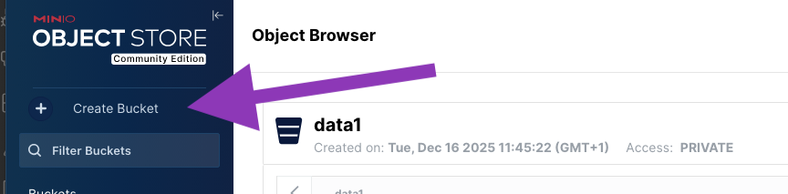
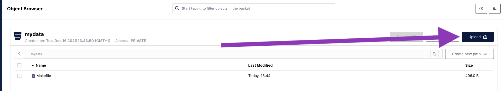

# Backup non-filesystem data

Modern infrastructures are not limited to files stored on traditional
filesystems. Your data may reside in various services, databases, or cloud
storage solutions.

In the first two parts of this quickstart, we
[created a Kloset Store and performed a backup of local filesystem data](../first-backup),
and then
[synchronized that Kloset Store to a second location](../synchronize-copies) to
improve durability.

In this guide, we will create a backup of an S3 bucket using **Plakar**. The
same logic applies to any other data source supported by **Plakar** through its
various connectors.

## Requirements

After following the previous parts of this quickstart, you should have:

- **Plakar** is installed on your system (see the
  [installation guide](../installation)).
- A Kloset Store on your local filesystem at `$HOME/backups`.
- A S3-compatible storage location configured in your **Plakar** configuration
  file under the name `s3-backups` (see
  [Part 2 of this quickstart](../synchronize-copies)).





## Initialize the S3 bucket with some data

Before we can back up an S3 bucket, we need to have one with some data in it. If
you already have an S3 bucket you want to back up, you can skip this step.

If, instead, you followed the previous part of this quickstart and set up a
local MinIO instance, you can use it to create a test bucket.

Open your browser and navigate to `http://localhost:9001`. Log in with the
default credentials `minioadmin` / `minioadmin`.

Click on the "Create bucket" button, and enter `mydata` as the bucket name.



Then, click on the "Upload" button, and upload a few files of your choice to the
bucket.







## Configure the S3 source in plakar

Similarly to how we configured the S3 store in
[Part 2 of this quickstart](../synchronize-copies), we need to let **Plakar**
know about the S3 source we want to back up.

Run the following command to create the new **source**:

```bash
$ plakar source add mydata \
  location=s3://localhost:9000/mydata \
  access_key=minioadmin \
  secret_access_key=minioadmin \
  use_tls=false
```

This command creates a new source named `mydata` that points to the `mydata`
bucket on the MinIO server running at `localhost:9000`. It uses the access key
and secret key provided above. The `use_tls=false` option is specified because
we are connecting to a local server without TLS.

_`use_tls` should be omitted or set to `true` when connecting to production
S3-compatible services that use TLS._





## Create the backup

To create a backup of the S3 bucket to the local Kloset Store at
`$HOME/backups`, run the following command:

```bash
plakar at $HOME/backups backup "@mydata"
```

As you can see, the alias `@mydata` is used to reference the source previously
configured.

To verify that the backup was created successfully, you can list the snapshots
in the local Kloset Store:

```bash
$ plakar at $HOME/backups ls
2025-12-16T12:55:30Z   842de8b1     496 B        0s /            # the backup of the S3 bucket we just created
2025-12-15T21:09:32Z   772fba5f   2.9 MiB        0s /private/etc # the previous backup, from Part 1
```

Note that in this example, we created the backup to a store hosted on the local
filesystem. It is perfectly possible to back up S3 data directly to another S3
location, or any other supported store, using
`plakar at "@store-name" backup "@source-name"`.





## Restore the backup

It is also possible to restore a snapshot directly to an S3 location.

To do so, first configure a new **destination**:

```bash
$ plakar destination add mydata \
  location=s3://localhost:9000/mydata \
  access_key=minioadmin \
  secret_access_key=minioadmin \
  use_tls=false
```

_`use_tls` should be omitted or set to `true` when connecting to production
S3-compatible services that use TLS._

And then, restore the snapshot to that destination:

```bash
$ plakar at $HOME/backups restore -to "@mydata" 842de8b1
repository passphrase:
info: 842de8b1: OK ✓ /
info: 842de8b1: OK ✓ /Makefile
info: restore: restoration of 842de8b1:/ at @mydata completed successfully
```

For the `restore` command, we used the alias again with `@mydata` which
references the S3 destination we just configured.





## Congratulations!

You have successfully created a backup of an S3 bucket using **Plakar**, and
restored it back to the S3 location.

This guide demonstrated how to back up non-filesystem data using **Plakar**. The
same principles apply to any other data source supported by **Plakar** through
its various connectors.

## Next steps

There is plenty more to discover about **Plakar**. Here are our suggestions on
what to try next:

- Learn more about the
  [core concepts behind Plakar](../../explanations/how-plakar-works).
- Create a
  [schedule for your backups](../../guides/setup-scheduler-daily-backups)
- Discover more about the
  [Plakar command line syntax](../../references/command-line-syntax)

