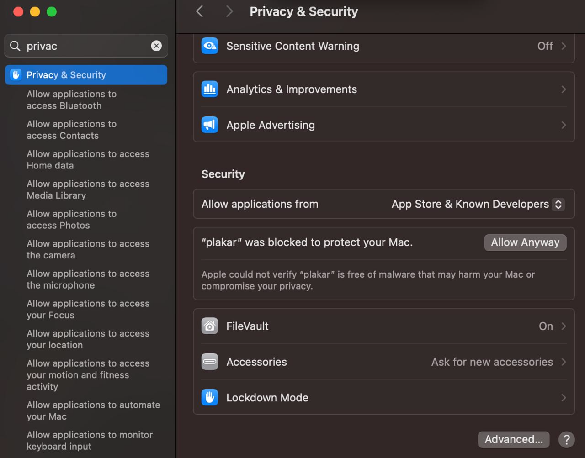
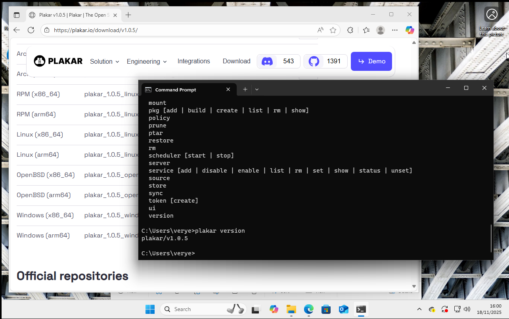
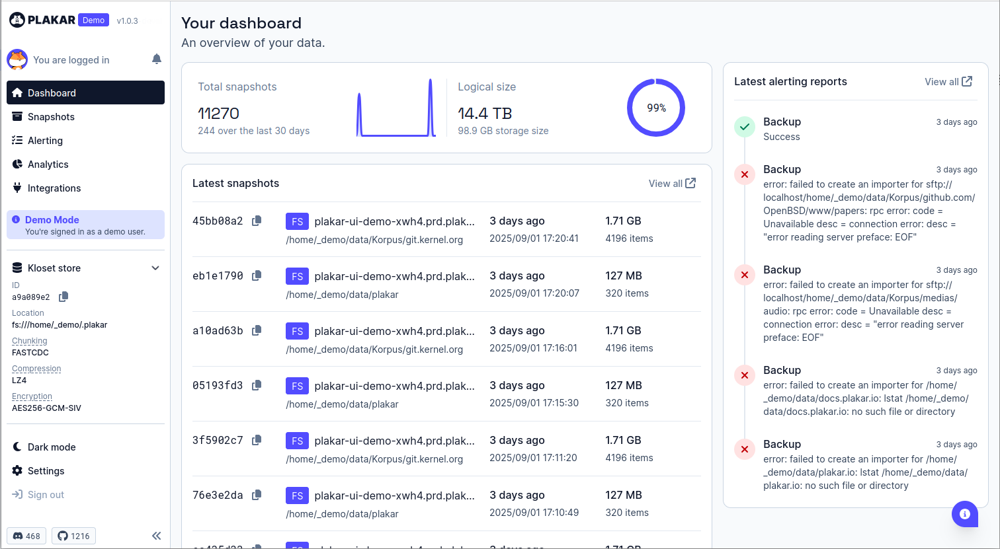

# Quickstart

Welcome to **Plakar** - easy, secure and efficient backups for people who value
their time and data. The aim of this quick guide is to get you up and running
with **Plakar** and create your first backup within minutes. Let's get started!

## What you will need

- an internet connection
- a Linux, macOS, Windows, FreeBSD or OpenBSD machine to run the software
- admin access to install
- sufficient local storage to store your backups
- a web browser (for logging in and using the UI)

## Install plakar





For Debian-based operating systems (such as Ubuntu or Debian), the easiest way
is to use our APT repository. First, install necessary dependencies and add the
repository's GPG key:

```bash
$ sudo apt-get update
$ sudo apt-get install -y curl gnupg2
$ curl -fsSL https://plakar.io/dist/keys/community-v1.0.0.gpg | sudo gpg --dearmor -o /usr/share/keyrings/plakar.gpg
$ echo "deb [signed-by=/usr/share/keyrings/plakar.gpg] https://plakar.io/dist/repos/deb/ stable main" | sudo tee /etc/apt/sources.list.d/plakar.list
```

Then update the package list and install plakar:

```bash
$ sudo apt-get update
$ sudo apt-get install plakar
```





For operating systems which use RPM-based packages (such as Fedora), the easiest
way is to use our DNF repository.

First, set up the repository:

```bash
$ cat <<EOF | sudo tee /etc/yum.repos.d/plakar.repo
[plakar]
name=Plakar Repository
baseurl=https://plakar.io/dist/repos/rpm/$(uname -m)/
enabled=1
gpgcheck=0
gpgkey=https://plakar.io/dist/keys/community-v1.0.0.gpg
EOF
```

Then install plakar with:

```bash
$ sudo dnf install plakar
```





The simplest way to install Plakar on macOS is with
[Homebrew](https://brew.sh/). Ensure you have Homebrew installed, then add the
Plakar tap and install Plakar with:

```bash
$ brew install plakarkorp/tap/plakar
```

> If you prefer not to use our tap, you can install from the default Homebrew
> repository instead with `brew install plakar`. Note that the version in the
> default repository may not always be the latest release.

macOS includes built-in protection against untrusted binaries. **To allow plakar
to run, you will need to explicitly approve it in the Privacy & Security
settings.**







The simplest way to install Plakar on Windows is by downloading the pre-built
package from the [Download page](/download).

The downloaded package is simply an archive containing the executable. Copy this
to anywhere on your system PATH, or run it directly from a shell where it is
installed.







To install using the Go toolchain, use `go install` with the version you want to
install, or `latest`:

```bash
$ go install "github.com/PlakarKorp/plakar@v1.0.5"
```

This will install the binary into your `$GOPATH/bin` directory, which you may
need to add to your `$PATH` if it is not already there.





### Arch Linux

Plakar is available on the Arch User Repository (AUR). If you use an AUR helper
such as `yay`, you can install it with:

```bash
$ yay -S plakar
```

### Building from Source

You can build Plakar from source. You will need:

- [Go (Golang)](https://go.dev/doc/install)
- `make` (available by default on most Linux distributions; on macOS, install
  the Xcode command line tools with `xcode-select --install`; on Windows, use
  [WSL](https://learn.microsoft.com/en-us/windows/wsl/install) or a tool like
  [GnuWin32 Make](https://gnuwin32.sourceforge.net/packages/make.htm))

Clone the repository and run `make`:

```bash
$ git clone https://github.com/PlakarKorp/plakar.git
$ cd plakar
$ make
```

This produces a `plakar` binary in the current directory. To build a specific
release version, check out the corresponding tag before running `make`:

```bash
$ git fetch --tags
$ git checkout tags/v1.0.5
$ make
```

### Other Platforms

For other supported operating systems, or for an alternative to the methods
mentioned above, it is possible to download pre-built binaries for different
platforms and architectures from the [Download page](/download).

These are in standard formats for the relevant platforms, so consult OS-specific
documentation for how to install them.





Verify the installation by running:

```bash
$ plakar version
```

This should return the expected version number, for example 'plakar/v1.0.5'.

## Create a Kloset Store

Before we can back up any data, we need to define where the backup will go. In
**Plakar** terms, this storage location is called a 'Kloset Store'. You can find
out more about the concept and rationale behind Kloset in
[this post on our blog](https://www.plakar.io/posts/2025-04-29/kloset-the-immutable-data-store/).

For our first backup, we will create a local Kloset Store on the filesystem of
the host OS. In a real backup scenario you would want to create a backup on a
different physical device, so substitute in a better location if you have one.

In the CLI enter the following command:

```bash
$ plakar at $HOME/backups create
```

**Plakar** will then ask you to enter a passphrase, and repeat it to confirm.

> [!WARNING]+ Don't Lose or Forget your Passphrase
>
> Be extra careful when choosing the passphrase. People with access to the
> Kloset Store and knowledge of the passphrase can read your backups.
>
> By default **Plakar** will enforce rules on your choice of passphrase to make
> sure it is complex enough to be secure. To add complexity, use a mixture of
> upper and lower case characters, numbers and symbols.
>
> Your passphrase is not stored anywhere and **cannot** be recovered in case of
> loss. A lost passphrase means the data within the repository can no longer be
> accessed or recovered.

## Create your first backup

Now that we have created the Kloset Store where data will be stored we can use
it to create our first backup. **Plakar** uses the `at` keyword to specify where
a command is to take place.

To create a simple example backup, try running:

```bash
$ plakar at $HOME/backups backup /private/etc
```

**Plakar** will process the files it finds at that location and pass them to the
Kloset where they will be chunked and encrypted. The output will indicate the
progress:

```bash
9abc3294: OK ✓ /private/etc/ftpusers
9abc3294: OK ✓ /private/etc/asl/com.apple.iokit.power
9abc3294: OK ✓ /private/etc/pam.d/screensaver_new_ctk
[...]
9abc3294: OK ✓ /private/etc/apache2
9abc3294: OK ✓ /private/etc
9abc3294: OK ✓ /private
9abc3294: OK ✓ /
backup: created unsigned snapshot 9abc3294 of size 3.1 MB in 72.55875ms
```

The output lists the short form of the snapshot's id number. This is used to
identify a particular snapshot and is also how you identify the snapshot to use
for various **Plakar** commands.

> [!NOTE]+ The help command
>
> Learning new tools can be confusing. To make things easier, **Plakar**
> includes built-in help for all commands. Just use `plakar help` and then the
> command you need help with for a full list of options and examples. For
> example, if you forget what the options are for restoring files from a
> snapshot: `plakar help restore`

You can verify that the backup exists:

```bash
$ plakar at $HOME/backups ls
2025-09-02T15:38:16Z   9abc3294    3.1 MB      0s   /private/etc
```

The output lists the datestamp of the last backup, the short UUID, the size of
files backed-up, the time it took to create the backup and the source path of
the backup.

Verify the integrity of the contents:

```bash
$ plakar at $HOME/backups check 9abc3294
9abc3294: ✓ /private/etc/afpovertcp.cfg
9abc3294: ✓ /private/etc/apache2/extra/httpd-autoindex.conf
9abc3294: ✓ /private/etc/apache2/extra/httpd-dav.conf
[...]
9abc3294: ✓ /private/etc/xtab
9abc3294: ✓ /private/etc/zshrc
9abc3294: ✓ /private/etc/zshrc_Apple_Terminal
9abc3294: ✓ /private/etc
check: verification of 9abc3294:/private/etc completed successfully
```

And restore it to a local directory:

```bash
$ plakar at $HOME/backups restore -to /tmp/restore 9abc3294
```

In this case we are restoring to temporary storage as it is just a test. The
output will list the restored files as it creates them:

```bash
9abc3294: OK ✓ /private/etc/afpovertcp.cfg
9abc3294: OK ✓ /private/etc/apache2/extra/httpd-autoindex.conf
9abc3294: OK ✓ /private/etc/apache2/extra/httpd-dav.conf
[...]
9abc3294: OK ✓ /private/etc/xtab
9abc3294: OK ✓ /private/etc/zprofile
9abc3294: OK ✓ /private/etc/zshrc
9abc3294: OK ✓ /private/etc/zshrc_Apple_Terminal
restore: restoration of 9abc3294:/private/etc at /tmp/restore completed successfully
```

To verify the files have been re-created, list the directory they were restored
to:

```bash
$ ls -l /tmp/restore
```

This will list the restored files. Note that the properties of the restored
files, such as the creation date, will be the same as the original files that
were backed up:

```bash
total 1784
-rw-r--r--@  1 gilles  wheel     515 Feb 19 22:47 afpovertcp.cfg
drwxr-xr-x@  9 gilles  wheel     288 Feb 19 22:47 apache2
drwxr-xr-x@ 16 gilles  wheel     512 Feb 19 22:47 asl
[...]
-rw-r--r--@  1 gilles  wheel       0 Feb 19 22:47 xtab
-r--r--r--@  1 gilles  wheel     255 Feb 19 22:47 zprofile
-r--r--r--@  1 gilles  wheel    3094 Feb 19 22:47 zshrc
-rw-r--r--@  1 gilles  wheel    9335 Feb 19 22:47 zshrc_Apple_Terminal
```

## Login

By default, **Plakar** works without requiring you to create an account or log
in. You can back up and restore your data with just a few commands, no external
services involved.

However, logging in unlocks optional features that improve usability and
monitoring, and adds the ability to easily install pre-built integrations. In
plakar, an integration is a package which supports an additional protocol as a
source, destination or storage method (or all three), such as FTP, Google Cloud
Storage or an S3 bucket.

Logging in is simple and needs only an email address or GitHub account for
authentication.

To log in using the CLI:

```bash
$ plakar login -email <youremailaddress@example.com>
```

Substitute in your own email address and follow the prompt. You can then check
your email and follow the link sent from plakar.io.

To check that you are now logged in you can run:

```bash
$ plakar login -status
```

## Access the UI

Plakar provides a web interface to view the backups and their content. To start
the web interface, run:

```bash
$ plakar at $HOME/backups ui
```

Your default browser will open a new tab. You can navigate through the
snapshots, search and view the files, and download them.




## Congratulations!

You have successfully:

- installed **Plakar**
- created a backup
- verified it
- restored files
- used the graphical UI

How long did it take? That's how easy **Plakar** is for simple, secure backups.

## Next steps

There is plenty more to discover about **Plakar**. Here are our suggestions on
what to try next:

- Create a
  [schedule for your backups](../../guides/setup-scheduler-daily-backups)
- Discover more about the
  [plakar command line syntax](../../references/command-line-syntax)
- Learn more about
  [why one backup is not enough](../../explanations/why-several-copies)

