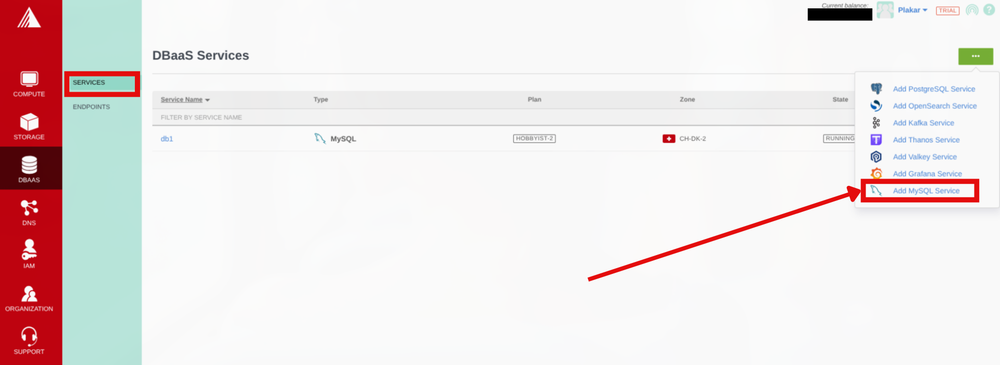
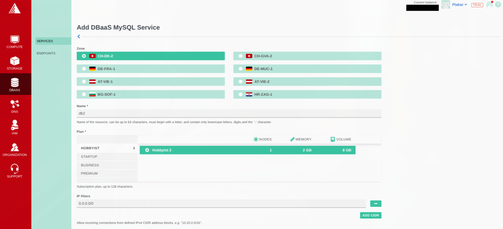
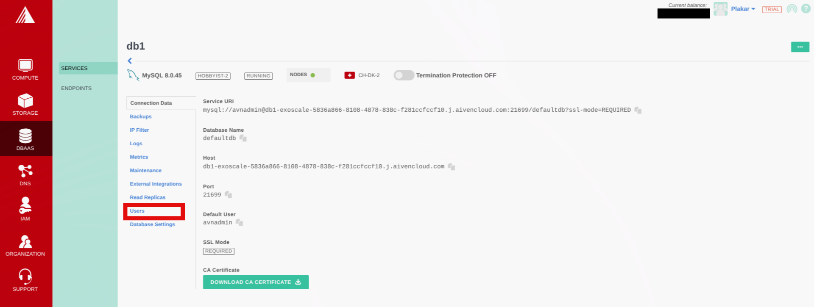

# Back Up an Exoscale Managed MySQL Database

This guide backs up an Exoscale Managed MySQL database using `mysqldump`
streamed through Plakar to Exoscale Object Storage (SOS). The result is an
encrypted, deduplicated snapshot stored separately from your database
infrastructure.

## Architecture

<!-- prettier-ignore-start -->

flowchart TB

subgraph Client["Backup Client"]
  MySQLDump["mysqldump"]
  Plakar["Plakar<br/>stdin integration"]
end

subgraph DB["Exoscale Managed MySQL"]
  MySQL["MySQL"]
end

subgraph Storage["Exoscale Object Storage"]
  SOS["Kloset Store<br/>(Encrypted & Deduplicated)"]
end

MySQL -->|SQL dump| MySQLDump
MySQLDump -->|stdin| Plakar
Plakar -->|Snapshots| SOS


<!-- prettier-ignore-end -->

## Prerequisites

- Exoscale account with billing configured

## Create MySQL Database

### Provision database

1. Log in to Exoscale Portal
2. Go to **DBAAS** → **Services**
3. Click on the button with an ellipsis icon then select **Add MySQL Service**
   from the dropdown
4. Configure:
   - Zone: Select location
   - Database name
   - Plan: Select instance size
   - IP Filters, click on **Add CIDR** and enter your IP address to access the
     database or use `0.0.0.0/0` to access it from any IP
5. Click **Add**





### Download connection details

1. In the database connection data tab, download your CA Certificates and get
   the other connection details.
2. In the users tab, save your database user password

## Install Tools

Install MySQL client:

```bash
$ sudo apt update
$ sudo apt install mysql-client
```

Install Plakar using the [installation guide](../../../quickstart/installation).

## Configure MySQL Connection

Set environment variables from connection details:

```bash
$ export MYSQL_HOST=<DB_HOST>
$ export MYSQL_TCP_PORT=21699
$ export MYSQL_USER=<DB_USER>
$ export MYSQL_PWD=<DB_PASSWORD>
```

Configure SSL/TLS with CA certificate:

```bash
# Place CA certificate in a secure location
$ sudo mkdir -p /etc/mysql/certs
$ sudo cp ca.pem /etc/mysql/certs/
$ sudo chmod 644 /etc/mysql/certs/ca.pem
```

Create MySQL configuration file:

```bash
$ cat > ~/.my.cnf << 'EOF'
[client]
ssl-ca=/etc/mysql/certs/ca.pem
ssl-mode=REQUIRED
EOF
$ chmod 600 ~/.my.cnf
```

Test connection:

```bash
$ mysql -e "SELECT VERSION();"
```

## Configure Object Storage

### Install S3 integration

```bash
$ plakar login -email you@example.com
$ plakar pkg add s3
```

### Create Object Storage bucket

If not already configured, follow:
[Exoscale Object Storage setup](../exoscale-compute-as-a-dedicated-backup-server/#configure-object-storage)

### Add storage connector

```bash
$ plakar store add exoscale-sos-mysql \
  location=s3://<SOS_ENDPOINT>/<BUCKET_NAME> \
  access_key=<ACCESS_KEY> \
  secret_access_key=<SECRET_KEY> \
  use_tls=true
```

Replace:

- `<SOS_ENDPOINT>`: e.g., `sos-ch-dk-2.exo.io`
- `<BUCKET_NAME>`: e.g., `plakar-backups`
- `<ACCESS_KEY>` and `<SECRET_KEY>`: From Exoscale IAM

### Initialize store

```bash
$ plakar at "@exoscale-sos-mysql" create
```

## Back Up Database

```bash
$ mysqldump --single-transaction \
  --routines \
  --triggers \
  --events \
  <DB_NAME> | plakar at "@exoscale-sos-mysql" backup stdin:dump.sql
```

Verify:

```bash
$ plakar at "@exoscale-sos-mysql" ls
```

## Restore Database

Retrieve snapshot ID:

```bash
$ plakar at "@exoscale-sos-mysql" ls
```

### Restore single database

```bash
$ plakar at "@exoscale-sos-mysql" cat <SNAPSHOT_ID>:dump.sql | mysql <DB_NAME>
```

## Troubleshooting

**Connection refused**

- Verify `MYSQL_HOST`, `MYSQL_TCP_PORT`, `MYSQL_USER`, `MYSQL_PWD` environment
  variables
- Check database is running in Exoscale Portal
- Verify network access/firewall rules

**Authentication failed**

- Confirm user credentials

**S3 upload errors**

- Check S3 credentials: `plakar store show exoscale-sos-mysql`
- Verify endpoint URL and bucket name
- Confirm bucket exists in Exoscale Portal

**mysqldump not found**

- Install MySQL client: `sudo apt install mysql-client`

