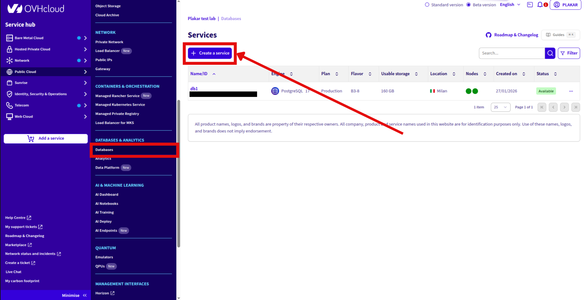
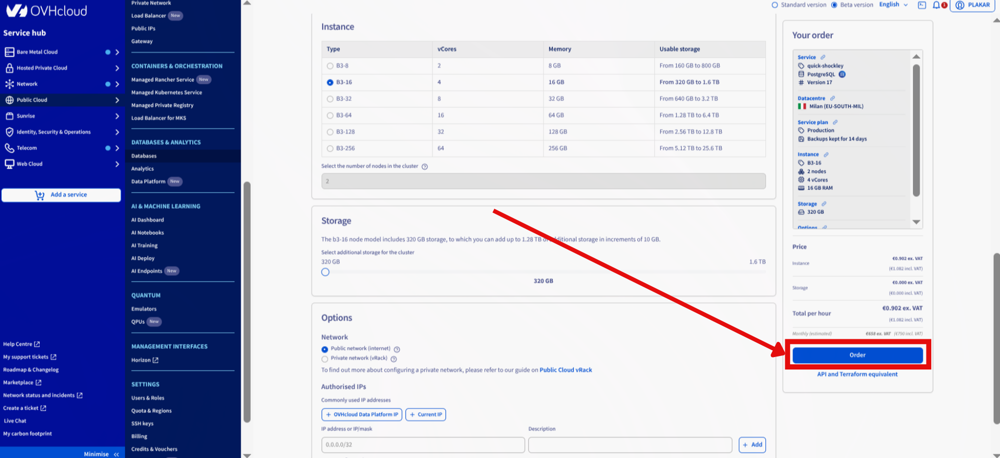
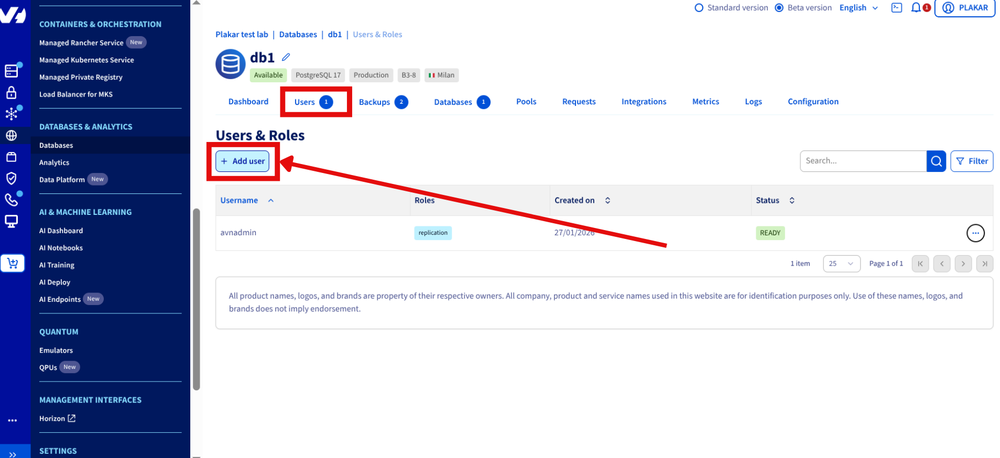
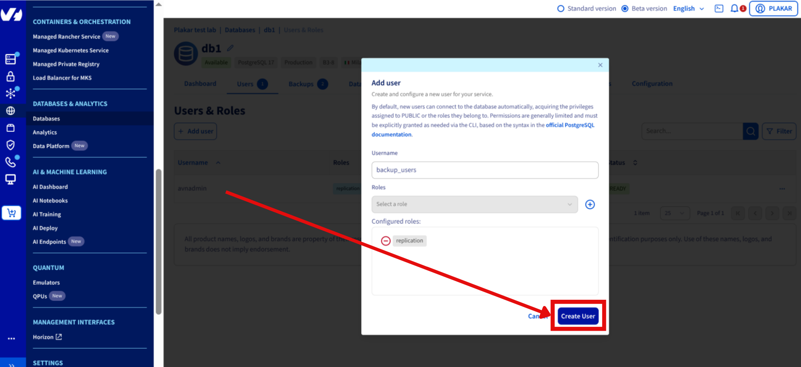
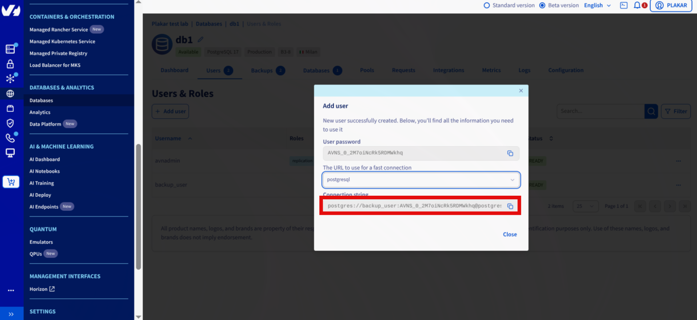

# Backing Up an OVHcloud Managed PostgreSQL Database

This guide backs up an OVHcloud Managed PostgreSQL database using `pg_dump`
streamed through Plakar to OVHcloud Object Storage. The result is an encrypted,
deduplicated snapshot stored separately from your database infrastructure.

## Architecture

<!-- prettier-ignore-start -->

flowchart TB

subgraph Client["Backup Client"]
  PGDump["pg_dump"]
  Plakar["Plakar<br/>stdin integration"]
end

subgraph DB["OVHcloud Managed PostgreSQL"]
  Postgres["PostgreSQL"]
end

subgraph Storage["OVHcloud S3 Object Storage"]
  S3["Kloset Store<br/>(Encrypted & Deduplicated)"]
end

Postgres -->|SQL dump| PGDump
PGDump -->|stdin| Plakar
Plakar -->|Snapshots| S3


<!-- prettier-ignore-end -->

## Prerequisites

- OVHcloud account with billing configured
- Plakar installed on backup client
- PostgreSQL client tools (`pg_dump`)
- OVHcloud Object Storage bucket configured

## Create PostgreSQL Database

### Provision database

1. Log in to OVHcloud Control Panel
2. Go to **Public Cloud** → **Databases & Analytics** → **Databases**
3. Click **Create a service**
4. Configure:
   - Database name
   - Engine: PostgreSQL
   - Version: 14-18 (OVHcloud supported)
   - Instance: Select vCores, memory, storage
   - Network: Public network
5. Click **Order**




### Create backup user

1. Open PostgreSQL database in dashboard
2. Go to **Users** tab
3. Click **Add user**
4. Configure:
   - Username: `backup_user`
   - Role: `replication`
5. Save connection string





## Install Tools

Install PostgreSQL client:

```bash
$ sudo apt update
$ sudo apt install postgresql-client
```

Install Plakar using the [installation guide](../../../quickstart/installation).

## Configure PostgreSQL Connection

Set environment variables from connection string:

```bash
$ export PGHOST=<DB_HOST>
$ export PGPORT=5432
$ export PGUSER=<DB_USER>
$ export PGPASSWORD=<DB_PASSWORD>
```

Test connection:

```bash
$ psql -X <DB_NAME>
```

Exit with `\q`.

## Configure Object Storage

### Install S3 integration

```bash
$ plakar login -email you@example.com
$ plakar pkg add s3
```

### Create Object Storage bucket

If not already configured, follow:
[OVHcloud Object Storage setup](../ovhcloud-as-a-dedicated-backup-server/#configure-object-storage)

### Add Kloset store

```bash
$ plakar store add ovhcloud-s3-postgres \
  location=s3://<S3_ENDPOINT>/<BUCKET_NAME> \
  access_key=<ACCESS_KEY> \
  secret_access_key=<SECRET_KEY> \
  use_tls=true
```

Replace:

- `<S3_ENDPOINT>`: e.g., `s3.eu-west-par.io.cloud.ovh.net`
- `<BUCKET_NAME>`: e.g., `plakar-backups`
- `<ACCESS_KEY>` and `<SECRET_KEY>`: From OVHcloud Control Panel

### Initialize store

```bash
$ plakar at "@ovhcloud-s3-postgres" create
```

## Back Up Database

Run backup:

```bash
$ pg_dump <DB_NAME> | plakar at "@ovhcloud-s3-postgres" backup stdin:dump.sql
```

Verify:

```bash
$ plakar at "@ovhcloud-s3-postgres" ls
```

## Restore Database

Retrieve snapshot ID:

```bash
$ plakar at "@ovhcloud-s3-postgres" ls
```

Restore:

```bash
$ plakar at "@ovhcloud-s3-postgres" cat <SNAPSHOT_ID>:dump.sql | psql <DB_NAME>
```

## Automate Backups

Create cron job for daily backups:

```bash
$ crontab -e
```

Add:

```bash
0 2 * * * pg_dump <DB_NAME> | plakar at "@ovhcloud-s3-postgres" backup stdin:dump-$(date +\%Y\%m\%d).sql
```

## Troubleshooting

**Connection refused**

- Verify `PGHOST`, `PGPORT`, `PGUSER`, `PGPASSWORD` environment variables
- Check network access to managed database

**Authentication failed**

- Confirm backup user has `replication` role
- Verify password in connection string

**S3 upload errors**

- Check S3 credentials: `plakar store show ovhcloud-s3-postgres`
- Verify endpoint URL and bucket name
- Confirm bucket exists in OVHcloud dashboard

**pg_dump not found**

- Install PostgreSQL client: `sudo apt install postgresql-client`

