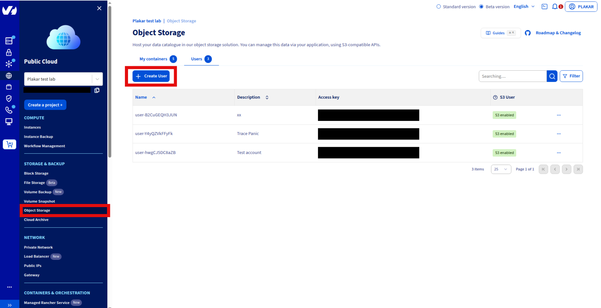
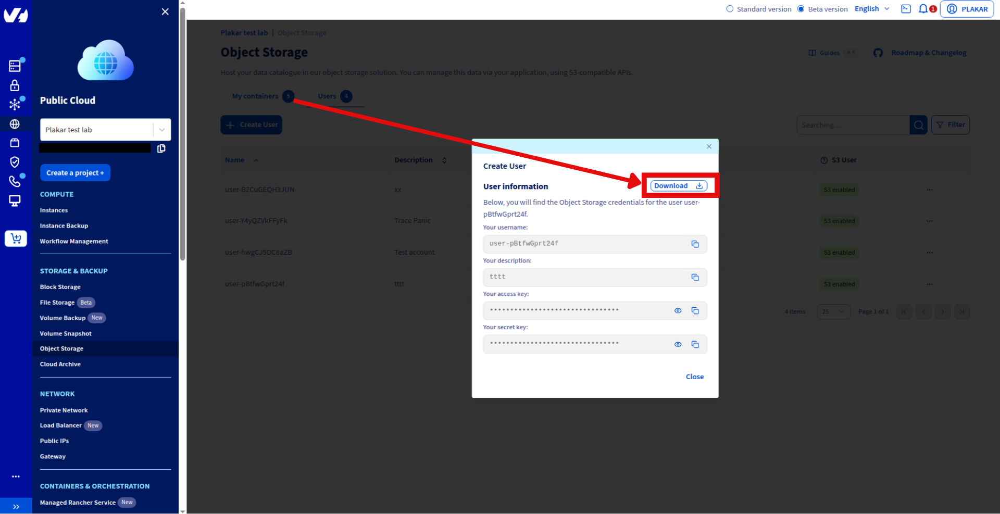
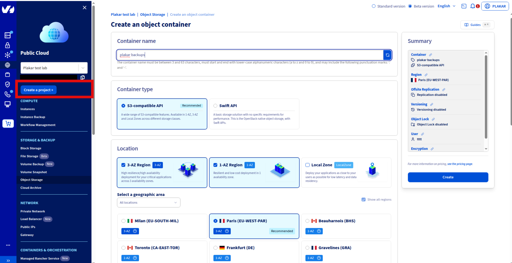
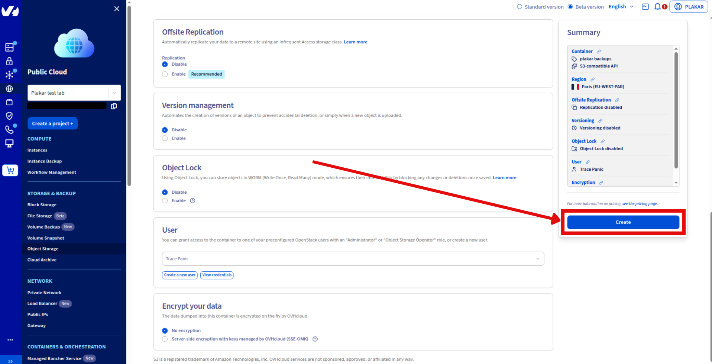
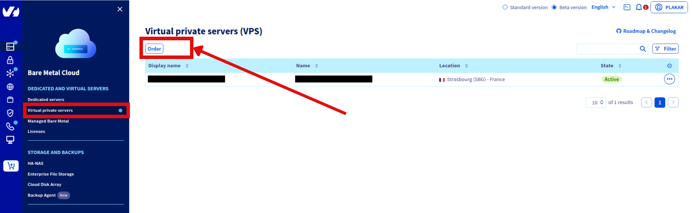
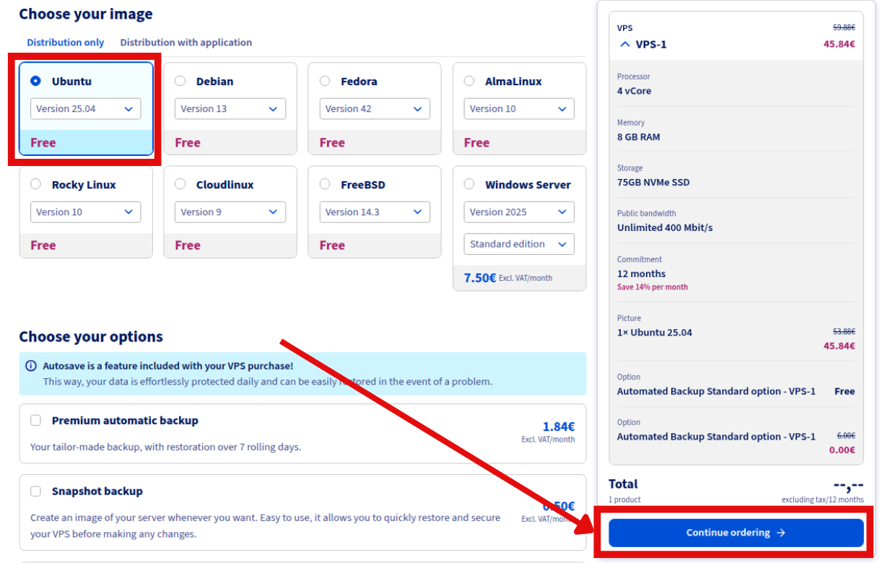

# Using OVHcloud VPS as a Dedicated Backup Server

This guide configures an OVHcloud VPS to automatically back up your servers to
Object Storage. The setup uses Plakar to create encrypted, deduplicated
snapshots on a scheduled interval with web UI monitoring.

## Architecture

- **Backup VPS**: Runs Plakar and schedules backups
- **Source servers**: OVHcloud servers to back up
- **OVHcloud Object Storage**: Stores encrypted backups

<!-- prettier-ignore-start -->

flowchart TB
subgraph Sources["Source Servers"]
  Server1["Web Server 1"]
  Server2["Web Server 2"]
  ServerN["Server N"]
end

BackupVPS["Backup VPS<br/>Plakar + Scheduler"]

subgraph Storage["OVHcloud Object Storage"]
  Kloset["Kloset Store<br/>Encrypted & Deduplicated<br/>Backup"]
end

Server1 -->|SSH/SFTP| BackupVPS
Server2 -->|SSH/SFTP| BackupVPS
ServerN -->|SSH/SFTP| BackupVPS
BackupVPS -->|Store Snapshots| Kloset


<!-- prettier-ignore-end -->

## Prerequisites

- OVHcloud account with billing configured
- SSH access to source servers
- Basic familiarity with Plakar commands





## Create Object Storage

### Create storage user

1. Log in to OVHcloud Control Panel
2. Navigate to **Public Cloud** → **Storage & Backup** → **Object Storage** →
   **Users**
3. Click **Create User**
4. Enter description and click **Create**
5. Download and store credentials securely




### Create storage container

1. Navigate to **Public Cloud** → **Storage & Backup** → **Object Storage**
2. Click **Create an Object Storage** container
3. Configure:
   - Name: `plakar-backups`
   - Container API: S3-compatible API
   - User: Select the user created above
   - Deployment: Choose 3-AZ (high availability) or 1-AZ (cost efficient)
   - Region: Select location closest to your servers
4. Click **Create**




Reference:
[OVHcloud S3 Object Storage documentation](https://help.ovhcloud.com/csm/fr-documentation-public-cloud-storage-object-storage-s3?id=kb_browse_cat&kb_id=574a8325551974502d4c6e78b7421938&kb_category=8eaef5882c21fe144a4e082b79ed2fb9&spa=1)





## Provision Backup VPS

### Order VPS

1. Go to **Bare Metal Cloud** → **Dedicated and Virtual Servers** → **Virtual
   Private Servers**
2. Click **Order** → **Configure your VPS**
3. Select configuration:
   - Model: VPS-1 (2 vCores, 8 GB RAM, 75GB Storage) or larger
   - Region: Same as Object Storage
   - Image: Ubuntu 25.04
4. Complete order




### Initial connection

Connect using credentials from delivery email:

```bash
ssh ubuntu@your_vps_ip
```

Change the temporary password when prompted, then reconnect.

Reference:
[OVHcloud VPS Getting Started guide](https://help.ovhcloud.com/csm/fr-vps-getting-started?id=kb_article_view&sysparm_article=KB0047736)





## Install Plakar

SSH to the backup VPS and install Plakar:

```bash
ssh ubuntu@your-vps-ip
```

Follow the
[Plakar Installation Guide](../../../../../docs/community/main/quickstart/installation/)





## Configure Object Storage

### Install S3 integration

```bash
$ plakar pkg add s3
```

### Add storage connector

```bash
$ plakar store add ovhcloud-s3-backups \
  location=s3://<S3_ENDPOINT>/<BUCKET_NAME> \
  access_key=<YOUR_ACCESS_KEY_ID> \
  secret_access_key=<YOUR_SECRET_ACCESS_KEY> \
  use_tls=true \
  passphrase='<YOUR_SECURE_PASSPHRASE>'
```

Replace:

- `<S3_ENDPOINT>`: e.g., `s3.eu-west-par.io.cloud.ovh.net`
- `<BUCKET_NAME>`: e.g., `plakar-backups`
- `<YOUR_ACCESS_KEY_ID>` and `<YOUR_SECRET_ACCESS_KEY>`: From Step 1
- `<YOUR_SECURE_PASSPHRASE>`: Strong passphrase for encryption

> [!NOTE]+
>
> Passphrase Configuring the passphrase in the store enables automated backups
> without prompts.

### Initialize Kloset Store

```bash
$ plakar at "@ovhcloud-s3-backups" create
```





## Configure SSH Access

### Install SFTP integration

```bash
$ plakar pkg add sftp
```

### Generate SSH keys

```bash
$ ssh-keygen -t ed25519 -f ~/.ssh/id_ed25519_plakar -C "plakar@backup"
```

Press Enter for no passphrase.

### Copy keys to source servers

```bash
$ ssh-copy-id -i ~/.ssh/id_ed25519_plakar.pub user@source-server-1
$ ssh-copy-id -i ~/.ssh/id_ed25519_plakar.pub user@source-server-2
```

Test access:

```bash
$ ssh -i ~/.ssh/id_ed25519_plakar user@source-server-1 'echo "Success"'
```

### Create SSH aliases

```bash
$ cat >> ~/.ssh/config << 'EOF'
Host source-1
  HostName source-server-1.example.com
  User backupuser
  Port 22
  IdentityFile ~/.ssh/id_ed25519_plakar

Host source-2
  HostName source-server-2.example.com
  User backupuser
  Port 22
  IdentityFile ~/.ssh/id_ed25519_plakar
EOF
```

Test:

```bash
$ ssh source-1 'echo "Alias works"'
```





## Configure Backup Sources

Add source connectors for each server:

```bash
$ plakar source add web-server-1 sftp://source-1:/var/www
$ plakar source add web-server-2 sftp://source-2:/var/www
```

Verify:

```bash
$ plakar source show
```





## Test Backup

Run a manual backup to verify configuration:

```bash
# Single source
$ plakar at "@ovhcloud-s3-backups" backup "@web-server-1"

# Multiple sources
$ plakar at "@ovhcloud-s3-backups" backup "@web-server-1" "@web-server-2"
```

List snapshots:

```bash
$ plakar at "@ovhcloud-s3-backups" ls
```





## Schedule Automatic Backups

### Create scheduler configuration

```bash
$ cat > ~/scheduler.yaml << 'EOF'
agent:
  tasks:
    - name: Backup web-server-1
      repository: "@ovhcloud-s3-backups"
      backup:
        path: "@web-server-1"
        interval: 24h
        check: true

    - name: Backup web-server-2
      repository: "@ovhcloud-s3-backups"
      backup:
        path: "@web-server-2"
        interval: 24h
        check: true
EOF
```

> [!NOTE]+
>
> Scheduler The scheduler is basic and will be improved in future versions.

### Start scheduler

```bash
$ plakar scheduler start -tasks ~/scheduler.yaml
```

See
[Scheduler Documentation](../../../../../docs/community/main/guides/setup-scheduler-daily-backups/)
for more scheduling options.





## Configure Systemd Services

### Create scheduler service

```bash
$ cat << 'EOF' | sudo tee /etc/systemd/system/plakar-scheduler.service > /dev/null
[Unit]
Description=Plakar Scheduler
After=network.target

[Service]
Type=forking
ExecStart=/usr/bin/plakar scheduler start -tasks /home/ubuntu/scheduler.yaml
ExecStop=/usr/bin/plakar scheduler stop
Restart=on-failure
User=ubuntu
WorkingDirectory=/home/ubuntu

[Install]
WantedBy=multi-user.target
EOF
```





## Access Web UI

### Option 1: Custom token (recommended)

Update the UI service with a custom token:

```bash
$ cat << 'EOF' | sudo tee /etc/systemd/system/plakar-ui.service > /dev/null
[Unit]
Description=Plakar Web UI
After=network.target

[Service]
Type=simple
Environment="PLAKAR_UI_TOKEN=your-secure-token-here"
ExecStart=/usr/bin/plakar at "@ovhcloud-s3-backups" ui -listen :8080
Restart=always
User=ubuntu
WorkingDirectory=/home/ubuntu

[Install]
WantedBy=multi-user.target
EOF
```

Reload and restart:

```bash
$ sudo systemctl daemon-reload
$ sudo systemctl restart plakar-ui
```

Access: `http://your-vps-ip:8080?plakar_token=your-secure-token-here`

### Option 2: Auto-generated token

Retrieve the token from logs:

```bash
$ sudo journalctl -u plakar-ui -n 100 --no-pager | grep -i token
```

Look for:

```bash
launching webUI at http://:8080?plakar_token=d9fccdbd-77a3-41a0-8657-24d77a6d00ac
```

Access: `http://your-vps-ip:8080` with the token from the URL.

> [!WARNING]+
>
> Security Configure firewall to restrict port 8080 access or use a reverse
> proxy with SSL.





## Troubleshooting

**Authentication errors**

- Verify SSH keys and user permissions on source servers

**Can't connect to Object Storage**

- Check S3 credentials and endpoint URL
- Verify passphrase: `plakar store show ovhcloud-s3-backups`

**Permission denied**

- Ensure SSH user has read access to backup directories

**Services won't start**

- Check status: `systemctl status plakar-scheduler`
- View logs: `journalctl -u plakar-scheduler` or `journalctl -u plakar-ui`

**Alternative UI access**

- Install Plakar locally and configure the same store with OVHcloud S3
  credentials to access backups without VPS connection

