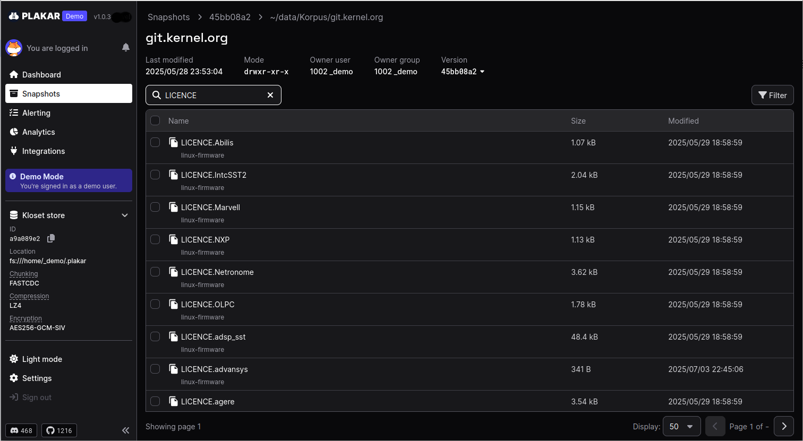

# Quickstart

This guide gets you started in minutes. You'll create your first backup
snapshot, verify it's secure, and learn how to restore your files.

**Plakar** makes backups simple and secure by default. Every backup is
end-to-end encrypted, deduplicated to save space, and stored as an independent
snapshot you can restore at any time without depending on previous backups.

If you've used traditional backup tools, here's what's different: instead of
incremental archives that chain together, Plakar creates self-contained
snapshots. You can delete old snapshots without breaking newer ones, compare any
two snapshots directly, and trust that your data is tamper-evident and encrypted
before it ever leaves your machine.

## Requirements

Make sure **Plakar** is installed on your system. If you haven't done this yet,
please refer to the [installation guide](../installation) for detailed
instructions.





## Create a Kloset Store

Before we can back up any data, we need to define where the backup will go. In
**plakar** terms, this storage location is called a **Kloset Store**. This is
where Plakar keeps your backups. Think of it like a safe folder for snapshots.
You can find out more about the concept and rationale behind Kloset in
[this post on our blog](https://www.plakar.io/posts/2025-04-29/kloset-the-immutable-data-store/).

For our first backup, we will create a local Kloset Store on the filesystem of
the host OS. In a real backup scenario you would want to store backups on a
different physical device, so substitute in a better location if you have one.

In your terminal, run the following command:

```bash
$ plakar at $HOME/backups create
```

> [!WARNING]+ Don't Lose or Forget your Passphrase Be extra careful when
> choosing the passphrase. People with access to the Kloset Store and knowledge
> of the passphrase can read your backups.
>
> By default **Plakar** will enforce rules on your choice of passphrase to make
> sure it is complex enough to be secure. To add complexity, use a mixture of
> upper and lower case characters, numbers and symbols.
>
> Your passphrase is not stored anywhere and **cannot** be recovered in case of
> loss. A lost passphrase means the data within the repository can no longer be
> accessed or recovered.





## Create your first backup

Now that we have created the Kloset Store where data will be stored, we can use
it to create our first backup. **Plakar** uses the `at` keyword to specify the
Kloset Store to use.

To create a simple example backup, try running:

```bash
$ plakar at $HOME/backups backup $HOME/Documents
```

This backs up your Documents folder into the `$HOME/backups`. Replace the paths
with any folder or storage location you prefer to do plakar operations on.

**Plakar** will process the files it finds at that location (in this case the
Documents folder) and pass them to the Kloset where they will be chunked and
encrypted.

The output will indicate the progress:

```bash
dd62691d: OK ✓ /home/user/Documents/Obsidian/NOTES.md
dd62691d: OK ✓ /home/user/Documents/budget.xlsx
dd62691d: OK ✓ /home/user/Documents/notes.txt
[...]
dd62691d: OK ✓ /home/user/Documents
dd62691d: OK ✓ /home/user
dd62691d: OK ✓ /home
dd62691d: OK ✓ /
info: backup: created unsigned snapshot dd62691d of size 6.4 KiB in 125.317267ms (wrote 577 KiB)
```

The output lists the short form of the snapshot ID. This is used to identify a
particular snapshot and is also how you identify the snapshot to use for various
**Plakar** commands.

> [!NOTE]+ The help command Learning new tools can be confusing. To make things
> easier, **Plakar** includes built-in help for all commands. Just use
> `plakar help` and then the command you need help with for a full list of
> options and examples. For example, if you forget what the options are for
> restoring files from a snapshot: `plakar help restore`





## List snapshots

You can verify that the backup exists with the `ls` command, which returns the
backups in that Kloset Store:

```bash
$ plakar at $HOME/backups ls
2026-01-14T06:45:32Z   dd62691d   6.4 KiB        0s /home/user/Documents
```

The output lists the date of the last backup, the short UUID, the size of files
backed-up, the time it took to create the backup and the source path of the
backup.





## Verify integrity

It's always a good idea to verify the integrity of your backups. You can do this
with the `check` command. This will read back the data from the Kloset Store,
decrypt it and verify its integrity by recomputing checksums.

```bash
$ plakar at $HOME/backups check dd62691d
info: dd62691d: ✓ /home/user/Documents
info: dd62691d: ✓ /home/user/Documents/Obsidian
info: dd62691d: ✓ /home/user/Documents/code_samples
[...]
info: dd62691d: ✓ /home/user/Documents/Obsidian/NOTES.md
info: dd62691d: ✓ /home/user/Documents/recipes/ingredients.csv
info: dd62691d: ✓ /home/user/Documents/resume.pdf
info: dd62691d: ✓ /home/user/Documents/project_proposal.docx
info: check: verification of dd62691d:/home/user/Documents completed successfully
```

In production, you would typically run this command periodically to ensure the
integrity of your backups over time. This is necessary to ensure that data has
not degraded or become corrupted while stored.





## Restore files from a backup

You can restore files from a backup using the `restore` command. In this case,
we are restoring the snapshot we just created to another directory called
`restored`.

```bash
$ plakar at $HOME/backups restore -to $HOME/restored dd62691d
info: dd62691d: OK ✓ /home/user/Documents
info: dd62691d: OK ✓ /home/user/Documents/Obsidian
info: dd62691d: OK ✓ /home/user/Documents/budget.xlsx
[...]
info: dd62691d: OK ✓ /home/user/Documents/recipes/desserts.txt
info: dd62691d: OK ✓ /home/user/Documents/recipes/dinner.txt
info: dd62691d: OK ✓ /home/user/Documents/resume.pdf
info: dd62691d: OK ✓ /home/user/Documents/recipes/ingredients.csv
info: restore: restoration of dd62691d:/home/user/Documents at /home/user/restored completed successfully
```

To verify the files have been re-created, list the directory they were restored
to. Note that the properties of the restored files, such as timestamps and
permissions, will match the original files:

```bash
$ ls -l $HOME/restored/Documents/
total 36
-rw-r--r-- 1 user user   30 Jan 14 06:31 budget.xlsx
drwxr-xr-x 2 user user 4096 Jan 14 06:31 code_samples
-rw-r--r-- 1 user user   28 Jan 14 06:31 notes.txt
[...]
-rw-r--r-- 1 user user   36 Jan 14 06:31 presentation.pptx
-rw-r--r-- 1 user user   40 Jan 14 06:31 project_proposal.docx
drwxr-xr-x 2 user user 4096 Jan 14 06:31 recipes
-rw-r--r-- 1 user user   29 Jan 14 06:31 resume.pdf
```





## Access the UI

Plakar provides a web interface to view the backups and their content. To start
the web interface, run:

```bash
$ plakar at $HOME/backups ui
```

Your default browser will open a new tab. You can navigate through the
snapshots, search and view the files, and download them.




A public instance of the web UI is also available at
[https://demo.plakar.io](https://demo.plakar.io). You can use it to explore the
features of the UI on real backups without installing anything.





## Congratulations!

You have successfully:

- created a backup
- verified it
- restored files
- used the graphical UI

How long did it take? This is how easy **Plakar** is for simple, secure backups.

## Next steps

Having a backup on the filesystem is a start, but to improve the durability of
your backups, you should consider hosting multiple copies in different
locations.

Continue to the [Part 2 of the Quickstart](../synchronize-copies) to create
multiple copies of your backups.

