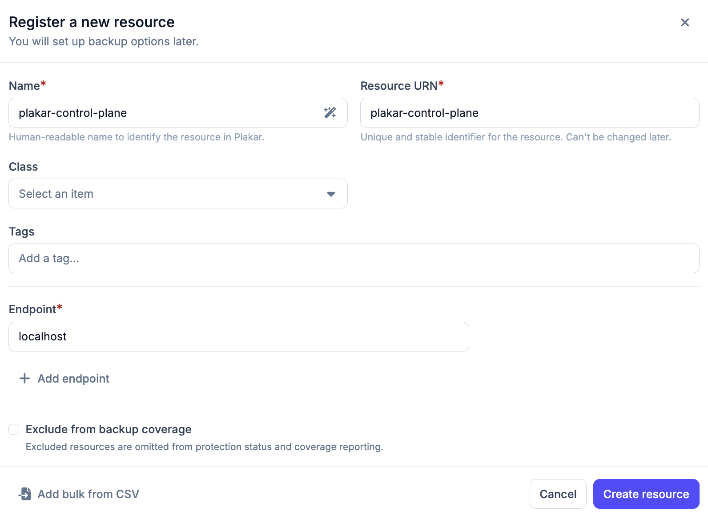
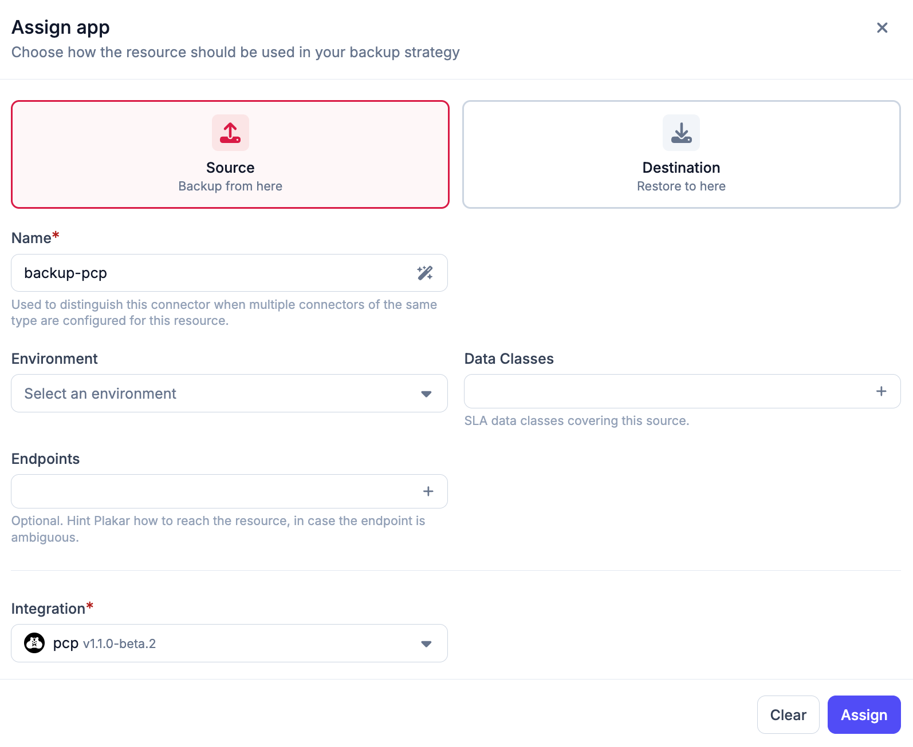
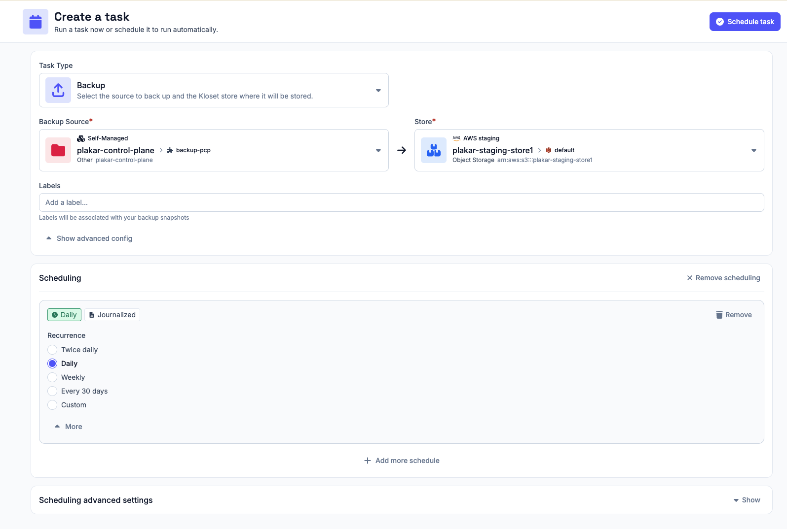

# Backing Up Plakar Control Plane

Plakar Control Plane can back up its own configuration and database using the
same backup workflow you use for any other resource. The process follows the
standard steps: create an inventory, register the resource, attach a source app,
and schedule a backup task.





## Create a self-managed inventory

If you do not already have a self-managed inventory to hold the Plakar Control
Plane resource, create one now. See
[Self-Managed Inventory](../../../infrastructure/inventories/self-managed) for
instructions.





## Register the Plakar Control Plane resource

Inside your self-managed inventory, add a new resource manually with the
following values:

| Field        | Value                                             |
| ------------ | ------------------------------------------------- |
| **Name**     | `Plakar Control Plane` (or any name you prefer)   |
| **URN**      | `plakar-control-plane` (or any unique identifier) |
| **Hostname** | `localhost`                                       |





## Add a source app using the PCP integration

Once the resource is created, open it and go to the **Apps** tab. Add a
**Source** app and select the **PCP** integration (PCP stands for Plakar Control
Plane).





## Schedule a backup task

With the source app in place, create a backup task to run it on a schedule. You
can do this from the app's dashboard or from **Operations > Scheduling**.

Select your PCP source app as the source and choose a store app as the
destination. Configure a schedule that fits your recovery point objective.

See [Scheduling](../../../operations/scheduling) for full details on creating
tasks.





## What the backup contains

Once a backup task completes, you can browse the snapshot contents like any
other backup. A Plakar Control Plane snapshot includes:

- Important configuration files
- A database dump of the Plakar Control Plane internal database

If you need to recover from this snapshot, see
[Restoring Plakar Control Plane](./restore).

