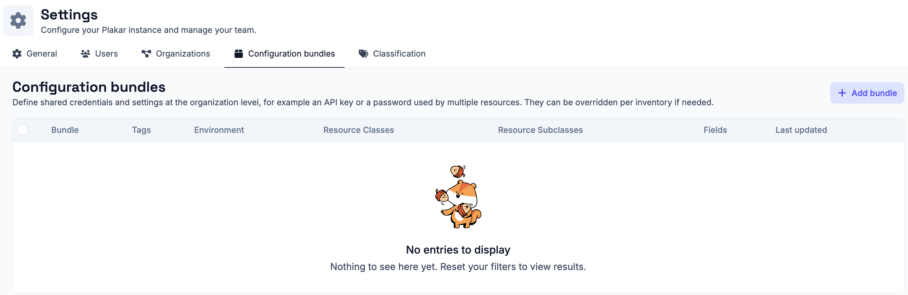
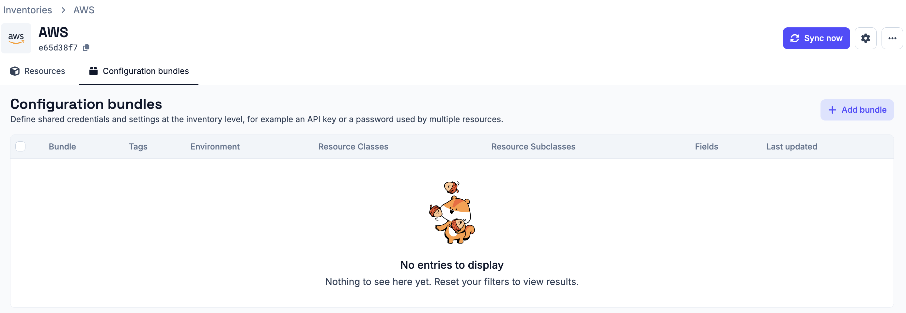
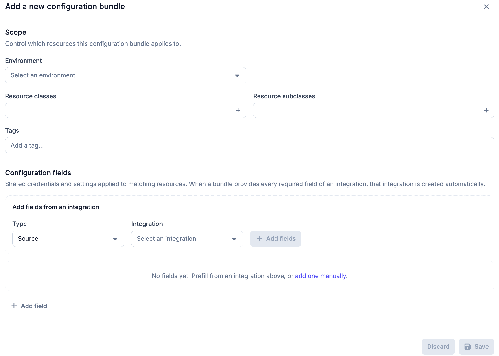
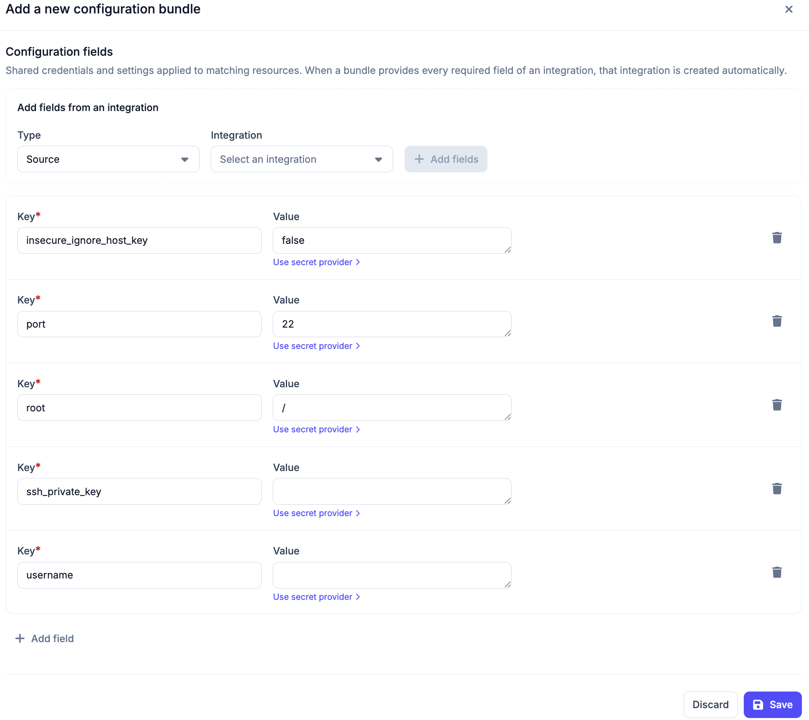

# Configuration Bundles

Configuration bundles let you define shared credentials and settings and apply
them automatically to matching resources. Instead of configuring the same
credentials on each resource individually, you define them once in a bundle and
Plakar Control Plane distributes them across matching resources.

This is especially useful when many resources share the same credentials. For
example, an AWS inventory might discover 20 S3 buckets that all use the same IAM
access key and secret key; instead of entering those credentials on each bucket
individually, a single bundle scoped to Object Storage resources applies them
everywhere at once, and keeps them in sync if the credentials ever change.

## Organization vs. inventory bundles

There are two kinds of configuration bundles. They work identically in every
other respect (same scope filters, same configuration fields, same behavior);
the only difference is where they're created and how broadly they apply:

- **Organization bundles** are created under **Settings > Configuration
  Bundles** and apply to matching resources across every inventory in the
  organization.

  

- **Inventory bundles** are created from an inventory's details page, under its
  **Configuration Bundles** tab, and apply only to matching resources within
  that inventory.

  

If a resource matches both an organization bundle and an inventory bundle, and
both provide a value for the same field, the **inventory bundle takes
priority**.

## Creating a configuration bundle

Open the relevant location (**Settings > Configuration Bundles** for an
organization bundle, or an inventory's **Configuration Bundles** tab for an
inventory bundle) and click **Add bundle**. The bundle form has two sections:
**Scope** and **Configuration fields**.

### Scope

Scope controls which resources the bundle applies to. By default a bundle
applies to all sources (within the organization, or within the inventory,
depending on bundle type); the following filters narrow that down and are
cumulative, meaning a resource must match all of them to receive the bundle:

- **Environment**: restricts the bundle to sources with a matching environment
  value.
- **Resource classes**: restricts the bundle to specific resource classes, such
  as Database or Object Storage. Multiple classes can be selected.
- **Resource subclasses**: further narrows by subclass, for example `Mysql` or
  `Azblob`. Only subclasses belonging to the resource classes you've selected
  are available here.
- **Tags**: restricts the bundle to resources that carry the specified tags.
  Multiple tags can be added. For managed inventories, Plakar Control Plane
  discovers resource tags automatically from the provider. For self-managed
  inventories, tags are set when
  [adding a resource manually](../../infrastructure/inventories/self-managed/#adding-resources).

### Configuration fields

Configuration fields are the key-value pairs the bundle distributes to matching
resources. There are two ways to add them:

**Add fields from an integration**

1. Choose the **Type**: `Source`, `Store` or `Destination`.
2. Choose the **Integration**, for example `scaleway`.
3. If the integration exposes more than one protocol (for example
   `scaleway-instance` vs. `scaleway-block`), choose the **Protocol**.
4. Click **Add fields**. This populates the field list with every key that
   integration and protocol require, empty and ready to fill in.

**Add fields manually**

Click **Add field** at the bottom of the Configuration fields section to add
extra key-value pairs beyond what an integration prefills.

Each field's value can be entered directly, or you can click **Use secret
provider** next to that field to source the value from a
[secret provider](../../secret-providers) instead of storing it as plain text.

## App setup

Bundles take effect when you assign a source or destination app, or create a
store app, on a matching resource. See the [apps](../../apps) documentation for
more on how apps work. Any configuration fields already supplied by a matching
bundle are filled in for you; you only need to fill in the remaining fields
yourself. If every required field for the selected integration ends up filled,
whether from the bundle or manually, Control Plane creates the app
automatically.

