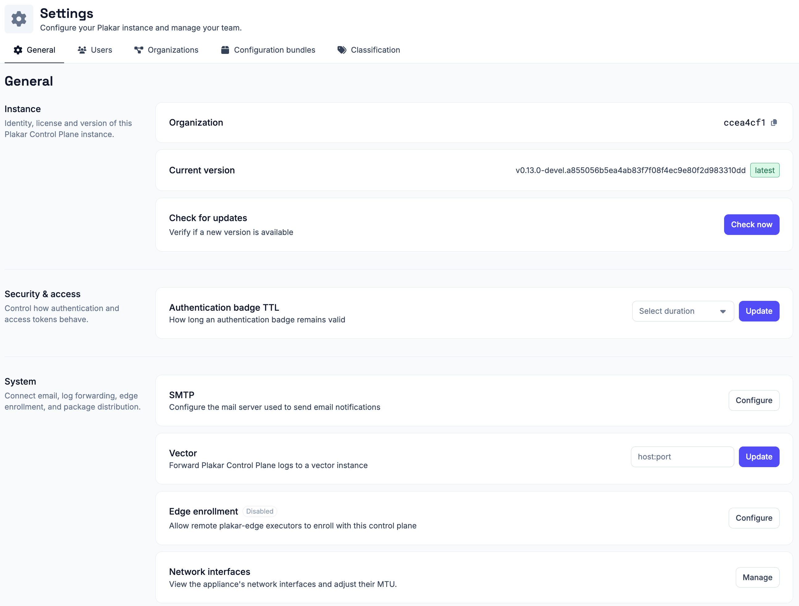
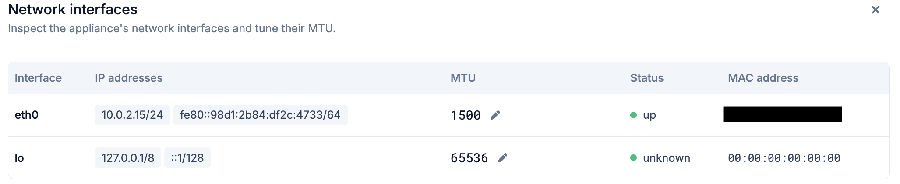

# General Settings

The general settings page lets you check your instance's identity and version,
control security and access, connect email and log forwarding, manage edge
enrollment and notifications, export diagnostics, and manage early-access
features.

## Organization

Shows your organization's unique identifier.

## Current version

Shows the version of Plakar Control Plane currently running.

## Check for updates

Click **Check now** to verify whether a newer version of Plakar Control Plane is
available. See [Updating Control Plane](../updating-control-plane) for how to
install updates and, where needed, update the underlying deployment
infrastructure.

## Authentication badge TTL

The authentication badge indicates the current authentication status of your
Plakar Control Plane session. Configure how long the badge remains valid after
authentication, then click **Update** to apply the new time-to-live (TTL).

## SMTP

Configure the SMTP server used by Plakar Control Plane to send outgoing emails,
including notifications and other system-generated messages. See
[Email & SMTP](../email-and-smtp) documentation for configuration details.

## Vector

Forward Plakar Control Plane logs to a Vector instance you manage. Plakar
Control Plane runs its own internal Vector instance for local log processing;
this setting adds the instance you provide as an additional
[Vector sink](https://vector.dev/docs/reference/configuration/sinks/vector/), so
a copy of the logs is forwarded there rather than replacing local processing.

Enter the target instance's address as `host:port` and click **Update** to
apply.

## Edge enrollment

Enable edge enrollment to allow new edge executors to register with your Plakar
Control Plane instance. Once enabled, you can generate or regenerate the
enrollment key used during the initial registration process. See
[Edges](../../infrastructure/edges) documentation for more information.

## Network interfaces

Click **Manage** to view and configure the appliance's network interfaces. The
network interface table shows each interface's name, IP address, link status,
MAC address, and current MTU.

To change an interface's MTU, click the pencil icon next to the current value,
enter the new MTU, and save your changes.

The default MTU is **1500 bytes**, which is appropriate for most Ethernet
networks. Increase the MTU only if every device along the network path supports
the larger frame size. Using an MTU larger than the network can handle may
result in packet fragmentation, dropped packets, or connectivity issues rather
than improved performance.

For more information about MTU values and jumbo frames, see
[MTU and Jumbo Frames](../../guides/mtu-and-jumbo-frames) documentation.

## Package repository

By default, Plakar Control Plane downloads the integrations index and packages
from `plakar.io`. In environments without internet access, such as air-gapped
deployments, you can instead configure an internal package repository.

Enter the URL of a web server hosting the integrations index and `.ptar`
packages, then click **Update**. Leave the field empty to use the default
`plakar.io` repository.

For air-gapped deployments, see [air-gapped enrollment](../intro/air-gapped) for
the complete enrollment process and
[hosting a package repository](../../guides/self-hosted-package-repository) for
instructions on setting up a local repository.

## Webhook

Deliver Plakar Control Plane events, such as job completions and failures, to an
external endpoint as HTTP requests. See [Webook](../webhooks) documentation for
more information.

## Plakar Control Plane logs

Download Plakar Control Plane's own logs for diagnostics and troubleshooting.
Pick a date and click **Download** to get a `.log.gz` file containing that day's
logs.

## Plakar Control Plane database

Download a full dump of the Plakar Control Plane internal database, as `SQL`,
`GZIP`, or `ZIP`. Select the format and click **Download**.

## Debug logging

Enable `DEBUG` logging to temporarily increase the level of detail recorded in
Plakar Control Plane logs while troubleshooting an issue. Select how long debug
logging should remain enabled, then click **Enable**. Once the selected duration
expires, Plakar Control Plane automatically restores the previous log level.

## UI preview mode

Enable preview mode to access early features. They may be unpolished, but let
you explore them and give feedback before release.

