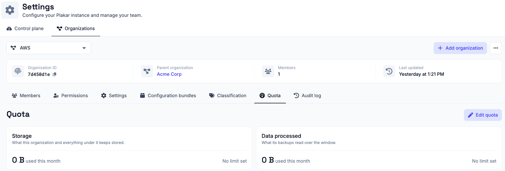

# Managing Organizations

Organizations partition a Plakar Control Plane instance into isolated
administrative domains. They allow a single deployment to manage multiple teams,
business units, customers, or environments while keeping their configuration and
operational data separate.

Every Plakar Control Plane deployment contains a root organization that is
created during the [initial setup (enrollment)](../../intro/enrollment), or
during [air-gapped enrollment](../../intro/air-gapped) on instances without
outbound connectivity. Additional organizations can be created beneath it,
forming a hierarchy. Each organization has a single parent and may contain any
number of child organizations.

For example:

```text
Root
├── AWS
│   ├── S3
│   └── EC2
└── VMware
    ├── Production
    └── Development
```

This hierarchy can be extended to any depth, allowing organizations to be
structured in whatever way best matches your operational or administrative
requirements.

## Organization isolation

Every object in Plakar Control Plane belongs to a single organization. This
includes [inventories](../../infrastructure/inventories), [apps](../../apps),
[policies](../../compliance/policies), and most other configuration and
operational objects.

[Users](../users) are the exception. A user identity is shared across the whole
deployment and is identified by an email address. What is scoped to an
organization is the user's membership of it, along with the permissions granted
there.

An organization's [settings](../settings/organization) and
[configuration bundles](../configuration-bundles) are scoped the same way, so
each organization is configured independently of the others.

Every other object is scoped to the organization in which it was created. Users
operating within an organization can view and manage only the objects that
belong to that organization.

For example, if separate **AWS** and **VMware** organizations exist beneath the
root organization, users operating in the **AWS** organization cannot view or
manage VMware inventories, resources, jobs, or other objects. Likewise, users in
the **VMware** organization cannot reach anything owned by **AWS**.

## Organization context

Users always operate within the context of a single organization. That context
determines which objects exist for them at all. Within it, what they can see and
do is determined by the role they hold there, described in
[Permissions](../permissions).

The context is chosen at sign-in. The account you sign in with selects the
organization, so a user who belongs to several organizations works in one of
them at a time. See [Signing In](../signing-in) for how an account selects an
organization.

Because the context is fixed for the session, there is no way to move between
organizations while signed in. To work in a different organization, sign out and
sign in again using that organization's identifier. For example, a user who is a
member of both the **AWS** and **VMware** organizations signs in to whichever of
the two they intend to work in, and cannot reach the root organization at all
unless they are also a member of it.

## Root organization

The root organization sits at the top of the hierarchy, but reaching more than
one organization is a matter of [permissions](../permissions) rather than of
being in the root. A [Superuser](../permissions/superuser) reaches the instance
itself and therefore every organization on it. Anyone else reaches only what
their own role covers, in the organizations they are a member of.

Organizations you can reach are administered from **Settings** ->
**Organizations**, where each one is selected and configured in place, without
changing the organization you signed in to. See
[Organization Settings](../settings/organization) for what can be configured
there.

However they are administered, objects remain owned by the organization in which
they were created. This isolation allows multiple independent administrative
domains to coexist within a single Plakar Control Plane deployment while
remaining centrally managed.

A few things belong to the instance rather than to any organization, such as
[Control Plane settings](../settings/control-plane) and the license. Those are
reached only by the **Superuser**, the admin account created when the instance
was first set up.

## Roles and permissions

A user's access within an organization is determined by the role assigned to
them there. Roles are scoped the same way objects are, so the same user can hold
a different role in each organization they belong to, and nothing granted in one
carries over to another.

A user added to an organization starts with no permissions and cannot do
anything there until a role is assigned.

See [Permissions](../permissions) for the roles that can be assigned and what
each of them reaches.

## Managing organizations

Organizations are managed from the **Settings** page, which is divided into two
tabs.

The **Control plane** tab holds the
[Control Plane settings](../settings/control-plane), which apply to the instance
rather than to any organization. Only a [Superuser](../permissions/superuser)
can see or open them.

The **Organizations** tab is where organizations themselves are managed. It
carries a dropdown listing every organization you have access to, and selecting
one from the dropdown changes which organization the tab is managing. This is
not the same as changing your [organization context](#organization-context). You
remain signed in to the organization you authenticated with, and only the
organization being administered changes.


New organizations are created from here as well, provided your permissions in
the parent allow it. Provide a name and select the parent organization, and the
new organization is added beneath it.



## Organization details

Selecting an organization gives access to everything that belongs to it. What
you can actually open and manage depends on the [permissions](../permissions)
you hold there:

- **Members**, the users who have access to the organization.
- **Permissions**, the roles granted to those users.
- **Settings**, the organization's own [settings](../settings/organization),
  each of which can be
  [handed down](../settings/organization#handing-settings-down) to the
  organizations beneath it.
- **Configuration bundles**, the organization's
  [configuration bundles](../configuration-bundles).
- **Classification**, the environments and data classes used to scope
  [SLA policies](../../compliance/policies).
- **Quota**, what the organization is allowed to consume, and what it has
  consumed so far.
- **Audit log**, a record of activity in the organization.

### Members

The **Members** tab lists all users who have access to the organization. From
here you add users to the organization and remove them again.

A user is added by name and email address. If no user with that email address
exists yet, they are created, and if one does exist they are simply added as a
member. See [Managing Users](../users) for how user identities work and what
happens when a user is removed.

### Permissions

The **Permissions** tab is where roles are granted in the organization. A role
is chosen from the available roles and the access it comes to is shown before it
is granted. See [Permissions](../permissions) for what each role reaches.

### Quota

The **Quota** tab reports what an organization is consuming and what it is
allowed to consume. Two measures are tracked:

- **Storage**, what the organization and everything under it keeps stored.
- **Data processed**, what its backups read over the window.

Both figures include the organization's descendants, so a limit set on an
organization binds its entire subtree rather than that one organization.

A quota is imposed from above. An organization does not set its own, it is given
one by an organization above it in the hierarchy, and the limits apply over the
current calendar month. Each of the two measures takes two limits, and either
can be left unlimited:

- **Warning threshold**, which is reported but never enforced.
- **Hard limit**, the figure at which new tasks stop being queued.

The deployment root is the exception. Nothing sits above it to impose a quota,
so its quota is the license Plakar issues you and cannot be edited here. The
consumption reported for it is the whole deployment's.



### Audit log

The **Audit Log** tab provides a chronological record of activity within the
organization. It records administrative and configuration changes, allowing you
to review who performed an action, when it occurred, and the changes that were
made.

Audit logs are inherited downward. If your role allows you to view them, you see
the log of the organization you have selected along with the logs of every
organization beneath it, and never the log of anything above it.


