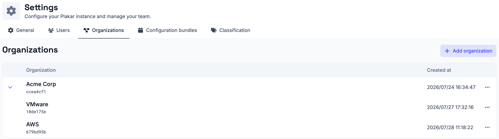
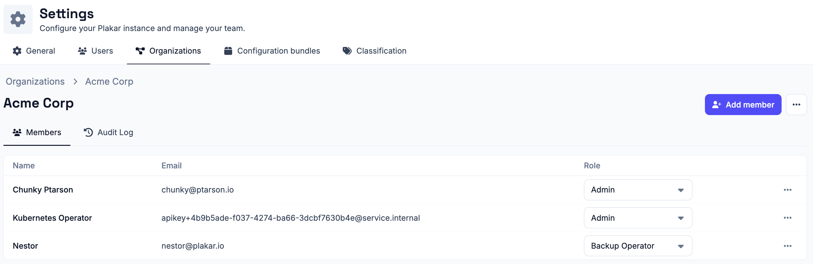
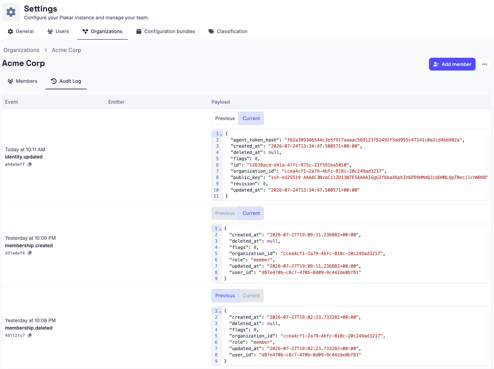

# Managing Organizations

Organizations partition a Plakar Control Plane instance into isolated
administrative domains. They allow a single deployment to manage multiple teams,
business units, customers, or environments while keeping their configuration and
operational data separate.

Every Plakar Control Plane deployment contains a root organization that is
created during the [initial setup (enrollment)](../../intro/enrollment).
Additional organizations can be created beneath it, forming a hierarchy. Each
organization has a single parent and may contain any number of child
organizations.

For example:

```text
Root
├── AWS
│   ├── S3
│   └── EC2
└── VMware
    ├── Production
    └── Development
```

This hierarchy can be extended to any depth, allowing organizations to be
structured in whatever way best matches your operational or administrative
requirements.

## Organization isolation

Every object in Plakar Control Plane belongs to a single organization. This
includes [users](../users), [inventories](../../infrastructure/inventories),
[resources](../../resources),
[secret providers](../../infrastructure/secret-providers), [apps](../../apps),
[policies](../../operations/policies),
[scheduled tasks](../../operations/scheduling/tasks),
[job history](../../operations/scheduling/job-history), and most other
configuration and operational objects.

Objects are scoped to the organization in which they are created. Users
operating within an organization can view and manage only the objects that
belong to that organization. Users with access to a parent organization can
switch to one of its child organizations to manage the objects within that
organization.

For example, if separate **AWS** and **VMware** organizations exist beneath the
root organization, users operating in the **AWS** organization cannot view or
manage VMware inventories, resources, jobs, or other objects. Likewise, users in
the **VMware** organization cannot access **AWS** organization.

## Organization context

Users always operate within the context of a single organization. The selected
organization determines which objects are visible and which administrative
operations can be performed.

A user may be granted access to one or more organizations. Users with access to
multiple organizations can switch between them at any time. For example, a user
with access to both the **AWS** and **VMware** organizations can switch between
those organizations, but cannot access the root organization unless they have
also been granted access to it.

Users with access to a parent organization can also switch to any of its
descendant organizations. For example, an administrator operating in the root
organization can switch to the **AWS** or **VMware** organization to manage its
objects directly.

## Root organization

The root organization has visibility across the entire organization hierarchy
and can operate within any descendant organization by switching context.

Although the root organization can administer child organizations, objects
remain owned by the organization in which they were created. This isolation
allows multiple independent administrative domains to coexist within a single
Plakar Control Plane deployment while remaining centrally managed.

## User roles

A user's permissions within an organization are determined by the role assigned
to them for that organization. The same user may have different roles in
different organizations. For example, a user may be an **Administrator** in the
**AWS** organization while being assigned the **Backup Operator** role in the
**VMware** organization.

See [Managing Users](../users) for information about available roles and how
they are assigned.

## Managing organizations

Organizations are managed from **Settings** → **Organizations**. This page lists
every organization you have access to and allows you to create new
organizations.



To create an organization, provide a name and select its parent organization.
New organizations are added beneath the selected parent, allowing you to build
an organization hierarchy that matches your operational requirements.



The active organization can be changed at any time from the organization
selector in the sidebar. Switching organizations changes the current context,
allowing you to view and manage the objects that belong to the selected
organization.



## Organization details

Selecting an organization opens its management page, where you can manage
members and review the organization's audit log.

### Members

The **Members** tab lists all users who have access to the organization.

From this page you can:

- Add existing users to the organization.
- Assign or update each user's role within the organization.
- Remove users from the organization.

Users must be created before they can be added to an organization. See
[Managing Users](../users) for information about creating member and application
users.



### Audit log

The **Audit Log** tab provides a chronological record of activity within the
organization. It records administrative and configuration changes, allowing you
to review who performed an action, when it occurred, and the changes that were
made.



