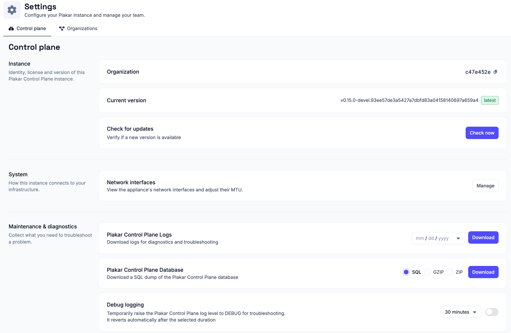

# Control Plane Settings

Control Plane settings apply to the appliance as a whole rather than to a single
organization. They cover the instance identity and version, appliance
networking, diagnostics, and early-access features.

Because these settings affect every organization hosted on the instance, they
require the **Superuser** role. The **Superuser** is the admin account created
when the instance is first set up, either during
[enrollment](../../../intro/enrollment#admin-account) or
[air-gapped enrollment](../../../intro/air-gapped#organization-and-admin-account).

## Instance

Identity, license, and version of this Plakar Control Plane instance.

### Organization

Shows the identifier of the organization you are currently working in. This is
the identifier used to sign in to that organization. See
[Signing In](../../signing-in) for how it is used.

### Current version

Shows the version of Plakar Control Plane currently running, and whether it is
the latest available.

### Check for updates

Verify whether a newer version of Plakar Control Plane is available. See
[Updating Control Plane](../../updating-control-plane) for how to install
updates and, where needed, update the underlying deployment infrastructure.

## System

How the instance connects to your infrastructure.

### Network interfaces

View and configure the appliance's network interfaces. The network interface
table shows each interface's name, IP address, link status, MAC address, and
current MTU.

To change an interface's MTU, click the pencil icon next to the current value,
enter the new MTU, and save your changes.

The default MTU is **1500 bytes**, which is appropriate for most Ethernet
networks. Increase the MTU only if every device along the network path supports
the larger frame size. Using an MTU larger than the network can handle may
result in packet fragmentation, dropped packets, or connectivity issues rather
than improved performance.

For more information about MTU values and jumbo frames, see
[MTU and Jumbo Frames](../../../guides/mtu-and-jumbo-frames) documentation.

## Maintenance and diagnostics

Everything needed to troubleshoot a problem on the instance.

### Plakar Control Plane logs

Download Plakar Control Plane's own logs for diagnostics and troubleshooting.
Pick a date and download a `.log.gz` file containing that day's logs.

### Plakar Control Plane database

Download a full dump of the Plakar Control Plane internal database, as `SQL`,
`GZIP`, or `ZIP`.

### Debug logging

Temporarily raise the Plakar Control Plane log level to `DEBUG` to record more
detail while troubleshooting an issue. Select how long debug logging should
remain enabled before turning it on. Once the selected duration expires, Plakar
Control Plane automatically restores the previous log level.

## Advanced

Experimental options and early features.

### UI preview mode

Enable preview mode to access early features. They may be unpolished, but let
you explore them and give feedback before release.

