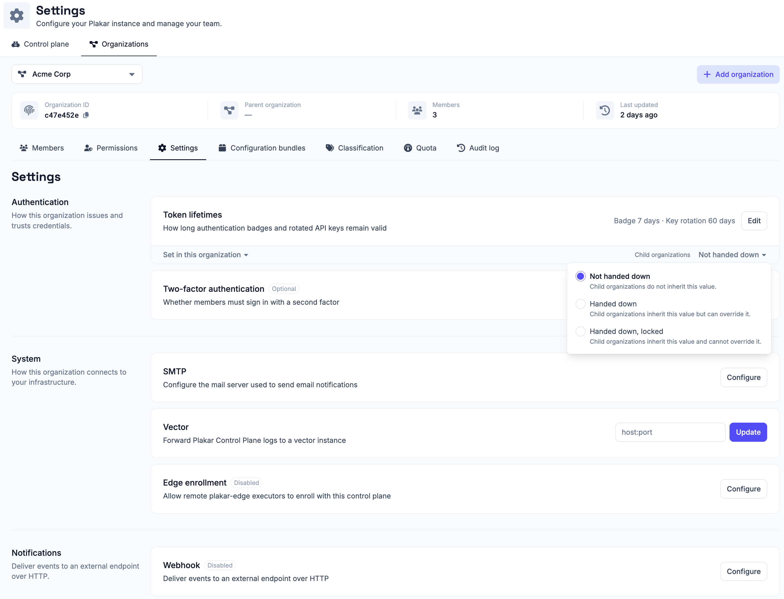

# Organization Settings

Organization settings apply to one organization only. Every organization on the
instance carries its own settings, so changing them affects that organization
and the resources that belong to it, and nothing else.

## Handing settings down

A setting is not confined to the organization it is set in. Alongside its value,
each setting carries a choice about what the organizations beneath it inherit:

- **Not handed down**, the value applies only to the organization it is set in.
  The organizations below it do not inherit it.
- **Handed down**, every organization below inherits the value, at any depth,
  and any of them can override it with one of its own.
- **Handed down, locked**, every organization below inherits the value and none
  of them can override it.

The choice is made per setting, so an organization can hand down its SMTP server
while keeping its webhook to itself. Locking a setting lets an organization high
in the hierarchy fix a value for everything beneath it, rather than setting the
same value in each organization and trusting it to stay.

### How an organization resolves a setting

Without a lock, an organization uses its own value for a setting. When it has
none, it inherits the value of the nearest organization above it that hands the
setting down, whether that is its parent or an organization several levels up.
When no organization above hands the setting down, the organization has no value
for it.

Only values that are handed down are inherited. The organizations beneath one
that keeps a value to itself skip it and inherit from further up. If the root
organization hands down an SMTP server and organization A below it sets its own
without handing it down, A uses its own server and organization B below A uses
the root organization's.

A lock overrides this order. Every organization below a locked value uses it,
and none of them can set its own. A value one of them set before the lock is
ignored while the lock is in place, and applies again if the lock is removed.

## Authentication

Controls how members authenticate in this organization and how long their
credentials remain valid.

### Token lifetimes

Two time-to-live (TTL) durations are configured together here:

- **Authentication badge TTL:** how long an authentication badge remains valid.
  The badge indicates the current authentication status of a session.
- **API key rotation TTL:** how long an API key remains valid after its owner
  rotates it.

### Two-factor authentication

Require the members of this organization to sign in with a second factor.
Members who already hold one are unaffected. Members without one are taken
through the setup the next time they sign in, and cannot reach Plakar Control
Plane until a factor is enrolled. See
[Two-factor authentication](../../two-factor-authentication) for what a member
sets up and how it is used at sign-in.

## System

How the organization connects to your infrastructure.

### SMTP

Configure the mail server used to send email notifications for this
organization, including notifications and other system-generated messages. See
[Email & SMTP](../../email-and-smtp) documentation for configuration details.

### Vector

Forward Plakar Control Plane logs to a Vector instance you manage. Plakar
Control Plane runs its own internal Vector instance for local log processing.
This setting adds the instance you provide as an additional
[Vector sink](https://vector.dev/docs/reference/configuration/sinks/vector/), so
a copy of the logs is forwarded there rather than replacing local processing.

Enter the target instance's address as `host:port` to apply it.

### Edge enrollment

Enable edge enrollment to allow remote `plakar-edge` executors to register with
Plakar Control Plane. Enrollment is disabled by default. Once enabled, an
enrollment key is generated for the initial registration process, and it can be
regenerated at any time. See [Edges](../../../infrastructure/edges)
documentation for more information.

This setting also decides which edges an organization can use. An organization
that inherits it can run tasks on the edges of the organization that set it, in
addition to its own, however many levels above that organization is. See
[Sharing edges with child organizations](../../../infrastructure/edges#sharing-edges-with-child-organizations).

## Notifications

Deliver events to an external endpoint over HTTP.

### Webhook

Deliver Plakar Control Plane events, such as job completions and failures, to an
external endpoint as HTTP requests. Webhook delivery is disabled by default. See
[Webhook](../../webhooks) documentation for more information.

