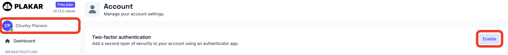
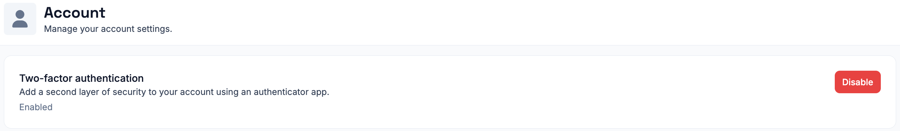

# Two-factor authentication

Two-factor authentication (2FA) adds an extra layer of security to your Plakar
Control Plane account. After entering your password during login, you'll also
need to provide a time-based one-time password (TOTP) generated by an
authenticator application.

Plakar Control Plane supports any authenticator application that implements the
TOTP standard.

## Enabling two-factor authentication

Two-factor authentication can be enabled from the **Account** page. Scan the QR
code with your preferred authenticator application, or manually enter the setup
key if you cannot scan the code.

## Recovery codes

After two-factor authentication is enabled, Plakar Control Plane generates a set
of recovery codes. Store these in a secure location. Each code can be used once
to sign in if you lose access to your authenticator application.

## Signing in

After entering your email address and password, Plakar Control Plane prompts for
the current verification code from your authenticator application. If the
application is unavailable, you can sign in using one of your unused recovery
codes instead.



## Disabling two-factor authentication

To disable two-factor authentication, return to **Account**, select **Disable**,
and confirm the action with a valid verification code from your authenticator
application or one of your unused recovery codes.

