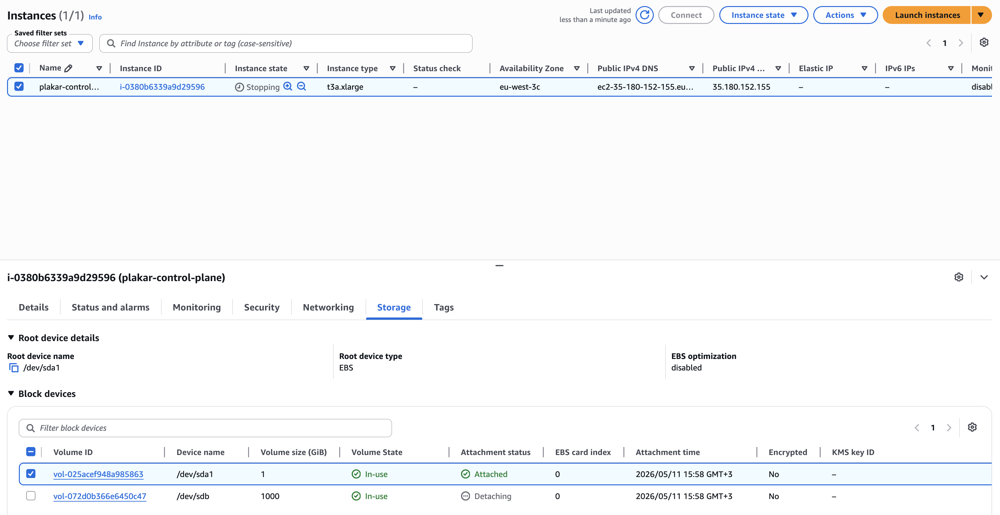
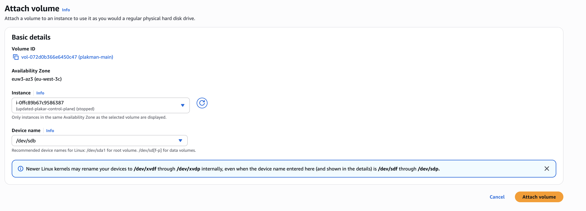

# Updating AWS AMI for Plakar Control Plane

Plakar Control Plane is distributed on AWS as an Amazon Machine Image (AMI)
through AWS Marketplace.

Most Plakar Control Plane updates can be installed directly from the settings
page without replacing the EC2 instance. However, in rare cases, the underlying
AMI also needs to be updated. This usually happens when infrastructure-level
changes are required.

## Deployment layout

A Plakar Control Plane deployment on AWS runs as an EC2 instance with two
attached EBS volumes:

- A small root volume used for the operating system (`1GB`)
- A larger data volume used to store Plakar Control Plane data (`1TB`)

The important volume is the larger data volume because it contains the actual
Plakar Control Plane data.

## Updating the AMI

The update process consists of:

1. Detaching the existing data volume
2. Deploying a new EC2 instance from the newer AMI
3. Reattaching the existing data volume to the new instance





### Stop the current instance

Stop the currently running Plakar Control Plane EC2 instance before making any
storage changes.





### Detach the existing data volume

Locate the larger attached data volume (`1TB`) and detach it from the stopped
instance. Before detaching the volume, note down the volume ID because the same
volume will later be attached to the new instance.

Also note down any instance-specific configuration that may need to be reapplied
later, including:

- IAM roles
- Security groups
- Elastic IP assignments
- DNS configuration
- Monitoring or automation integrations

> [!IMPORTANT]+ Volume ID
>
> Make sure you detach the larger data volume and not the root volume.





### Launch a new Plakar Control Plane instance

Deploy a new Plakar Control Plane instance from AWS Marketplace using the newer
AMI. Follow the standard deployment process documented in the
[AWS installation](../../intro/installation/aws) guide.

Due to an AWS limitation, it is not possible to attach an existing EBS volume
during the initial EC2 instance deployment process. AWS will always provision
the instance with a new empty data volume.

As a workaround, the new instance must first be created normally, then stopped
so the empty volume can be replaced with the original data volume from the
previous deployment.

The new instance will be provisioned with:

- A new root volume
- A new empty data volume





### Stop the new instance

Once the new instance has been provisioned successfully, stop it before
modifying its attached volumes.





### Remove the new empty data volume

Detach the newly created empty data volume from the new instance. This volume is
not needed because the original data volume from the previous deployment will be
reused instead.

Do not delete the detached volume yet until the migration is confirmed working
correctly.





### Attach the old data volume

Attach the original data volume from the previous instance to the new instance.
Once attached, the new instance will use the existing Plakar Control Plane data
and configuration.





### Reconfigure instance settings

Reapply any configuration that existed on the previous instance. This may
include:

- IAM roles
- Security groups
- Elastic IP assignments
- DNS configuration
- Monitoring or automation integrations





### Start the new instance

Start the new EC2 instance.

Once the instance is running, Plakar Control Plane should resume normally using
the existing data volume. All inventories, schedules, policies, configuration,
and backup data should remain intact.





### Cleanup

After confirming the new deployment is working correctly, you can safely remove
unused resources:

- Delete the old EC2 instance
- Delete the old root volume
- Delete the unused empty data volume created with the new instance

> [!WARNING]+ Deleting Volumes
>
> Do not delete any volumes until you have verified the new deployment is
> working correctly.





