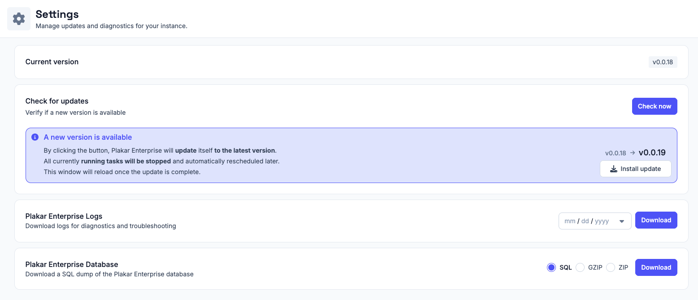
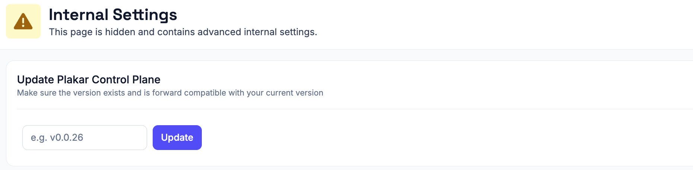

# Updating Plakar Control Plane

Plakar Control Plane supports in-place application updates directly from the web
interface.

From the **Settings** page, you can:

- View the currently installed version
- Check whether a newer version is available
- Install updates directly from the UI

When a new version is available, the settings page will display an update
notification with the target version and an **Install update** action.

During the update process:

- Running tasks are stopped
- Tasks are automatically rescheduled after the update
- The web interface reloads once the update is complete

> [!NOTE]+
>
> Most Plakar Control Plane updates only update the application itself and do
> not require changes to the underlying infrastructure or deployment
> environment.

## Updating an air-gapped Plakar Control Plane

An air-gapped instance cannot reach `plakar.io` to discover new releases, so the
update notification never appears. Updates are started instead by entering the
target version by hand, from a hidden internal settings page.

Type `thisisinternal` anywhere in the web interface to open **Internal
Settings**. The page is not linked from the navigation and holds advanced
settings that are not part of normal operation.

Under **Update Plakar Control Plane**, enter the version you want to install,
for example `v1.1.2`, then click **Update**.

The version must already exist in your releases repository. Versions are tags,
and each one corresponds to a directory of the same name in that repository, so
mirror a release before entering it here. See
[hosting a package repository](../../guides/self-hosted-package-repository) for
how that repository is laid out and mirrored.

From there the update behaves as it does from the settings page. Running tasks
are stopped and rescheduled afterwards, and the web interface reloads once the
update is complete.

## Updating the underlying deployment infrastructure

Plakar Control Plane can run on multiple environments including:

- AWS
- OVHcloud
- Scaleway
- On-premises infrastructure

Depending on the platform, Plakar Control Plane may be distributed using
different deployment formats such as:

- Virtual machine images
- Cloud marketplace appliances
- Container images

Occasionally, infrastructure-level updates may also be required depending on the
deployment platform and distribution method.

For example, on AWS, Plakar Control Plane is distributed as an AMI through AWS
Marketplace. Most application updates can be installed directly from the
Settings page without replacing the EC2 instance or updating the AMI.

Platform-specific infrastructure update procedures are documented separately:

## [Updating AWS AMI](https://www.plakar.io/docs/control-plane/administration/updating-control-plane/aws/index.md)

## [Updating Scaleway QCOW2](https://www.plakar.io/docs/control-plane/administration/updating-control-plane/scaleway/index.md)

## [Updating vSphere](https://www.plakar.io/docs/control-plane/administration/updating-control-plane/vsphere/index.md)

## [Updating Proxmox ISO](https://www.plakar.io/docs/control-plane/administration/updating-control-plane/proxmox/index.md)

