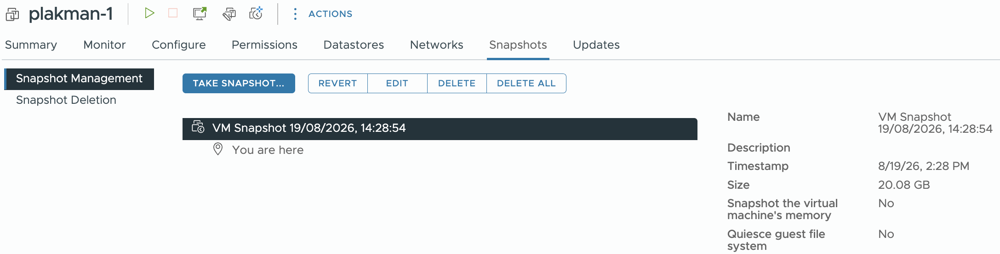
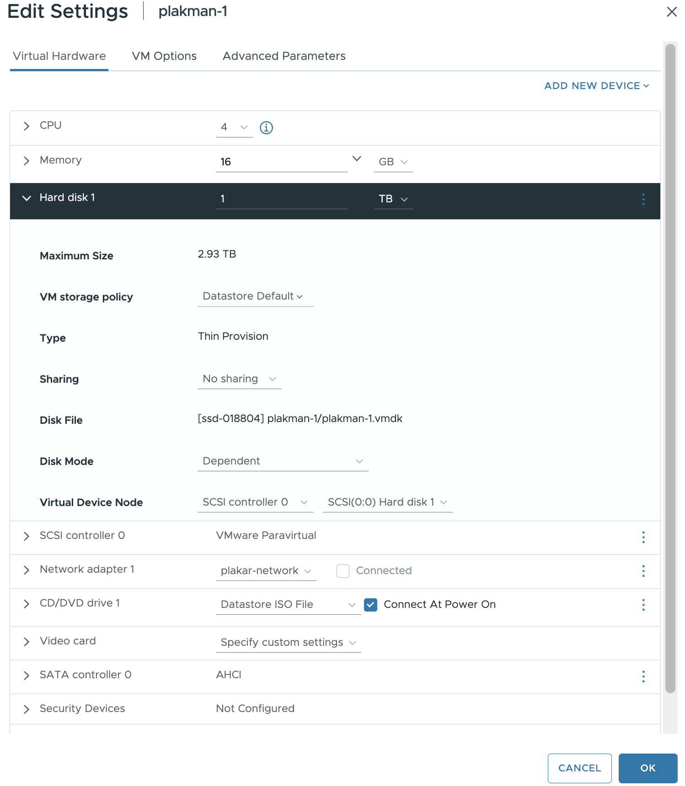
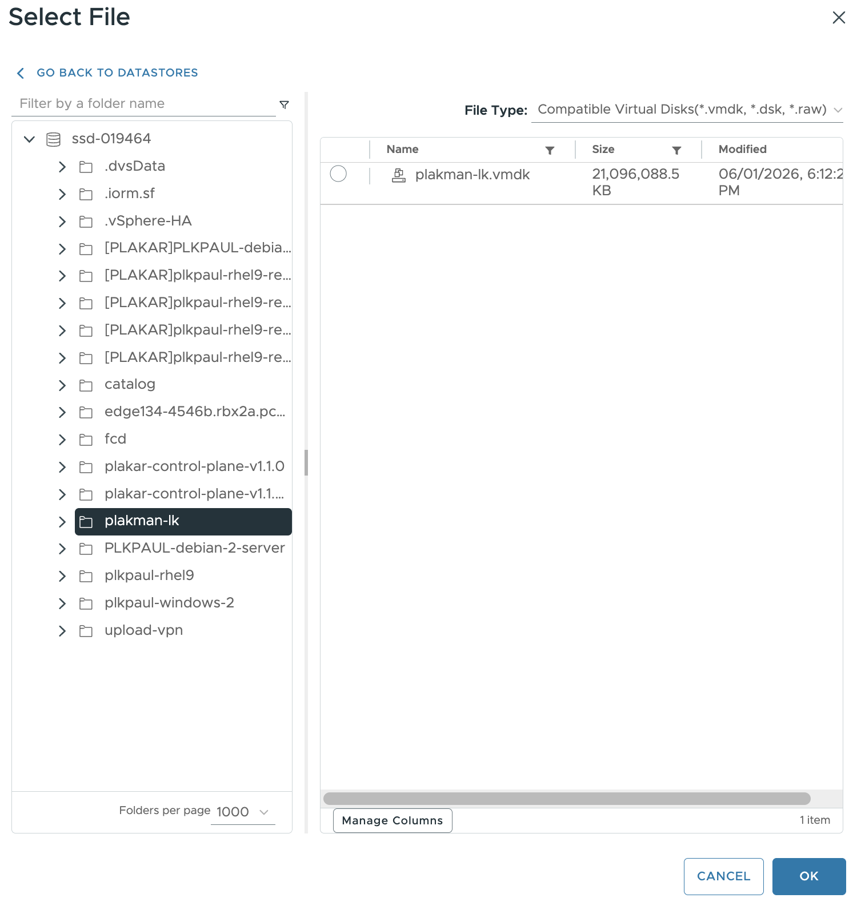

# Updating vSphere Installation for Plakar Control Plane

Plakar Control Plane can be deployed on vSphere from either an OVA appliance or
a manually-built VM booted from the Plakar Control Plane ISO. Most Plakar
Control Plane updates can be installed directly from the settings page without
touching the VM. However, in some cases, the underlying appliance needs to be
updated. The update procedure depends on how the VM was deployed.

## Deployment layout

On the **ISO** path, the appliance image is immutable and runs entirely in RAM.
Persistent Plakar Control Plane data and configuration are stored on the VM's
data disk. Updating the appliance only requires replacing the ISO and restarting
the existing VM. The persistent data disk remains unchanged.

On the **OVA** path, the appliance is installed on the VM's boot disk.
Persistent Plakar Control Plane data and configuration are stored on a separate
data disk. Updating the appliance requires deploying a new OVA and attaching the
existing data disk to the new VM.

## Updating the appliance









### Deploy the new OVA

Download the newer Plakar Control Plane appliance OVA from the
[downloads](/download) page and deploy it as a new VM, following
[Creating the Virtual Machine](../../../intro/installation/virtual-machines/vsphere#creating-the-virtual-machine)
in the vSphere installation guide. Do not power on the new VM yet.





### Power off the VMs

Power off the existing appliance VM and, if it was powered on during deployment,
the new VM as well. A disk cannot be detached from or attached to a running VM.





### Delete snapshots from the old VM

On the existing VM, open the **Snapshots** tab and check whether any snapshots
exist. If there are, open **Manage Snapshots** and select **Delete All**.

> [!WARNING]+ Deleting Snapshots
>
> Deleting a snapshot removes the ability to revert the VM to that point in
> time. Make sure the snapshots are no longer needed before deleting them.





### Detach the data disk from the old VM

On the existing VM, open **Actions > Edit Settings** and locate the data disk
under **Virtual Hardware**. Note the disk's **Disk File** path. You will use it
to identify the disk when attaching it to the new VM.

Click the ellipsis at the right of the disk row and select **Remove device**.
Click **OK** to apply the change.

> [!WARNING]+ Detaching the Data Disk
>
> Do not select the option that removes the device and deletes its files from
> the datastore. That option deletes the data disk and its contents.





### Attach the data disk to the new VM

On the new VM, open **Edit Settings** and select **Add New Device** → **Existing
Hard Disk**. Browse to the disk file noted in the previous step and click
**OK**.





### Power on the new VM

Power on the new VM.

The appliance will boot using the existing data disk. Inventories, schedules,
policies, configuration, and other Plakar Control Plane data will remain intact.





### Verify

Once the VM is reachable on the network, open Plakar Control Plane in a browser
and confirm that the appliance is running the new version and that existing data
is present.

Once confirmed, the old VM and its remaining boot disk can be removed.













### Upload the new ISO

Download the newer Plakar Control Plane appliance ISO from the
[downloads](/download) page and upload it to the datastore currently holding the
ISO used by the VM.

Refer to
[Upload the ISO to a datastore](../../../intro/installation/virtual-machines/vsphere#upload-the-iso-to-a-datastore)
in the vSphere installation guide for details.





### Power off the VM

Right-click the VM in **Hosts and Clusters** and select **Power** > **Power
Off**.





### Remove the existing CD/DVD drive

Right-click the VM and select **Edit Settings**. Locate the **CD/DVD Drive**
under **Virtual Hardware** and click the ellipsis at the right of the device
row.

Select **Remove device**, then click **OK** to apply the change.





### Add a new CD/DVD drive

Open **Edit Settings** again and select **Add New Device** > **CD/DVD Drive**.
Select **Datastore ISO File** as the source, then click **Browse** and select
the newly uploaded Plakar Control Plane ISO.

Enable **Connect At Power On**, then click **OK**.

> [!NOTE]+
>
> Removing and adding the CD/DVD drive only changes the appliance media. The
> VM's data disk and other configured devices remain unchanged.





### Power on the VM

Right-click the VM and select **Power** → **Power On**.

The appliance will boot from the new ISO and uses the existing data disk.
Inventories, schedules, policies, configuration, and other Plakar Control Plane
data will remain intact.





### Verify

Once the VM is reachable on the network, open Plakar Control Plane in a browser
and confirm that the appliance is running the new version and that existing data
is present.









