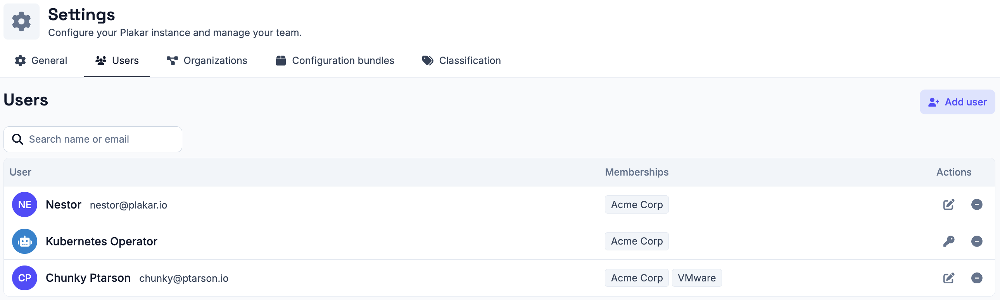

# Managing Users

Users represent identities that can access Plakar Control Plane. They are used
either by people interacting with the web interface or by applications
authenticating to the API.

Plakar Control Plane supports two types of users:

- **Member**: a person who signs in to the web interface and interacts with
  Plakar Control Plane.
- **Application**: a non-human identity used by software to authenticate to the
  Plakar Control Plane API using an access key.

Application users are intended for automation and integrations, such as the
[Plakar Kubernetes Operator](../infrastructure-as-code/kubernetes-operator) or
custom applications that interact with the API.

## Creating users

You can create either a **Member** or **Application** user depending on how the
identity will access Plakar Control Plane.

Newly created users are not assigned to any organization by default. Before a
member user can sign in or an application user can be issued an API key, the
user must be granted access to at least one organization.

See [Managing Organizations](../organizations) for information about granting
users access to organizations.

## Member users

Member users authenticate through the Plakar Control Plane web interface. Once
they have been granted access to one or more organizations, they can switch
between those organizations according to their assigned permissions.

### Creating a member user

To create a member user, select **Member** as the user type, then provide the
user's name, email address, and an initial password.

Newly created users are not assigned to any organization by default. Before they
can sign in to Plakar Control Plane, they must be granted access to at least one
organization. See [Managing Organizations](../organizations) for more
information.



The initial password is used only for the first sign-in. After authenticating
for the first time, the user is prompted to choose a new password before
accessing Plakar Control Plane.

## Application users

Application users authenticate to the Plakar Control Plane API using API keys
instead of interactive credentials. They are intended for automation and
integrations, such as the Plakar Kubernetes Operator or custom applications.

### Creating an application user

To create an application user, select **Application** as the user type, then
provide a name for the application.

Newly created application users are not assigned to any organization by default.
Before they can authenticate to the Plakar Control Plane API, they must be
granted access to at least one organization. See
[Managing Organizations](../organizations) for more information.

Once the application has been granted access to an organization, generate an API
key to authenticate API requests.

## API keys

Application users authenticate to the Plakar Control Plane API using API keys.
Each application user can have multiple API keys, allowing different services or
deployments to use separate credentials.

To create an API key, open the application's **API key** dialog, optionally
provide a description, then generate the key. The generated key is used to
authenticate API requests on behalf of the application user.

The API key management dialog also lists all existing API keys for the
application, allowing you to review and delete keys that are no longer needed.



> [!WARNING]+ API keys
>
> API keys are displayed only once when they are created. After you leave this
> page, the key cannot be viewed again. Store it securely in a password manager,
> secrets manager, or another secure location before continuing.

## User Roles

A user's permissions are determined by the role assigned to them within each
organization. The same user may have different roles in different organizations.
For example, a user may be an **Administrator** in the **AWS** organization
while being assigned the **Backup Operator** role in the **VMware**
organization.

Currently, Plakar Control Plane provides two roles:

- **Administrator** – full administrative access to the organization.
- **Backup Operator** – access limited to backup operations.

> [!NOTE]+ Roles
>
> Plakar Control Plane currently provides two built-in roles. Future releases
> will introduce several additional roles to better support different
> operational responsibilities and access control requirements.

