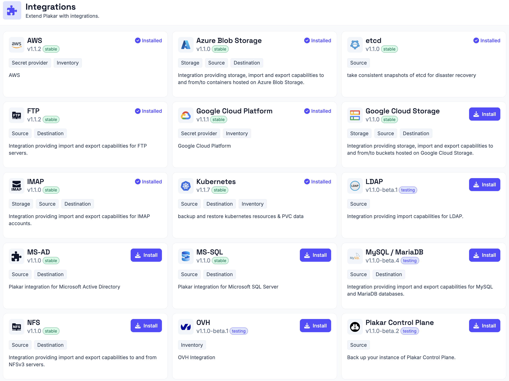

# Managing Integrations

Integrations extend Plakar Control Plane with support for external services,
platforms, storage systems, and inventory providers. Before an integration can
be used, it must be installed from the **Integrations** page.

Installed integrations become available automatically wherever they are
supported. For example:

- Inventory integrations become available when creating a new inventory.
- App integrations become available when configuring compatible apps.

Plakar Control Plane automatically matches integrations to resources based on
their `class` and `subclass`. If multiple compatible integrations are installed,
you can choose which one an app should use during configuration.

## Installing an integration

Navigate to **Integrations**, locate the integration you want to use, and click
**Install**. Once installation completes:

- Inventory integrations become available in the **Add inventory** dialog.
- App integrations become available when configuring compatible apps. See
  [Apps](../apps) for more information.

If you open the **Add inventory** dialog before installing an inventory
provider, providers that are not yet installed display an **Install** button.
Providers that are already installed can be selected immediately.

## Updating an integration

Installed integrations with a newer version available display an **Upgrade**
button on their integration card. Click **Upgrade** to install the newer
version.

