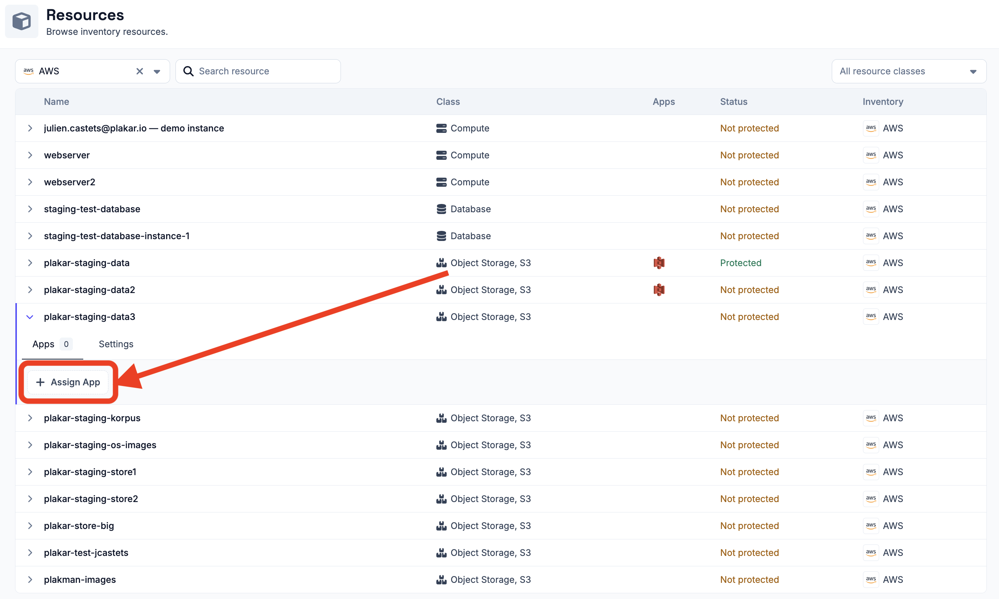
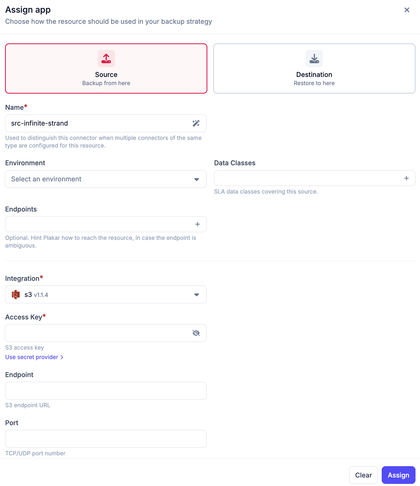
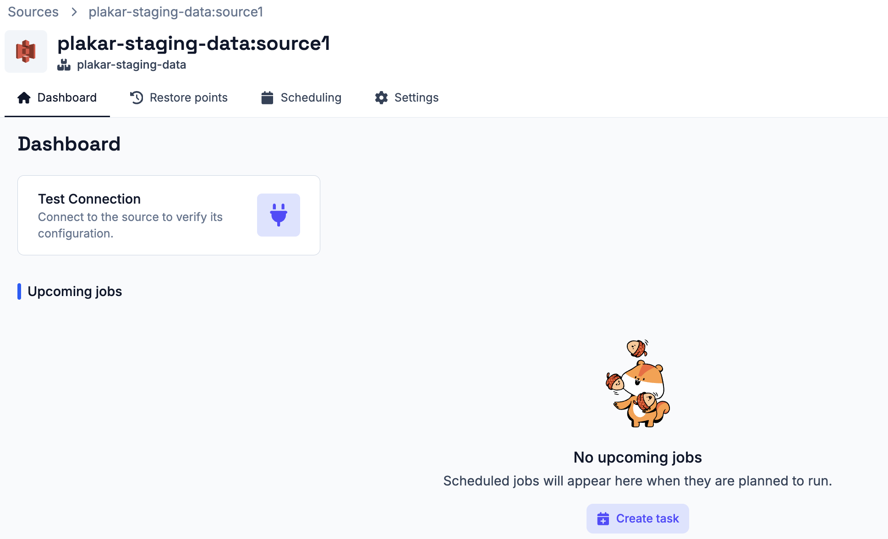
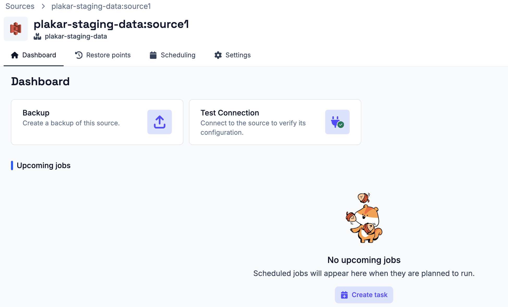
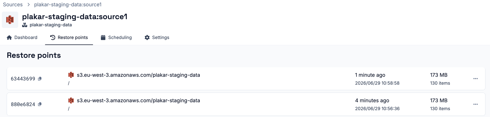

# Source App

A source app defines a resource that Plakar Control Plane can back up.

## Assigning a source app

Source apps are assigned from the **Resources** page. Click on a resource to
open it, then go to the **Apps** tab. This tab shows all source and destination
already assigned to the resource and allows you to assign new ones. Store apps
are not managed from here, see the [store app](../stores) documentation for how
to assign a store.

To assign a source app, click **Assign app** from the **Apps** tab and select
**Source**. Then provide a name for the app. The name is used to distinguish
this app when multiple apps of the same type are configured for the same
resource.

Next, select the **Environment** and **Data Class** for the source:

- **Environment** - the environment the resource belongs to, such as production,
  development, or testing
- **Data Class** - the type of data stored in the resource, such as critical,
  database, financial records, or PII. Multiple data classes can be selected if
  the resource contains more than one type of data.

These values are used by the policies engine to determine which policies apply
to this source. See the [policies documentation](../../operations/policies) for
more details.

Plakar Control Plane then checks the resource `class` and `subclass` to find
compatible integrations. If only one integration is compatible, it is selected
automatically, which is the most common case. If multiple integrations are
compatible, you will need to select one manually. Some integrations support
multiple protocols. For example, the Scaleway integration supports three
protocols, that is `scaleway-instance`, `scaleway-block`, and `scaleway-secrets`
and you will need to select the appropriate one after choosing the integration.

Finally, provide the configuration and credentials required for the selected
resource. See the [resources documentation](../../resources) for the required
fields. If a [configuration bundle](../../administration/configuration-bundles)
matches this resource, matching fields are filled in automatically.

## Testing the connection

Once a source app is created, its details page provides a **Dashboard** tab with
a **Test Connection** action. Use this to verify that Plakar Control Plane can
connect to the source using the provided configuration and credentials.

If the connection test fails, check the app configuration and credentials, then
run the test again. Once the store has been initialized, additional actions
become available from the dashboard:

- **Create Backup** - create a backup task from this source

## Browsing Restore Points

You can view all backup restore points stored on a store from the **Restore
Points** tab. From there, you can view the files contained in each restore point
and download individual files without performing a full restore.

## Tasks and Schedules

Tasks can be created directly from the source app dashboard or from the
**Operations > Scheduling** section. See the
[scheduling documentation](../../operations/scheduling) for details on creating
and managing tasks and schedules.

