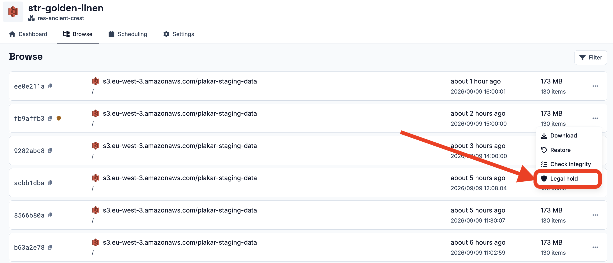
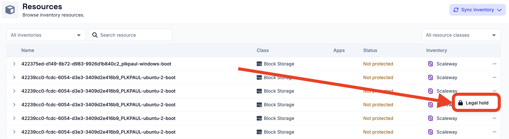

# Legal Hold

A **legal hold** marks something as protected so that Plakar Control Plane
refuses to act on it. Use a hold when data has to be preserved beyond its normal
lifetime, or left untouched entirely, such as during litigation or an audit.

There are two kinds of hold:

- A hold on a **restore point** prevents that restore point from being deleted.
- A hold on a **resource** prevents [tasks](../../scheduling/tasks) from using
  that resource at all.

Both types of hold are applied manually to something that already exists. This
distinguishes a legal hold from an [SLA policy](../policies) or
[data residency](../residency), which define requirements that PCP applies to
ongoing operations. The permissions for each type of hold are also separate:
being allowed to hold a restore point does not grant permission to hold a
resource. See [permissions](../../administration/permissions) for details.

## Holding a restore point

A hold is placed on an individual restore point from the restore points listed
in the **Browse** tab of a
[store app](../../apps/stores#browsing-restore-points).



A held restore point is excluded from pruning. When an [SLA policy](./policies)
determines that a restore point has reached the end of its retention period, PCP
skips it if a legal hold is in place.

The restore point therefore remains available until the hold is removed,
regardless of the retention period defined by the policy that created it.

## Holding a resource

A resource hold takes a resource out of service for as long as the hold remains
in place. Plakar Control Plane refuses any task that would use the resource,
including backups, restores, checks, and prunes. Tasks that are already
scheduled will fail on their next scheduled run.

You can place a hold on an individual resource from the actions available in the
[resource](../../resources) listing.



## What a hold does not prevent

A legal hold is enforced by Plakar Control Plane, not by the store itself. The
stores Plakar Control Plane creates are ordinary Kloset stores, and a store can
be used from Plakar Control Plane and from the open source `plakar` CLI
interchangeably. Anyone holding the store passphrase can therefore delete a
restore point directly with `plakar`, whether or not a hold is in place.

A hold also has no effect on the underlying files. The objects or files the
store is made of can still be deleted by anyone with access to the bucket or the
filesystem holding them.

> [!NOTE]
>
> To prevent deletion below Plakar Control Plane, use what the storage itself
> provides, such as object lock on object storage or file permissions on a
> filesystem.

