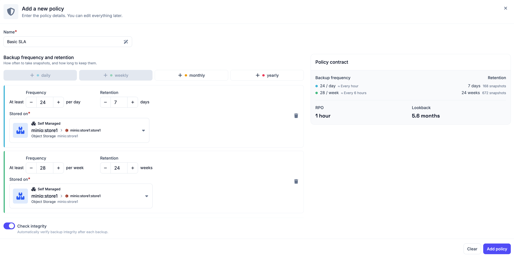
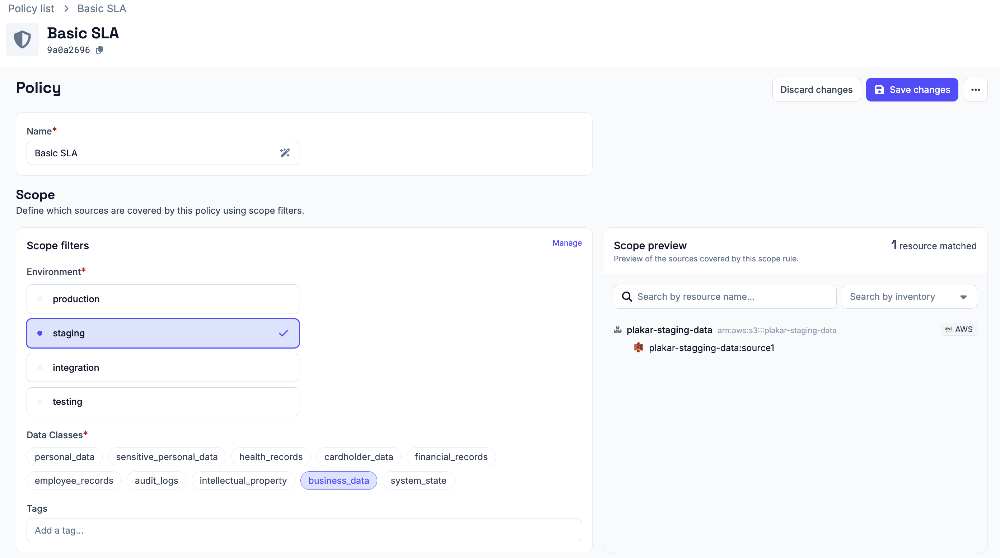
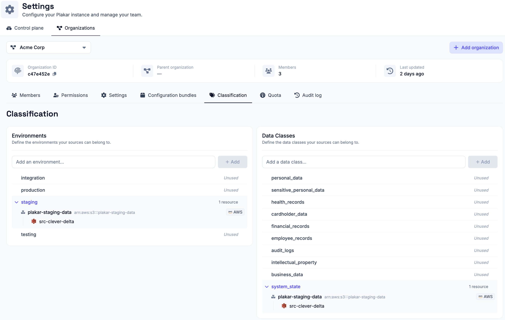

# SLA Policies

An SLA policy defines backup requirements for your sources i.e. how often
backups should be taken and how long they should be retained. When a policy is
scoped to an environment and data class, Plakar Control Plane automatically
creates backup schedules for all source apps that match.

<!-- prettier-ignore-start -->

flowchart TD
  subgraph Policy["SLA Policy"]
    Requirements["Frequency & retention"]
    Scope["Scope\nenvironment · data class · tag"]
    PolicyStore["Store app"]
  end

  subgraph Sources["Source Apps"]
    S1["Source A\nproduction · database"]
    S2["Source B\nproduction · critical"]
    S3["Source C\nstaging · database"]
  end

  Scope -->|"auto-match"| S1 & S2
  S1 & S2 -->|"schedule created"| Backup["Backup"]
  Requirements --> Backup
  Backup --> PolicyStore

<!-- prettier-ignore-end -->

Policies belong to a single organization. You work only with the policies of the
organization you signed in to, and what you can do with them is determined by
the [permissions](../../administration/permissions) you hold there.

## Creating a policy

To create a policy, provide a name, then define the backup requirements and
select a store app to use for backups.

### Backup frequency and retention

You define requirements across six time granularities. You can configure any
combination of these:

- Daily
- Weekly
- Monthly
- Yearly

For each granularity you enable, you configure:

- **Frequency:** how often a backup should be taken within that period, for
  example 4 times or once a day
- **Retention:** how long backup restore points should be kept

You then select a [store](../../apps/stores) where the backup will be stored and
toggle whether you want to run a [check task](../../scheduling/tasks#check-task)
on the after each. It's recommended to leave this on.

### Policy summary

Before creating the policy, Plakar Control Plane shows you a summary of the
policy contract based on your selections.

The summary shows the RPO and lookback derived from your settings. RPO is the
maximum data loss window based on your most frequent backup, and lookback is how
far back you can restore from based on your retention settings.

## Scoping a policy

After creating a policy, you are immediately taken to the scoping page to set up
the environment and data class filters.

Supported scope filters include:

- **Environment:** the environment the policy applies to. Environments are
  managed from the organization's
  [classification settings](#managing-environments--data-classes).
- **Data Class:** one or more data classes the policy applies to. Data classes
  are managed from the organization's
  [classification settings](#managing-environments--data-classes).
- **Tag:** narrows the matched sources down further to only those carrying the
  specified tag. Useful when environment and data class alone would match more
  sources than intended.

Plakar Control Plane matches all source apps against the configured scope. Any
source app whose environment and data class match the policy is automatically
scheduled according to the policy rules. When a new source app is added with
matching values, it is automatically picked up by the policy without any
additional configuration.

Scope is not the only condition. A policy also respects
[data residency](./residency): a matched source is only scheduled when it and
the policy's store share the same residency.

A source app can be covered by multiple policies if their scopes overlap. This
allows policies to be layered for example, a general policy covering all
production sources and a stricter policy specifically covering production
databases.

## Scheduling

Once a policy is scoped, the policy scheduler automatically creates backup
schedules for all matching sources using the store app selected when the policy
was created. See the
[policy scheduler documentation](../../scheduling/policy-scheduler) for more
details.

## Managing environments & data classes

Environments and data classes used by the SLA system to scope resources are
managed per organization, from **Settings** -> **Organizations** -> **[your
organization]** -> **Classification**. From there, you can create new
environments and data classes, or delete existing ones.

Because they belong to an organization, the environments and data classes
available to a policy are the ones defined in the organization that policy lives
in. See [Managing Organizations](../../administration/organizations) for more
information about how organizations isolate configuration.

