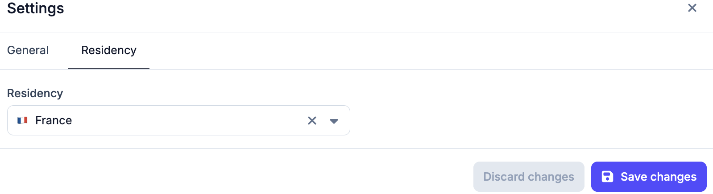
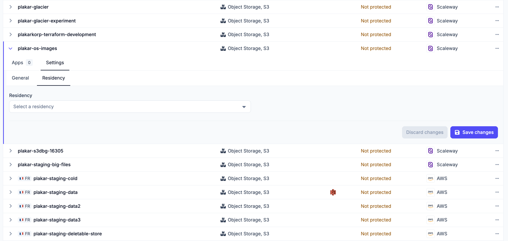

# Data Residency

Data residency ties a resource to a country and prevents Plakar Control Plane
from moving its data anywhere else. Regulations often require that certain data
never leaves a jurisdiction, and residency turns that requirement into something
the system enforces on every operation rather than something operators have to
remember each time they need to perform a task.

## Setting a residency

Residency is set on an [inventory](../../infrastructure/inventories) by
selecting the country its data belongs to. This can be modified from the
inventory settings. Every resource discovered or added in that inventory
inherits it, so an inventory that represents infrastructure in one country only
has to be configured once.

It can also be set on an individual [resource](../../resources), from the
**Residency** tab under the resource's **Settings** tab. The **General** tab
next to it holds the other
[resource settings](../../resources#resource-settings). A residency set on a
resource takes precedence over the one it inherits from its inventory, which
covers infrastructure that does not sit in the same country as the rest of the
inventory.

## What residency constrains

A resource can only be used with other resources that have the same residency.

For example, if a source has a residency in France, only stores with a French
residency can be selected for its backups. A restore can only use a destination
with the same residency as the store, and a sync can only target a store with
the same residency as its source.

PCP enforces this when you configure the [task](../../scheduling/tasks), so you
cannot use resources with a different residency. This prevents a task from being
configured to move data between different countries.

[SLA policies](./policies) follow the same rule. A policy only schedules a
backup when the source and its store have the same residency, in addition to
matching the policy's other requirements.

## Changing a residency

Policies do not have to be revisited when a residency changes. The
[policy scheduler](../../scheduling/policy-scheduler) re-evaluates what each
policy matches and updates the schedules it owns, so a source that no longer
shares a residency with the policy's store stops being scheduled, and one that
now does starts.

