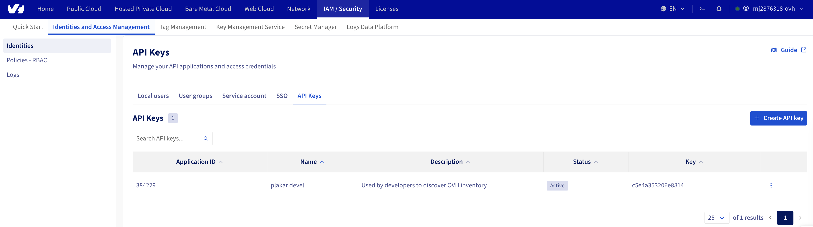

# Managing API Applications and Credentials

Plakar Control Plane requires an application key, application secret, and
consumer key to authenticate against OVHcloud APIs. These credentials are used
by the OVHcloud inventory to discover resources in your account, and by
integrations that need access to OVHcloud services such as Object Storage.

In OVHcloud, API credentials are generated through a token creation portal.
Unlike IAM-based systems, OVHcloud's legacy API authentication model ties three
tokens together: an application key that identifies the application, an
application secret that authenticates it, and a consumer key that authorizes it
to act on a specific account with a defined set of permissions.

This guide walks through generating the three tokens Plakar Control Plane needs.





## Generating API Credentials

OVHcloud provides a token creation portal where you can generate all three
credentials in a single step. You can reach it in two ways:

- Navigate directly to the region-specific URL:
  - **Europe**: `https://eu.api.ovh.com/createToken`
  - **US**: `https://us.ovhcloud.com/auth/api/createToken`
  - **Canada**: `https://ca.api.ovh.com/createToken`
- From the OVHcloud Control Panel, go to **IAM / Security** > **Identities and
  Access Management** > **API keys** and click **Create API key**. See
  screenshot in [last section](#managing-and-revoking-credentials)

Open the portal for your region and log in with your OVHcloud account
credentials. If your account is a sub-user, enter the account ID in the format
`XXXX-XXXX-XX/user` along with the password. If two-factor authentication is
enabled, you will also be prompted for a one-time code.



Once logged in, fill in the token form:

- **Application name and description**: Provide a name and description that
  identify what this token is for. A clear description makes it easier to audit
  or revoke access later.

- **Validity period**: Choose how long the credentials should remain valid. If
  left unlimited, the credentials will not expire on their own.

- **Rights**: Define which API paths and HTTP methods the credentials are
  allowed to use. The required paths depend on the OVHcloud service you are
  configuring. The required paths are documented in each OVHcloud integration
  guide. For example, the
  [OVHcloud inventory](../../../infrastructure/inventories/ovhcloud)
  documentation lists the paths needed to discover resources.

To grant access to all paths under a product, you can use a wildcard. For
example, entering `/*` with GET, POST, PUT, and DELETE grants full access to all
OVHcloud APIs. Use wildcards with caution and prefer scoping access to only the
paths your use case requires.

Click **Create** once the form is complete.

> [!WARNING]+
>
> If the credentials are used for an important workflow such as automated
> backups, an expired token will prevent Plakar Control Plane from running those
> backups until the credentials are updated.





## Storing the Credentials

After creating the token, OVHcloud displays three values:

- **Application key (AK)**: identifies the application. This value is not
  sensitive and can be stored alongside configuration.
- **Application secret (AS)**: authenticates the application. Treat this as a
  secret and store it securely.
- **Consumer key (CK)**: authorizes the application to act on your account.
  Treat this as a secret and store it securely.

> [!WARNING]+
>
> The application secret and consumer key are only shown once. Copy and store
> them somewhere safe before leaving the page.

Enter these three values into the relevant Plakar Control Plane integration or
inventory configuration.





## Managing and Revoking Credentials

Existing API credentials can be viewed and revoked from the OVHcloud Control
Panel under **IAM / Security** > **Identities and Access Management** > **API
keys**.

