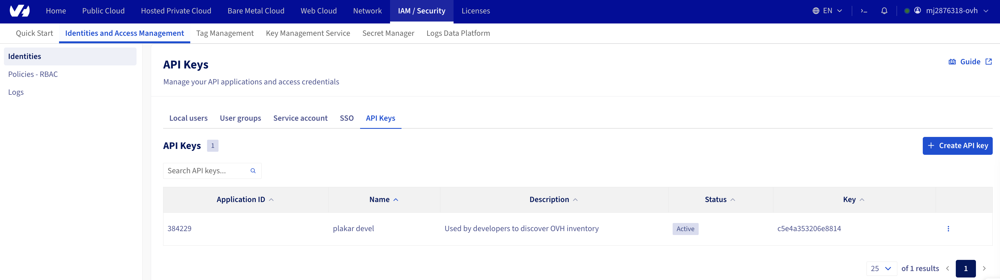

# Managing API Applications and Credentials

Plakar Control Plane requires an application key, application secret, and
consumer key to authenticate against OVHcloud APIs. The OVHcloud inventory uses
these credentials to discover resources in your account.

The three tokens work together. The application key identifies the application.
The application secret authenticates it. The consumer key authorizes it to act
on your account with a defined set of permissions.

This guide walks through generating the three tokens Plakar Control Plane needs.





## Generating API Credentials

OVHcloud provides a token creation portal where you can generate all three
credentials in a single step. You can reach it in two ways:

- Navigate directly to the region-specific URL:
  - **Europe**: `https://auth.eu.ovhcloud.com/api/createToken`
  - **US**: `https://auth.us.ovhcloud.com/api/createToken`
  - **Canada**: `https://auth.ca.ovhcloud.com/api/createToken`
- From the OVHcloud Control Panel, go to **IAM / Security** > **Identities and
  Access Management** > **API keys** and click **Create API key**. See
  screenshot in [last section](#managing-and-revoking-credentials)

Open the portal for your region and log in with your OVHcloud account
credentials. If two-factor authentication is enabled, you will also be prompted
for a one-time code.



Once logged in, fill in the token form:

- **Application name and description**: Provide a name and description that
  identify what this token is for. A clear description makes it easier to audit
  or revoke access later.

- **Validity period**: Choose how long the credentials should remain valid. If
  left unlimited, the credentials will not expire on their own.

- **Rights**: Define which API paths and HTTP methods the credentials are
  allowed to use. The
  [OVHcloud inventory](../../../infrastructure/inventories/ovhcloud#required-permissions)
  documentation lists the paths it needs.

A path can end with a wildcard. For example, `/cloud/project*` covers
`/cloud/project` and every path under it. Grant only the paths and methods your
use case requires.

Click **Create** once the form is complete.

> [!WARNING]+
>
> If the credentials are used for an important workflow such as automated
> backups, an expired token will prevent Plakar Control Plane from running those
> backups until the credentials are updated.





## Storing the Credentials

After creating the token, OVHcloud displays three values:

- **Application key (AK)**: identifies the application. This value is not
  sensitive and can be stored alongside configuration.
- **Application secret (AS)**: authenticates the application. Treat this as a
  secret and store it securely.
- **Consumer key (CK)**: authorizes the application to act on your account.
  Treat this as a secret and store it securely.

> [!WARNING]+
>
> The application secret and consumer key are only shown once. Copy and store
> them somewhere safe before leaving the page.

Enter these three values when creating the
[OVHcloud inventory](../../../infrastructure/inventories/ovhcloud) in Plakar
Control Plane.





## Managing and Revoking Credentials

Existing API credentials can be viewed and revoked from the OVHcloud Control
Panel under **IAM / Security** > **Identities and Access Management** > **API
keys**.

