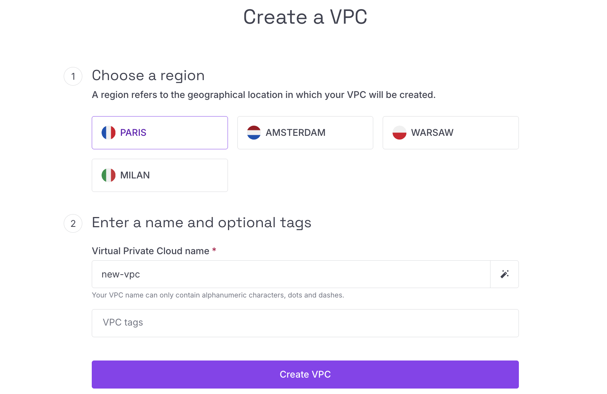
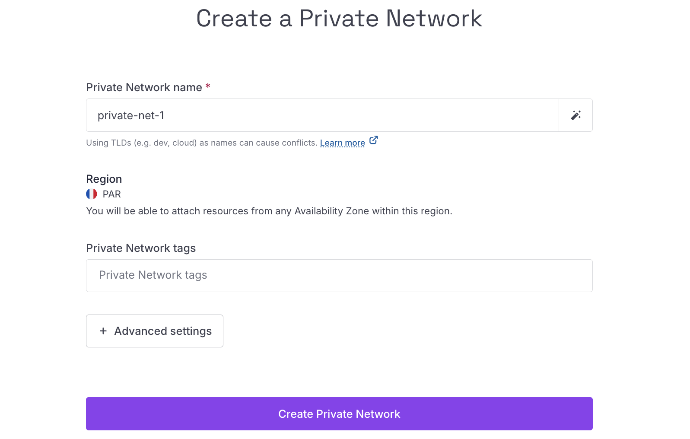
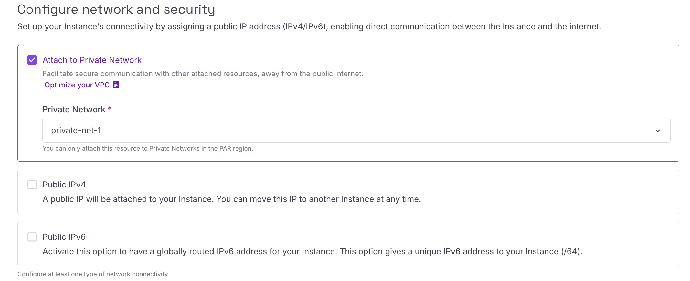
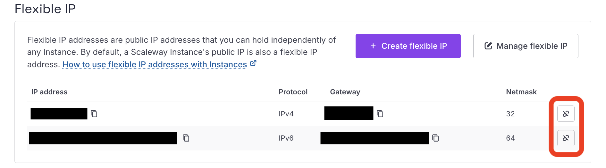
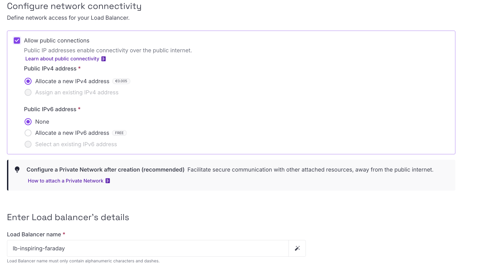
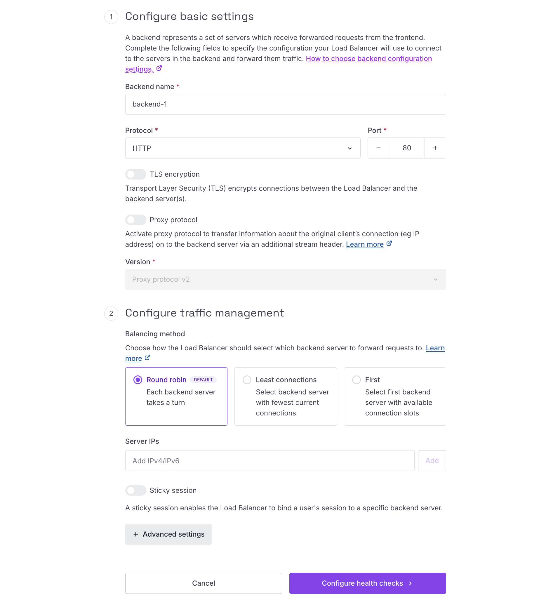
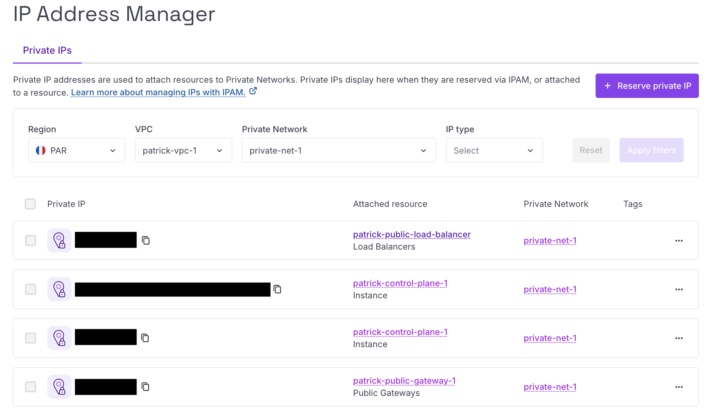
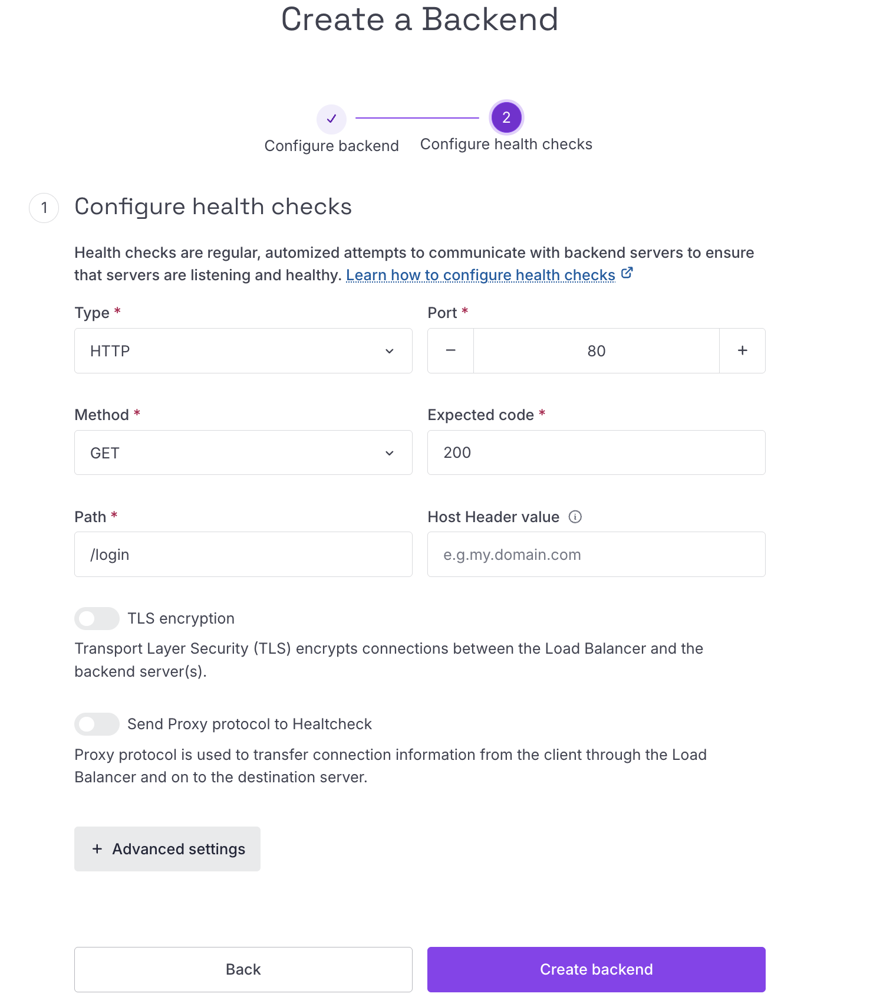
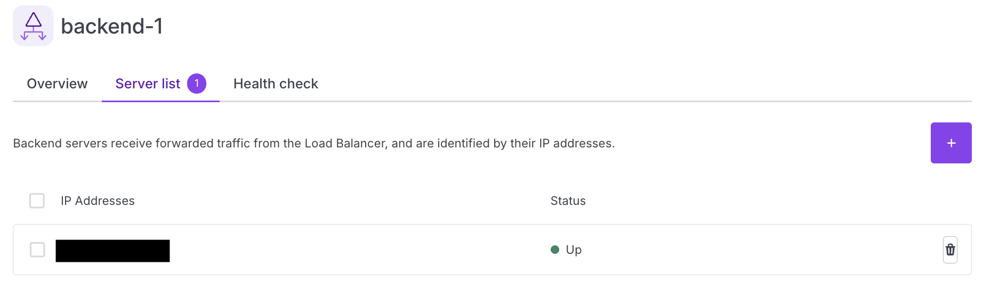
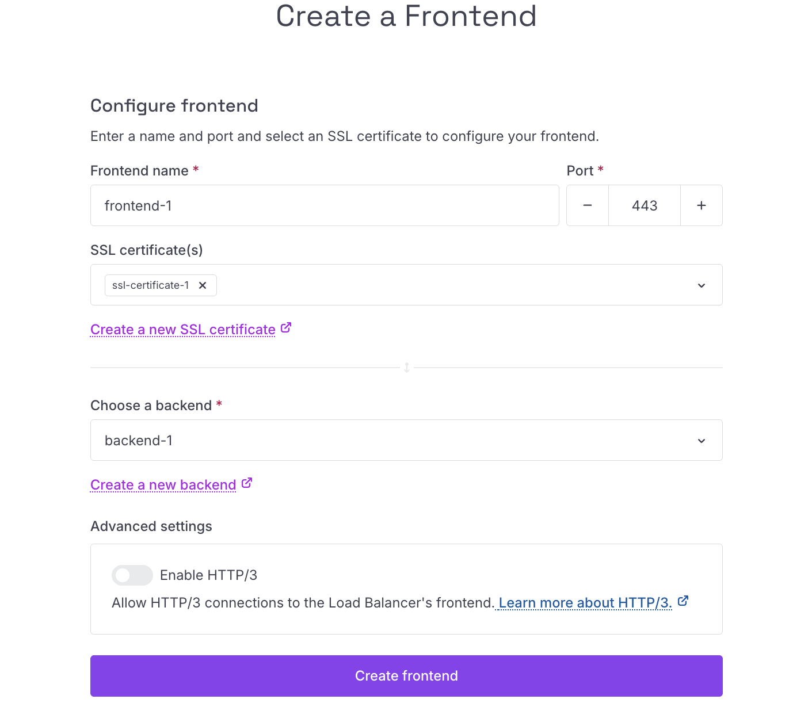

# Setting up HTTPS access to Plakar Control Plane on a Scaleway Private Network

Scaleway VPC allows you to build your own Virtual Private Cloud on top of
Scaleway's shared public cloud. Within each VPC, you can create Private Networks
and attach Scaleway resources to them, as long as the resources are in an AZ
within the network's region. Attached resources can then communicate between
themselves in isolated and secured networks, away from the public internet. The
routing feature allows the different Private Networks of a VPC to communicate
with each other.

In this guide, we will set up Plakar Control Plane (PCP) on a Scaleway Private
Network and expose it securely over HTTPS. To do so, we will:

1. Create a VPC and a Private Network within it
2. Add a Public Gateway to the network so PCP can reach the internet
3. Attach the PCP instance to the Private Network
4. Create a Load Balancer and attach it to the Private Network
5. Configure the Load Balancer to route traffic to PCP
6. Generate and attach an SSL certificate to the Load Balancer

<!-- prettier-ignore-start -->

flowchart TD
  User["User / Browser"]
  DNS["Domain name"]

  subgraph Scaleway["Scaleway"]
    LBFrontend["Load Balancer Frontend HTTPS :443 SSL certificate"]

    subgraph VPC["VPC"]
      subgraph PN["Private Network"]
        LBBackend["Load Balancer Backend HTTP :80"]
        PCP["PCP Instance No public IP"]
        Gateway["Public Gateway Outbound internet access"]
      end
    end

    Internet["Internet Updates, external services"]
  end

  User --> DNS
  DNS --> LBFrontend

  LBFrontend --> LBBackend
  LBBackend --> PCP

  PCP --> Gateway
  Gateway --> Internet

  LBBackend -. "Health check GET /health/ready Expected 200" .-> PCP

<!-- prettier-ignore-end -->





## Create a VPC and a Private Network

In the Scaleway console, navigate to **Network** > **VPC** in the left sidebar.
Click **Create VPC**, select a region, and give it a name.

Once the VPC is created, open it and go to the **Private Networks** tab. Click
**Create private network** and provide a name. No additional configuration is
required at this stage.





## Create a Public Gateway and attach it to the Private Network

In the Scaleway console, navigate to **Network** > **Public Gateways**. Click
**Create public gateway** and configure the following:

- **Zone**: select the zone that matches your Private Network
- **Bandwidth**: choose a gateway bandwidth tier
- **IP**: select **Allocate new IP** to assign a fresh public IP to the gateway
- **Name**: give the gateway a name

Once the gateway is created, open it and go to the **Private Networks** tab.
Click **Attach to a private network**, select the Private Network created in
[Create a VPC and a Private Network](#create-a-vpc-and-a-private-network), and
configure the attachment:

- **Advertise default route**: enable this so that other resources on the
  Private Network learn the default route through the gateway, allowing them to
  reach the internet
- **Private IPv4 address**: leave this set to auto-allocate an available IP from
  the pool



If you ever replace this gateway with a new one, make sure **Advertise default
route** is enabled on the new gateway's attachment to the Private Network.
Resources on the network learn the default route via DHCP, so after switching
gateways, reboot the PCP instance to pick up the new route.





## Attach the PCP instance to the Private Network

If you have not yet created your PCP instance, follow the
[Scaleway installation guide](../../intro/installation/scaleway). When creating
the instance, do not assign a public IPv4 or IPv6 address to it. The Public
Gateway set up in
[Create a Public Gateway and attach it to the Private Network](#create-a-public-gateway-and-attach-it-to-the-private-network)
will provide internet access. You can also attach the instance to the Private
Network directly during instance creation.

If your instance already exists, open your VPC in the Scaleway console, navigate
to the Private Network created in
[Create a VPC and a Private Network](#create-a-vpc-and-a-private-network), and
click **Attach a resource**. Set the resource type to **Instance**, select your
PCP instance, and leave both **Private IPv4 address** and **Private IPv6
address** set to auto-allocate from the pool.



If your existing instance has a public IP attached, you can detach it from the
instance details page under the **Flexible IPs** section.





## Create and configure the Load Balancer





### Create the Load Balancer

In the Scaleway console, navigate to **Network** > **Load Balancers** and click
**Create load balancer**. Configure the following:

- **Zone**: select the zone matching your Private Network
- **Bandwidth**: choose a bandwidth tier
- **Network connectivity**: enable **Allow public connections** and assign a
  public IPv4 address. IPv6 is not required
- **Name**: give the Load Balancer a name

When prompted for quick setup, skip it. We will configure everything manually.





### Attach the Load Balancer to the Private Network

Open the Load Balancer and go to the **Private Networks** tab. Click **Attach to
a private network**, select the Private Network from
[Create a VPC and a Private Network](#create-a-vpc-and-a-private-network), and
leave **Private IPv4 address** set to auto-allocate from the pool.





### Add a backend

Go to the **Backends** tab and click **Add backend**. Configure the following:

- **Name**: provide a name for the backend
- **Protocol**: HTTP
- **Port**: 80
- **TLS encryption**: leave disabled. PCP does not use HTTPS internally and the
  Private Network provides sufficient isolation
- **Proxy protocol**: leave disabled
- **Balancing method**: choose your preferred method (Round robin, Least
  connections, or First)
- **Sticky session**: enable if needed, disabled by default

To add your PCP instance as a backend server, you need its private IP address.
Navigate to **Network** > **IPAM** to find it, then enter it under **Backend
servers**.

Configure the health check as follows:

- **Type**: HTTP
- **Port**: 80
- **Method**: GET
- **Expected code**: 200
- **Path**: `/health/ready`
- **TLS encryption**: leave disabled
- **Send Proxy protocol to Healthcheck**: leave disabled

The `/health/ready` endpoint reports whether Plakar Control Plane is ready to
serve requests. It returns **HTTP 200** only after the application has started
successfully and established a connection to its database. Until then, it
returns **HTTP 503**, preventing the Load Balancer from routing traffic to an
instance that is not yet ready.

> [!NOTE]+ Health Endpoints
>
> Plakar Control Plane exposes two health endpoints:
>
> - `/health` is a lightweight liveness check that verifies the application is
>   running. It does not check database connectivity.
> - `/health/ready` is a readiness check that verifies the application is ready
>   to serve requests, including successful database connectivity. This endpoint
>   is recommended for Load Balancer health checks.

Once the backend is saved, you can monitor the health of your instance from the
**Servers** tab on the backend details page. The Load Balancer will report the
server status based on health check results.





### Create an SSL certificate

Go to the **SSL Certificates** tab and click **Create SSL certificate**. Provide
a name and choose one of two options:

- **Let's Encrypt**: provide a Common Name (your main domain name) and Scaleway
  will generate the certificate automatically
- **Import certificate**: generate your own certificate using OpenSSL and paste
  the full PEM-formatted certificate chain, including the public key, private
  key, and optionally the certificate authorities







### Add a frontend

Go to the **Frontends** tab and click **Add frontend**. Configure the following:

- **Name**: provide a name for the frontend
- **Port**: 443
- **SSL certificate**: select the certificate created above
- **Backend**: select the backend created above

Click **Create frontend**. Your PCP instance is now accessible over HTTPS
through the Load Balancer.

If you prefer to keep your Load Balancer off the public internet entirely, see
[Access Plakar Control Plane via SSH Bastion](./ssh-bastion-access) for an
approach using SSH port forwarding through a bastion, with no public-facing load
balancer.









## What you have built

Your Plakar Control Plane is now running on a Scaleway Private Network with no
public IP exposed on the instance itself. A Public Gateway gives it outbound
internet access, and a Load Balancer with a valid SSL certificate handles all
inbound HTTPS traffic. The instance is reachable only through the Load Balancer,
keeping it isolated from the public internet.

