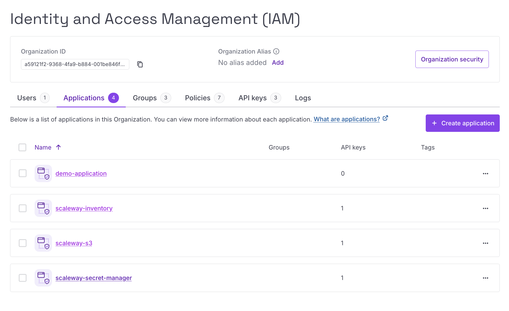
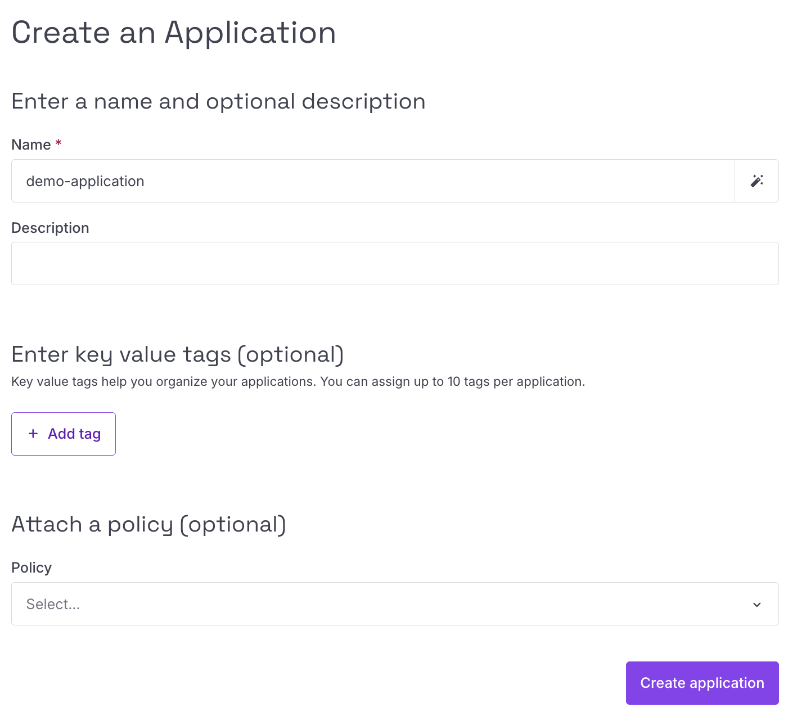
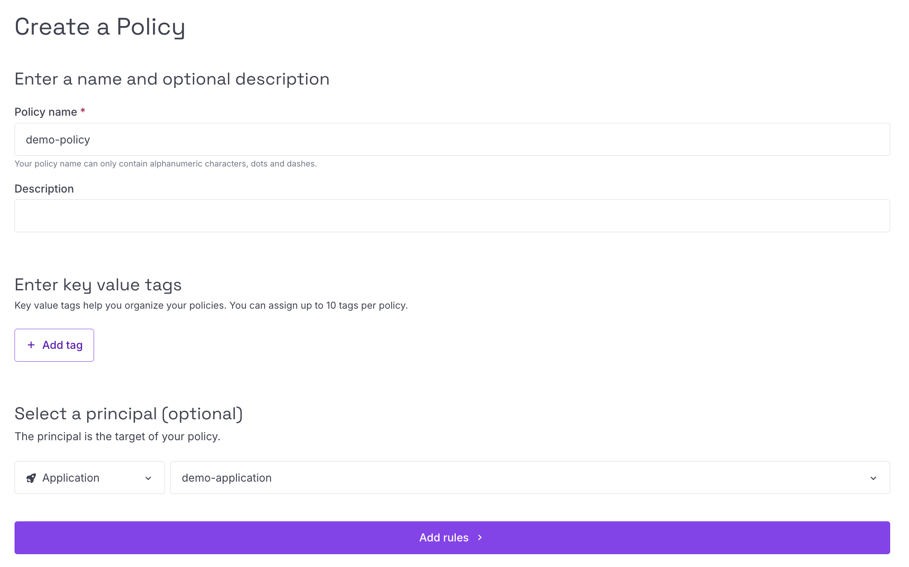
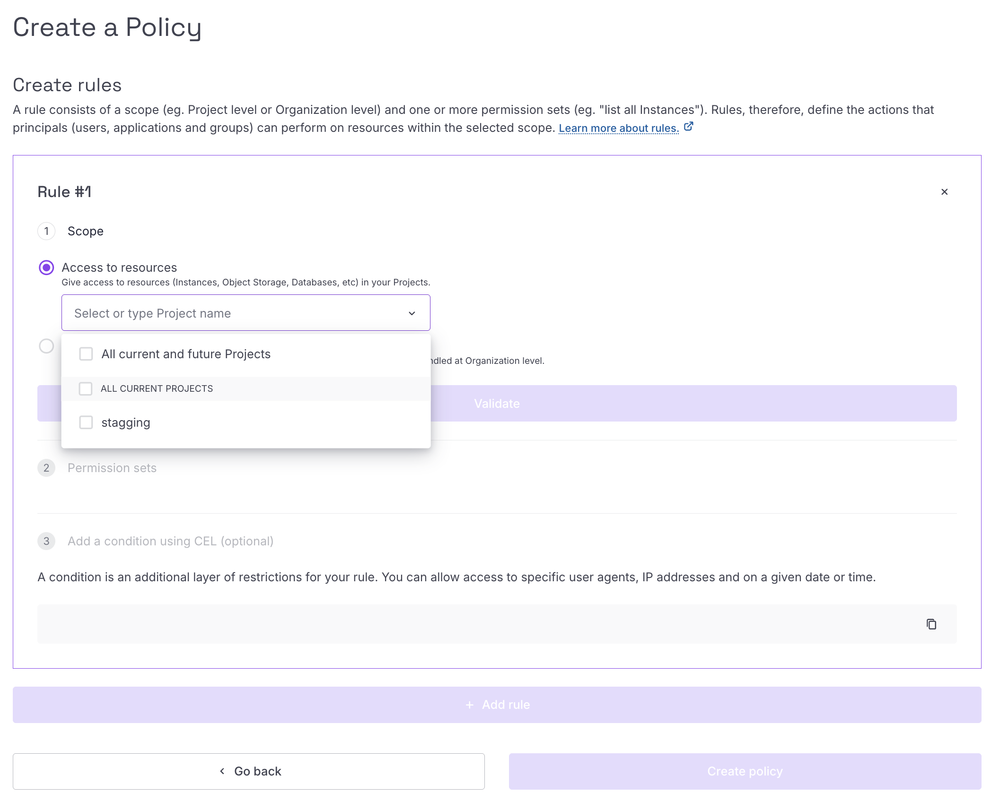

# Managing IAM Policies and API Keys

Plakar Control Plane requires permissions to access Scaleway services in
different situations. For example, when using Scaleway Secret Manager, Plakar
Control Plane needs permission to read secrets. Scaleway credentials are also
used by [Scaleway Inventory](../../../infrastructure/inventories/scaleway) to
discover resources in your account, and by integrations that need access to
services like Object Storage or Scaleway Instances.

In Scaleway, access is managed through IAM policies attached to IAM
applications. API keys are then generated from those applications and used by
external services such as Plakar Control Plane to authenticate against Scaleway
APIs.

This guide walks through creating an IAM application, creating and attaching an
IAM policy, and generating an API key.





## Creating an IAM Application

In Scaleway, API keys can be generated either for an IAM user or for an IAM
application. In this guide we only use IAM applications, since they are designed
for service-to-service authentication and automation workflows.

An application represents a dedicated identity for an external service or
automation tool. Because API keys are generated at the application level, each
application should be scoped to the permissions needed for its specific use
case.

For example, you might create one application dedicated to managing secrets when
using Scaleway Secret Manager, and another application used by a Scaleway
inventory to discover resources in your account. This helps avoid giving one set
of credentials more access than it needs.

When creating an application, you only need to provide a name for it. You can
also optionally attach policies during creation, but in this guide we will
create the policies separately first before attaching them to the application.





## Creating an IAM Policy

After creating the IAM application, create an IAM policy to define what the
application is allowed to access.

When creating the policy, provide a name for it, then select the principal the
policy should apply to. The principal is the target of the policy. For this
guide, select **Application**, then choose the IAM application created in the
previous step. This will attach this policy to the application we created
before.

Next, add rules to the policy. A policy can contain multiple rules, and each
rule defines a scope and the permission sets allowed within that scope.

When adding a rule, Scaleway lets you choose between two scopes:

- **Access to resources**: gives access to resources such as Instances, Object
  Storage, Databases, and other resources inside your projects.
- **Access to Organization features**: gives access to IAM, billing, support and
  abuse tickets, and project management features handled at the organization
  level.

For Plakar Control Plane, select **Access to resources**.

After selecting the resource scope, choose the project or projects the rule
should apply to. Scaleway uses projects to isolate resources. For example, an
Instance created in a production project can only use resources from that same
project, such as block devices created in that project.

You can limit a rule to a single project, select multiple projects, or allow
access to all current and future projects. This is useful when you want to
separate access between environments. For example, you can create separate
Scaleway inventories in Plakar Control Plane for production, staging, and
testing, with each inventory using API keys from an application scoped only to
the matching project.

Next, select the permission sets required for the rule. Permission sets are
grouped by product categories such as Storage, Containers, Network, and Compute.
For example, under Storage, you may find permission sets such as:

- `BlockStorageFullAccess`
- `BlockStorageReadOnly`
- `FileStorageFullAccess`
- `FileStorageReadOnly`
- `ObjectStorageBucketsRead`
- `ObjectStorageBucketsDelete`

Select only the permission sets required for the Scaleway service you want
Plakar Control Plane to use. The required permission sets are documented in each
Scaleway guide. For example, the Scaleway Secret Manager guide lists the
permissions needed to read secrets, while the Scaleway inventory guide lists the
permissions needed to discover resources.

You can add more rules if the application needs access to additional services or
projects. Once the policy contains the rules you need, you can create the
policy.





## Generating API Keys

After creating the IAM application and attaching the required policy, generate
an API key for the application. This API key is what Plakar Control Plane uses
to authenticate with Scaleway APIs.

When creating the API key, Scaleway asks you to select the API key bearer.
Select **An application**, then choose the IAM application created earlier in
this guide.

Next, select an expiration period for the API key.

> [!WARNING]+
>
> Check the expiration period carefully before creating the API key. If the key
> is used for an important workflow, such as automated backups for Object
> Storage, and the key expires, Plakar Control Plane will no longer be able to
> run automated backups for that resource until the credentials are updated.

Scaleway then asks whether the API key will be used for Object Storage. If the
policy attached to the application includes a rule that needs access to Object
Storage, select **Yes, set up preferred Project** and choose the relevant
project. Otherwise, select **No, skip for now**.



After generating the API key, Scaleway shows an access key ID and a secret key.
Copy and store the secret key securely.

> [!WARNING]+
>
> The secret key is only shown once. Store it somewhere safe before leaving the
> page.





