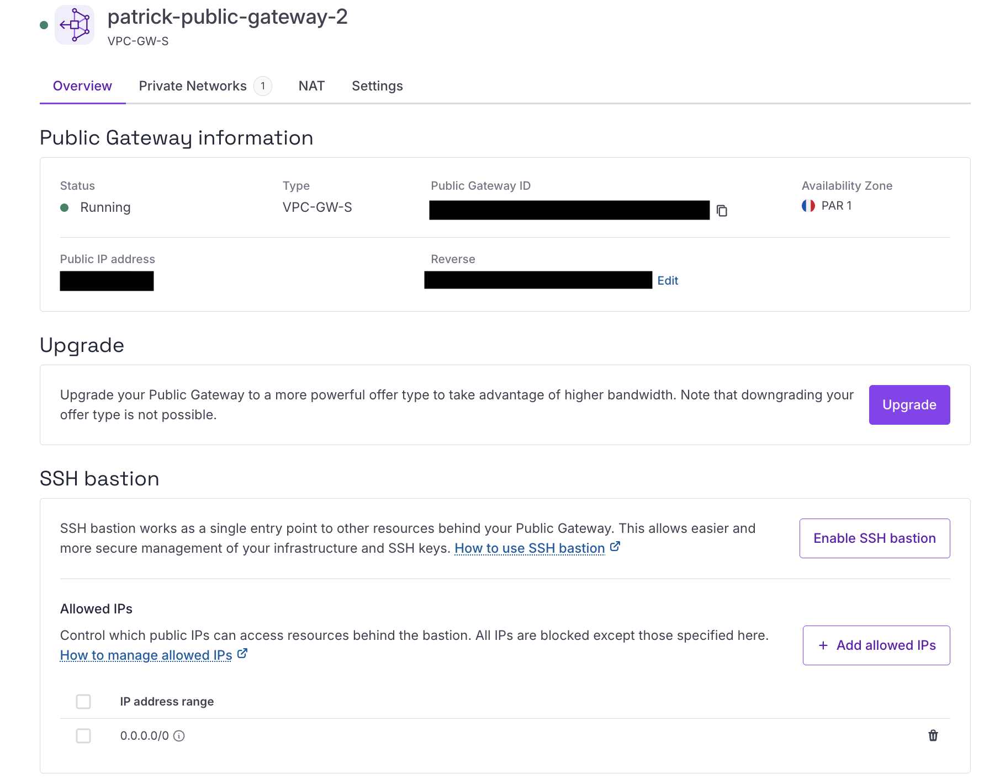

# Access Plakar Control Plane via SSH Bastion

This guide covers accessing Plakar Control Plane (PCP) on a Scaleway Private
Network using the SSH bastion feature of the Public Gateway. The instance has no
public IP and is not reachable directly from the internet. Access to the web UI
is established via SSH port forwarding through the bastion.

<!-- prettier-ignore-start -->

flowchart TD
  Browser["Browser<br/>http://localhost:8080"]
  SSHClient["SSH client<br/>ssh plakar-pcp -N"]

  subgraph LocalMachine["Local machine"]
    Browser -->|"local access"| SSHClient
  end

  subgraph Scaleway["Scaleway VPC"]
    subgraph PN["Private Network"]
      Gateway["Public Gateway<br/>SSH bastion enabled<br/>Port 61000"]
      PCP["PCP Instance<br/>Private IP only<br/>No public IP"]
    end
  end

  SSHClient -->|"SSH tunnel via bastion"| Gateway
  Gateway -->|"forwards TCP to private IP<br/>Port 80"| PCP

  PCP -. "Web UI<br/>HTTP :80" .-> Gateway
  Gateway -. "tunnel response" .-> SSHClient
  SSHClient -. "localhost:8080" .-> Browser

<!-- prettier-ignore-end -->

## Prerequisites

Before starting, complete the following steps from the
[HTTPS access guide](./https-access-to-a-private-network):

- [Create a VPC and a Private Network](./https-access-to-a-private-network#create-a-vpc-and-a-private-network)
- [Create a Public Gateway and attach it to the Private Network](./https-access-to-a-private-network#create-a-public-gateway-and-attach-it-to-the-private-network)
- [Attach the PCP instance to the Private Network](./https-access-to-a-private-network#attach-the-pcp-instance-to-the-private-network)

Make sure the instance has no public IPv4 or IPv6 address assigned.





## Enable SSH bastion on the Public Gateway

In the Scaleway console, navigate to **Network** > **Public Gateways** and open
the gateway created in the prerequisites. On the **Overview** page, find the
**SSH Bastion** section and click **Enable SSH bastion**.

Choose a port for the bastion to listen on, or leave the default (`61000`) and
click **Save SSH bastion settings**.







## Configure allowed IPs (optional)

By default, SSH bastion allows connections from any public IP (`0.0.0.0/0`). To
restrict access to specific IP ranges, delete the default entry and add your own
under the **Allowed IPs** section on the gateway's overview page.

Enter each IPv4 range with its subnet mask, using `/32` for single addresses.





## Configure your SSH client

Add the following to your `~/.ssh/config` file, replacing the placeholders with
your Public Gateway's public IP and your PCP instance's private IP. The private
IP can be found under **Network** > **IPAM** in the Scaleway console.

```txt
Host plakar-pcp
  HostName <PUBLIC_GATEWAY_IP>
  Port 61000
  User bastion
  LocalForward 8080 <PLAKAR_SERVER_PRIVATE_IP>:80
```





## Access the web UI via port forwarding

Run the following command to open the tunnel. No SSH access to the PCP instance
is required since the bastion makes a direct TCP connection to it over the
Private Network.

```sh
ssh plakar-pcp -N
```

Then open your browser and navigate to:

```
http://localhost:8080
```





## What you have built

Your Plakar Control Plane is accessible through an SSH tunnel without any public
IP or open port on the instance. The Public Gateway's SSH bastion is the only
entry point, and access can be restricted to specific IP ranges. This setup is
suitable for environments where exposing a load balancer publicly is not
desirable.

