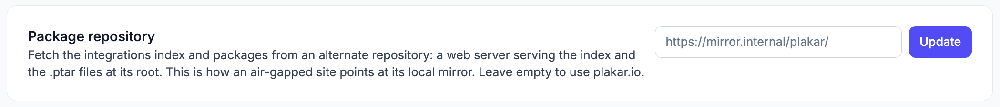

# Hosting a Package Repository

By default, Plakar Control Plane downloads
[integrations](../../apps/integrations) and appliance components from
`plakar.io`. In an air-gapped environment, you can host these files on your own
network and configure the appliance to use them instead.

Air-gapped deployments use two separate repositories:

- **Integrations repository**: contains the integration index and `.ptar`
  packages that Plakar Control Plane uses after it starts.
- **Releases repository**: contains the component definitions that the appliance
  uses to configure Plakar Control Plane during its initial boot and when it is
  being updated.

Both repositories are plain directory trees served over HTTP or HTTPS. They can
be hosted on the same server or on separate servers.

## Integrations repository

The integrations repository contains the `.ptar` packages and the JSON index
that Plakar Control Plane uses to discover available integrations.

You can mirror the required version directly from `plakar.io`. Replace `v1.1.0`
with the version you want to make available:

```sh
wget --mirror --no-parent --no-host-directories --cut-dirs=5 \
  --accept '*.ptar,*.json' \
  -e robots=off \
  https://www.plakar.io/dist/releases/plakar/offline/v1.1.0/
```

The `--accept` option limits the mirror to `.ptar` packages and JSON files,
excluding the generated directory listing pages.

After mirroring the files, serve the resulting directory from your HTTP or HTTPS
server. The repository must preserve the directory structure downloaded from
`plakar.io`.

Unlike the releases repository, the integrations repository is configured from
Plakar Control Plane rather than from the appliance user-data. Open **Settings >
General** and enter the URL of the server hosting your mirrored files in the
[package repository](../../administration/general-settings#package-repository)
field, for example `https://dist.corp.example/integrations`.

Plakar Control Plane retrieves the integrations index and `.ptar` packages from
that server instead of `plakar.io`. Leaving the field empty restores the default
`plakar.io` repository.



## Releases repository

The appliance also needs access to the component definitions used to deploy
Plakar Control Plane. These files are separate from the integrations repository
and must be mirrored independently. The releases are available under:

```text
https://www.plakar.io/dist/releases/plakar/enterprise/
```

Each version is stored in its own directory and contains three files:
`proxy.yaml`, `plakman.yaml`, and `database.yaml`.

Mirror the version you intend to run. Replace `v1.1.2` with the required
version:

```sh
wget --mirror --no-parent --no-host-directories --cut-dirs=4 \
  --accept '*.yaml' \
  -e robots=off \
  https://www.plakar.io/dist/releases/plakar/enterprise/v1.1.2/
```

The `--accept` option limits the mirror to the component definition files,
excluding the generated directory listing pages.

When a new version is released, mirror it into the same repository alongside the
versions you already host then
[upgrade to the new version](../../administration/updating-control-plane#updating-an-air-gapped-plakar-control-plane).

### Configure the appliance

Point the appliance to your local releases repository in its user-data:

```yaml
#cloud-config
releases:
  url: https://dist.corp.example/plakar/enterprise
  version: v1.1.2
```

The `url` must use either `http://` or `https://`. If an unsupported URL scheme
is configured, the appliance logs the configuration and falls back to
`plakar.io`.

If a forward proxy is configured, the host specified in `releases.url` is
automatically excluded from the proxy.

## Serving the repositories

Both repositories can be served using any static HTTP server. For example,
[Caddy](https://caddyserver.com) can serve both repositories from different
paths on the same host:

```text
:80
handle_path /integrations/* {
  root * /srv/integrations
  file_server browse
}

handle_path /enterprise/* {
  root * /srv/enterprise
  file_server browse
}
```

The `/integrations` path serves the integrations repository, while `/enterprise`
serves the releases repository.

You can also host the repositories on separate servers. In either case, make
sure the appliance and Plakar Control Plane can reach the configured repository
over your internal network.

