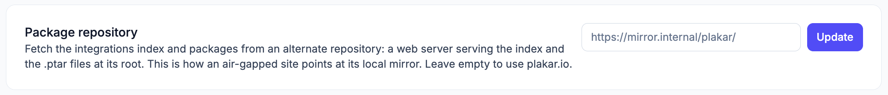

# Hosting a Package Repository

By default, Plakar Control Plane downloads
[integrations](../../apps/integrations) and appliance components from
`plakar.io`. In an air-gapped environment, you can host these files on your own
network and configure the appliance and Plakar Control Plane to use them
instead.

Air-gapped deployments use two separate repositories:

- **Integrations repository**: contains the integration index and `.ptar`
  packages that Plakar Control Plane uses after it starts.
- **Releases repository**: contains the component definitions used by the
  appliance to configure Plakar Control Plane during its initial boot and
  subsequent updates.

Both repositories are plain directory trees served over HTTP or HTTPS. They can
be hosted on the same server or on separate servers.

## Integrations repository

The integrations repository contains the integrations distribution files
published at `https://www.plakar.io/dist/plugins/kloset/enterprise`. The
repository uses a slightly different layout: the `integrations-v1.0.0.json`
index is moved to the repository root, while the integration packages remain
under the `enterprise` directory.

```text
<air-gapped-package-repository>/
├── integrations-v1.0.0.json
└── enterprise/
  └── v1.1.0/
    ├── aws/
    │ ├── aws_v1.1.3_linux_amd64.ptar
    │ ├── aws_v1.1.3_linux_amd64.ptar.sum
    │ ├── aws_v1.1.3_linux_amd64.ptar.sum.sig
    │ ├── recipe.yaml
    │ ├── recipe.yaml.sum
    │ ├── recipe.yaml.sum.sig
    │ └── ...
    ├── postgresql/
    └── ...
```

The `enterprise` directory contains one directory for each integration API
version. Each integration directory contains the integration packages, recipe,
checksums, and signatures.

Plakar Control Plane verifies package signatures before installing them, so the
`.sum` and `.sig` files must also be mirrored.

Mirror the tree from `plakar.io`, then move the index to the repository root:

```sh
wget --mirror --no-parent --no-host-directories --cut-dirs=3 \
  --accept '*.ptar,*.yaml,*.sum,*.sig,*.json' \
  -e robots=off \
  https://www.plakar.io/dist/plugins/kloset/enterprise/
mv enterprise/integrations-v1.0.0.json .
```

The `--accept` option limits the mirror to the repository files and excludes the
generated directory listing pages.

After mirroring the files, serve the resulting directory from your HTTP or HTTPS
server.

Unlike the releases repository, the integrations repository is configured in
Plakar Control Plane rather than in the appliance user-data. Open the
[settings](../../administration/settings) and enter the URL of the server
hosting the mirrored files in the package repository field, for example
`https://dist.corp.example/integrations`.

The URL must point to the root of the repository, where
`integrations-v1.0.0.json` is located, and not to the `enterprise` directory.

Plakar Control Plane retrieves the integrations index and `.ptar` packages from
this server instead of `plakar.io`. Leave the field empty to use the default
`plakar.io` repository.



## Releases repository

The appliance also needs access to the component definitions used to deploy
Plakar Control Plane. These files are separate from the integrations repository
and must be mirrored independently.

The releases are available under:

```text
https://www.plakar.io/dist/releases/plakar/enterprise/
```

Each version is stored in its own directory and contains three files:
`proxy.yaml`, `plakman.yaml`, and `database.yaml`.

Mirror the version you intend to run. Replace `v1.1.2` with the required
version:

```sh
wget --mirror --no-parent --no-host-directories --cut-dirs=4 \
  --accept '*.yaml' \
  -e robots=off \
  https://www.plakar.io/dist/releases/plakar/enterprise/v1.1.2/
```

The `--accept` option limits the mirror to the component definition files and
excludes the generated directory listing pages.

When a new version is released, mirror it into the same repository alongside the
versions you already host, then
[upgrade to the new version](../../administration/updating-control-plane#updating-an-air-gapped-plakar-control-plane).

### Configure the appliance

Point the appliance to your local releases repository in its user-data:

```yaml
#cloud-config
releases:
  url: https://dist.corp.example/plakar/enterprise
  version: v1.1.2
```

The `url` must use either `http://` or `https://`. If an unsupported URL scheme
is configured, the appliance logs the configuration and falls back to
`plakar.io`.

If a forward proxy is configured, the host specified in `releases.url` is
automatically excluded from the proxy.

## Serving the repositories

Both repositories can be served using any static HTTP server. For example,
[Caddy](https://caddyserver.com) can serve both repositories from different
paths on the same host:

```text
:80
handle_path /integrations/* {
  root * /srv/integrations
  file_server browse
}

handle_path /enterprise/* {
  root * /srv/enterprise
  file_server browse
}
```

The `/integrations` path serves the integrations repository, while `/enterprise`
serves the releases repository.

You can also host the repositories on separate servers. In either case, make
sure the appliance and Plakar Control Plane can reach the configured repository
over the internal network.

