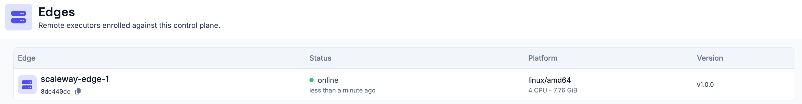
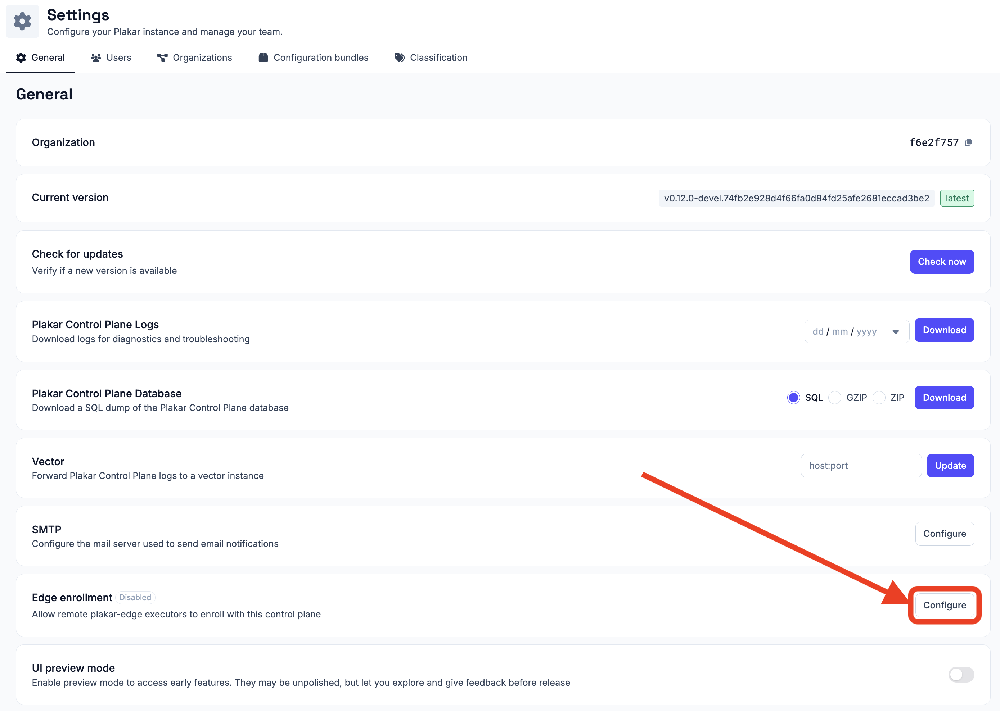

# Edges

By default, Plakar Control Plane (PCP) executes all scheduled operations from
the Control Plane appliance itself. This is suitable for small deployments, but
larger or geographically distributed environments often benefit from executing
tasks closer to the systems being protected.

An **edge** is a remote lightweight executor that registers with PCP and
performs operations on its behalf. Rather than requiring the Control Plane to
have direct network access to every source and destination, edges are deployed
inside the networks where the data resides and execute tasks locally.

Using edges provides several benefits:

- Execute tasks close to the protected resources, reducing latency and network
  traffic.
- Back up resources located behind private networks, firewalls, or NAT gateways.
- Scale horizontally by distributing work across multiple edge executors.
- Keep the Control Plane isolated while extending protection to remote
  environments.



## Architecture

In a typical deployment, the Control Plane coordinates work while one or more
edges execute tasks within their local environments.

<!-- prettier-ignore-start -->

flowchart LR
  PCP["Plakar Control Plane"]

  subgraph Site1["Datacenter A"]
    Edge1["Edge"]
    VM1["Virtual Machines"]
    DB1["Databases"]
  end

  subgraph Site2["Remote Office"]
    Edge2["Edge"]
    NAS["NAS"]
    Files["File Servers"]
  end

  PCP -->|Assign task| Edge1
  PCP -->|Assign task| Edge2

  Edge1 --> VM1
  Edge1 --> DB1

  Edge2 --> NAS
  Edge2 --> Files

<!-- prettier-ignore-end -->

The Control Plane is responsible for scheduling work, managing inventories,
storing metadata, and resolving secrets. Edges receive work from the Control
Plane, execute it locally, and report the results back to Control Plane.

## How edges work

Edge enrollment is a one-time operation. Once enrolled, the edge continuously
polls the Control Plane for work. Whenever a scheduled task is assigned, the
Control Plane resolves any required secrets, the edge performs the operation
locally, and the result is reported back.

<!-- prettier-ignore-start -->

sequenceDiagram
  participant Edge as plakar-edge
  participant PCP as Plakar Control Plane
  participant Target as Source / Destination

  Note over Edge,PCP: One-time enrollment
  Edge->>PCP: Register with enrollment key
  PCP-->>Edge: Authentication token

  Note over Edge,PCP: Task execution
  PCP->>Edge: Assign task
  PCP-->>Edge: Resolve and provide required secrets
  Edge->>Target: Execute operation locally
  Target-->>Edge: Result
  Edge-->>PCP: Report task status

<!-- prettier-ignore-end -->

## Requirements

Each edge must be able to communicate with:

- The **Plakar Control Plane** over HTTP or HTTPS.
- The systems or services it is expected to protect.

The Control Plane does not require direct connectivity to those protected
resources. Instead, it dispatches work to an edge, which executes the operation
locally and reports the outcome back.





## Installing plakar-edge

The `plakar-edge` source code is available from
[PlakarKorp/plakar-edge](https://github.com/PlakarKorp/plakar-edge).

Currently, the edge must be built from source:

```sh
$ make

# or

$ go build -o plakar-edge .
```

Future releases will provide prebuilt binaries, and edge functionality will
eventually be integrated directly into the `plakar` CLI.





## Enabling edge enrollment

New edges authenticate using an enrollment key generated by the Control Plane.
Edge enrollment is disabled by default.

To enable enrollment:

1. Open **Settings**.
2. Select the **General** tab.
3. Under **Edge Enrollment**, click **Configure**.
4. Enable enrollment.



Once enabled, PCP generates an enrollment key. New edges use this key during
their first startup to obtain an authentication token. You can regenerate the
key at any time.

Enrollment only needs to remain enabled while new edges are joining the Control
Plane and can be disabled once all required edges have been registered. Existing
edges continue to authenticate using their stored token even after enrollment
has been disabled.





## Enrolling an edge

Start the edge for the first time using the enrollment key:

```sh
$ plakar-edge \
  -control-plane https://plakman.example.com \
  -enroll <enrollment-key> \
  -name edge-paris-1 \
  -tags env:prod,zone:eu-1 \
  -state-dir /var/lib/plakar-edge \
  -pkg /var/lib/plakar-edge/pkgs
```

- **`-control-plane`**: **Required.** Base URL of the Plakar Control Plane.
- **`-enroll`**: **Required on first run only.** Enrollment key. Not needed on
  subsequent restarts once the edge has stored its token. Can also be supplied
  via the `PLAKAR_EDGE_ENROLL_KEY` environment variable instead of the flag.
- **`-name`**: **Optional.** Defaults to the hostname. Display name shown in the
  Control Plane.
- **`-tags`**: **Optional.** Comma-separated list of tags self-reported to the
  Control Plane on every poll (e.g. `env:prod,zone:eu-1`), letting it target
  this edge by tag match.
- **`-state-dir`**: **Optional.** Defaults to `/var/lib/plakar-edge`. Directory
  used to store the edge identity and authentication token.
- **`-pkg`**: **Optional.** Defaults to `<state-dir>/pkg`. Base directory used
  to store downloaded connector packages.
- **`-poll-hold`**: **Optional.** Defaults to `30s`. Expected server-side
  long-poll duration.
- **`-listen`**: **Optional.** Defaults to `127.0.0.1:9877`. Address for the
  supervision HTTP server (`/health`, `/ready`, `/metrics`). Can be set to an
  empty string to disable it.
- **`-metrics`**: **Optional.** Defaults to `true`. Enable Prometheus metrics on
  the supervision endpoint.

After a successful enrollment, the edge stores its identity and authentication
token in `-state-dir`.





## Restarting an enrolled edge

Once enrolled, the edge no longer requires the `-enroll` option. On subsequent
starts, the stored authentication token is reused automatically.

## Supervision and metrics

The edge exposes a lightweight HTTP server for supervision and monitoring.

By default, this server listens on `127.0.0.1:9877`. Configure `-listen` with a
different address if external monitoring systems need to reach it, or set it to
an empty string to disable the server entirely.

- **`/health`**: Returns `200 OK` while the edge process is running. Suitable
  for liveness checks.
- **`/ready`**: Returns `200 OK` only after the edge has successfully enrolled
  and is polling the Control Plane. Returns `503` otherwise. Suitable for
  readiness checks.
- **`/metrics`**: Exposes host, process, Go runtime, and node-exporter metrics
  in Prometheus format.

The `-metrics` flag controls whether the `/metrics` endpoint is exposed.

## Secrets

When an edge executes a task, PCP resolves the required secrets and securely
provides them to the edge for the duration of that task. This includes
repository credentials such as the repository passphrase.

## Running tasks on an edge

Scheduled tasks run on the PCP appliance by default. To execute a task on an
edge instead, select the desired edge in the **Advanced** section when creating
or editing a scheduled task. See
[Scheduled Tasks](../../operations/scheduling/tasks) documentation for more
information.

