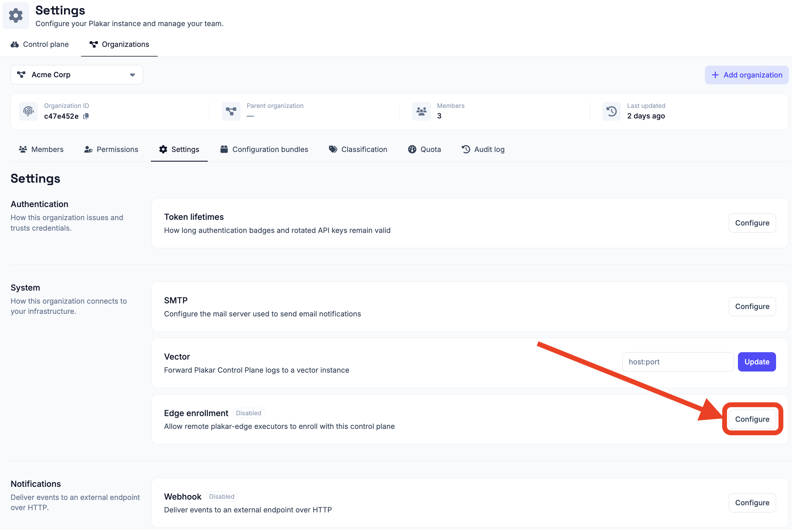

# Edges

By default, Plakar Control Plane (PCP) runs scheduled operations from the
Control Plane appliance. This works well when the resources you want to protect
are reachable from the appliance.

For environments where resources are spread across different networks, or where
the Control Plane should not have direct access to them, you can run operations
through an **edge**.

An edge is a lightweight executor that runs in the environment where the
resources you want to protect are located. It connects to PCP, receives work
from the Control Plane, performs the operation locally, and reports the result
back.

This lets the Control Plane coordinate protection without needing direct
connectivity to every source and destination.

## When to use an edge

An edge is useful when the systems being protected are not directly reachable
from the Control Plane, when it is more efficient to run the operation close to
those systems, when the appliance on its own cannot keep up with the work, or
when an integration needs tools that the appliance does not carry.

For example, you might deploy an edge inside a datacenter containing virtual
machines and databases, while the Control Plane runs elsewhere. The edge can
then access those resources locally without exposing them to the Control Plane
network.

Edges are also how a deployment scales. Every operation an edge runs is work the
appliance does not run itself, so adding edges increases how much protection a
single deployment can carry out at once, without resizing the appliance.

Edges are particularly useful for:

- Protecting resources behind private networks, firewalls, or NAT gateways.
- Running operations close to the data to reduce unnecessary network traffic and
  latency.
- Distributing work across multiple executors so that protection scales beyond
  what one appliance can run.
- Keeping the Control Plane isolated from networks containing protected
  resources.
- Running the few integrations that depend on external tools, which can be
  installed on the edge host.

An edge belongs to a single organization. You can only access the edges
belonging to the organization you are signed in to, subject to your permissions
for that organization.

## Architecture

The Control Plane remains responsible for coordinating protection. It schedules
operations, manages inventories, stores metadata, and resolves the secrets
required to perform a task.

The edge is responsible for executing the operation. It connects to the Control
Plane and accesses the source or destination from its own network.

A deployment can contain multiple edges in different environments:

<!-- prettier-ignore-start -->

flowchart LR
  PCP["Plakar Control Plane"]

  subgraph Site1["Datacenter A"]
    Edge1["Edge"]
    VM1["Virtual Machines"]
    DB1["Databases"]
  end

  subgraph Site2["Remote Office"]
    Edge2["Edge"]
    NAS["NAS"]
    Files["File Servers"]
  end

  PCP -->|Assign task| Edge1
  PCP -->|Assign task| Edge2

  Edge1 --> VM1
  Edge1 --> DB1

  Edge2 --> NAS
  Edge2 --> Files

<!-- prettier-ignore-end -->

The important part of this architecture is that **the Control Plane does not
need direct access to the protected resources**. It only needs to communicate
with the edges. Each edge must be able to reach both the Control Plane and the
resources it is responsible for.

## How an edge works

An edge is enrolled once with the Control Plane. During enrollment, PCP gives
the edge an authentication token that it stores locally.

After enrollment, the edge maintains its connection to PCP by polling for work.
When a scheduled operation is assigned to it, PCP provides the information and
secrets required to perform the operation. The edge then connects directly to
the source, store or destination, performs the operation, and reports its status
to PCP.

<!-- prettier-ignore-start -->

sequenceDiagram
  participant Edge as plakar-edge
  participant PCP as Plakar Control Plane
  participant Target as Source / Destination

  Note over Edge,PCP: One-time enrollment
  Edge->>PCP: Register with enrollment key
  PCP-->>Edge: Authentication token

  Note over Edge,PCP: Task execution
  PCP->>Edge: Assign task
  PCP-->>Edge: Resolve and provide required secrets
  Edge->>Target: Execute operation locally
  Target-->>Edge: Result
  Edge-->>PCP: Report task status

<!-- prettier-ignore-end -->

Because the edge initiates communication with PCP, you do not need to expose an
edge to inbound connections from the Control Plane. This also makes it suitable
for environments where inbound connectivity is restricted.

## Requirements

An edge needs network access to two things:

- The **Plakar Control Plane**, over HTTP or HTTPS.
- The systems and services it is expected to protect.

The Control Plane itself does not need network access to those systems. The edge
provides that connectivity when it executes a task.

### Integrations that need external tools

Most integrations are agentless. They communicate directly with the resource
they manage and do not require additional software on the machine running the
task. For example, the [Windows VSS integration](../../resources/compute/vss)
connects to the Windows host over SSH and does not require any additional tools
on the Control Plane or edge.

Some integrations such as MongoDB, PostgreSQL and MySQL instead rely on
utilities provided by the vendor. These utilities must be installed on the
machine that executes the task. The
[MongoDB integration](../../resources/database/mongodb), for example, uses
`mongosh`, `mongodump`, and `mongorestore`, which must be available in the
`PATH` of the process running the task.

These utilities are not included in the appliance, and the appliance is not
intended to be extended with additional software. Tasks that require external
tools should therefore run on an [edge](../../infrastructure/edges) where the
required tools can be installed.

Install the tools required by the integration on the edge host, then configure
the task to run on that edge. As deployments grow, edges can be equipped with
different sets of tools so that workloads can be distributed to the machines
capable of running them.

## Enable edge enrollment

Before an edge can join an organization, **edge enrollment** must be enabled for
that organization. Enrollment is disabled by default.

New edges authenticate using an enrollment key generated by the Control Plane.
The key is used when an edge connects to PCP for the first time and exchanges it
for an authentication token.

Edges work within an organization. You work only with the edges of the
organization you signed in to, and what you can do with them is determined by
the [permissions](../../administration/permissions) your application user has on
the organization.

To enable enrollment, open the organization's settings and enable **Edge
enrollment** under **Settings -> Organizations -> [your organization] ->
Settings**. Enable it for the organization where the new edge should be
registered.



Keep enrollment enabled while you are adding edges. Once an edge has
successfully enrolled, it no longer depends on the enrollment setting. PCP has
issued it an authentication token, which the edge stores locally and uses for
subsequent connections.

You can therefore **disable edge enrollment after you have finished registering
your edges**. Disabling enrollment prevents new edges from joining the
organization, but does not affect edges that are already enrolled.

If you need to add another edge later, enable enrollment again before starting
its first connection to PCP.

You can regenerate the enrollment key at any time. If you regenerate it, use the
new key when enrolling subsequent edges.

## Installing an edge

An edge can run either as a standalone binary or as a Kubernetes workload.
Choose the deployment method that best fits the environment where the edge will
run.





### Build `plakar-edge`

The standalone edge is currently built from source. The source code is available
in the [PlakarKorp/plakar-edge](https://github.com/PlakarKorp/plakar-edge)
repository.

Build it with:

```sh
$ make
# OR
$ go build -o plakar-edge .
```

Prebuilt binaries will be provided in a future release, and edge functionality
will eventually be integrated directly into the `plakar` CLI.

### Enroll the edge

Start the edge with the Control Plane URL, enrollment key, and organization it
should join:

```sh
$ plakar-edge \
  -control-plane https://plakman.example.com \
  -enroll <enrollment-key> \
  -organization <organization-id> \
  -name edge-paris-1 \
  -tags env:prod,zone:eu-1 \
  -state-dir /var/lib/plakar-edge \
  -pkg /var/lib/plakar-edge/pkgs
```

The enrollment key and organization are only required for the first startup.
After successful enrollment, the edge stores its identity and authentication
token in its state directory and reuses them on subsequent starts.

For subsequent starts, you can therefore run:

```sh
$ plakar-edge \
  -control-plane https://plakman.example.com \
  -name edge-paris-1 \
  -tags env:prod,zone:eu-1 \
  -state-dir /var/lib/plakar-edge \
  -pkg /var/lib/plakar-edge/pkgs
```

### Configure the edge

The most important options are:

| Option           | Required  | Description                                                                                                                  |
| ---------------- | --------- | ---------------------------------------------------------------------------------------------------------------------------- |
| `-control-plane` | Yes       | Base URL of the Plakar Control Plane.                                                                                        |
| `-enroll`        | First run | Enrollment key used to register the edge. It can also be provided through `PLAKAR_EDGE_ENROLL_KEY`.                          |
| `-organization`  | First run | Identifier of the organization the edge joins. It can also be provided through `PLAKAR_EDGE_ORGANIZATION`.                   |
| `-name`          | No        | Name displayed for the edge in PCP. Defaults to the hostname.                                                                |
| `-tags`          | No        | Comma-separated tags reported by the edge on each poll. Tags can be used to target work to matching edges.                   |
| `-state-dir`     | No        | Directory used to store the edge identity and authentication token. Defaults to `/var/lib/plakar-edge`.                      |
| `-pkg`           | No        | Directory used for downloaded connector packages. Defaults to `<state-dir>/pkg`.                                             |
| `-max-parallel`  | No        | Maximum number of tasks the edge runs concurrently. Defaults to `5`.                                                         |
| `-poll-hold`     | No        | Expected server-side long-poll duration. Defaults to `30s`.                                                                  |
| `-listen`        | No        | Address of the supervision HTTP server. Defaults to `127.0.0.1:9877`. Set it to an empty string to disable the server.       |
| `-metrics`       | No        | Enables the Prometheus `/metrics` endpoint. Defaults to `true`.                                                              |
| `-scripts-dir`   | No        | Directory holding the [hook scripts](#pre-job-and-post-job-hooks) tasks may run. Empty by default, which refuses every hook. |

`-max-parallel` caps how much work one edge takes on at a time. Tasks assigned
beyond that limit wait until a running one finishes.

Tags are useful when you have multiple edges and want PCP to select an edge
based on its environment. For example:

```text
env:prod,zone:eu-1
```

An edge can report multiple tags. See [Selecting an edge](#selecting-an-edge)
for how PCP matches them when assigning work.





### Deploy the edge

Each release provides a container image and Helm chart:

```text
ghcr.io/plakarkorp/plakar-edge
oci://ghcr.io/plakarkorp/charts/plakar-edge
```

The Helm chart runs each edge as an independent StatefulSet replica. Each
replica receives its own identity when it enrolls with the Control Plane.

The edge stores its identity and package cache on persistent storage. This is
important because restarting a pod should not cause it to enroll as a new edge.

Each replica also has a stable hostname, which is used as its edge name by
default.

### Store the enrollment key

Store the enrollment key in a Kubernetes Secret rather than putting it directly
in the Helm values:

```sh
$ kubectl create secret generic plakar-edge-enroll-key \
  --from-literal=enroll-key=<enrollment-key>
```

The chart references the Secret by name, keeping the enrollment key out of
`values.yaml`, rendered manifests, and Helm history.

### Install the chart

For example, to run three edges:

```sh
$ helm install my-edges oci://ghcr.io/plakarkorp/charts/plakar-edge \
  --set controlPlane=https://plakman.example.com \
  --set organization=<organization-id> \
  --set enrollKey.secretName=plakar-edge-enroll-key \
  --set replicaCount=3
```

Each replica enrolls independently and appears as a separate edge in the Control
Plane.

Without `--version`, Helm installs the latest published chart. To pin a release,
specify the chart version:

```sh
--version <version>
```

The chart automatically uses the image version associated with the selected
chart release.

### Configure the chart

The main values for an edge deployment are:

| Value                          | Default                          | Description                                                                                                     |
| ------------------------------ | -------------------------------- | --------------------------------------------------------------------------------------------------------------- |
| `controlPlane`                 | `""`                             | Base URL of the Plakar Control Plane. Required.                                                                 |
| `organization`                 | `""`                             | Identifier of the organization the edges should join. Required.                                                 |
| `enrollKey.secretName`         | `""`                             | Existing Secret containing the enrollment key. Required.                                                        |
| `enrollKey.secretKey`          | `enroll-key`                     | Key containing the enrollment key inside the Secret.                                                            |
| `replicaCount`                 | `1`                              | Number of independent edges to run.                                                                             |
| `tags`                         | `""`                             | Tags reported by every edge.                                                                                    |
| `pollHold`                     | `""`                             | Long-poll duration. An empty value uses the binary default.                                                     |
| `persistence.size`             | `5Gi`                            | Storage allocated to each edge.                                                                                 |
| `persistence.storageClassName` | `""`                             | StorageClass used for the edge volume. An empty value uses the cluster default.                                 |
| `persistence.mountPath`        | `/data`                          | Mount point for the edge's persistent data.                                                                     |
| `image.repository`             | `ghcr.io/plakarkorp/plakar-edge` | Edge container image repository.                                                                                |
| `image.tag`                    | `""`                             | Edge image tag. An empty value uses the chart's application version.                                            |
| `scripts.configMapName`        | `""`                             | Existing ConfigMap whose entries are the [hook scripts](#pre-job-and-post-job-hooks). Empty refuses every hook. |
| `scripts.mountPath`            | `/scripts`                       | Mount point of the hook scripts, passed to the edge as `-scripts-dir`.                                          |

The chart also supports standard Kubernetes scheduling and resource settings
such as `resources`, `serviceAccount`, `nodeSelector`, `tolerations`, and
`affinity`.

To see all available values:

```sh
$ helm show values oci://ghcr.io/plakarkorp/charts/plakar-edge
```





## Supervision and metrics

An edge can expose a small HTTP server for health checks and monitoring.

The server listens on `127.0.0.1:9877` by default. If an external monitoring
system needs to access it, configure `-listen` with an address reachable from
that system.

The server provides three endpoints:

- `/health` reports whether the edge process is running. It returns `200 OK`
  while the process is alive.
- `/ready` reports whether the edge has successfully enrolled and is polling the
  Control Plane. It returns `200 OK` when ready and `503` otherwise.
- `/metrics` exposes host, process, Go runtime, and node-exporter metrics in
  Prometheus format.

The `/metrics` endpoint can be disabled with `-metrics=false`.

For Kubernetes deployments, these endpoints are primarily useful for external
monitoring. The edge itself does not require inbound connectivity to perform its
normal work.

## Secrets

Secrets required by a task remain managed by the Control Plane.

When PCP assigns a task to an edge, it resolves the secrets required for that
operation and provides them to the edge for the duration of the task. This can
include repository credentials such as a repository passphrase.

The edge therefore does not need to maintain a separate copy of the credentials
required by every task it executes.

## Run tasks on an edge

A task that is not pinned to an edge is dispatched by the Control Plane, which
prefers an available edge over running the task itself. See
[Selecting an edge](#selecting-an-edge).

To run a task on a specific edge, pin it to that edge when creating or editing
the schedule.

This allows you to choose where an operation runs based on the network location
of the resources it protects.

See [Scheduled Tasks](../../scheduling/tasks) for information about configuring
scheduled operations.

## Pre-job and post-job hooks

Backup and restore tasks running on an edge can use **pre-job** and **post-job
hooks** to perform actions immediately before and after the task. Hooks are
useful when a workload needs preparation before a backup or restore, or cleanup
afterward. For example, a pre-job hook can quiesce a database or mount a
snapshot, while a post-job hook can resume the database or remove the snapshot.

Hooks are scripts that are managed on the edge host. The edge only executes
scripts from the directory configured with `-scripts-dir`. The task refers to a
script by its file name; it cannot provide an arbitrary path. File names
containing path separators, `.` or `..` are rejected. An edge without a
configured scripts directory does not accept hooks.

The pre-job hook runs before the backup or restore begins. If it fails, the task
is aborted and the backup or restore does not start. The post-job hook runs
after the job once a pre-job hook has completed, regardless of whether the
backup or restore itself succeeded. This ensures that cleanup or recovery
actions can still take place after a failed job.

A failure in the post-job hook causes the task to be reported as failed, even if
the backup or restore itself succeeded. The backup is not discarded in this
case. For example, if a post-job hook is responsible for resuming a database and
that operation fails, the task reports the hook failure so that the resulting
state can be investigated.

Hook scripts inherit the environment of the edge process and receive additional
variables describing the current task:

- `PLAKAR_WORK_ID`: identifier of the work item.
- `PLAKAR_OP`: operation being performed.
- `PLAKAR_HOOK`: `pre_job` or `post_job`.

This allows the same script to be used by multiple tasks and to distinguish
between the pre-job and post-job phases.

When a hook fails, the end of its output is included in the error reported to
the Control Plane, providing context for diagnosing the failure.

### Hooks on Kubernetes

On Kubernetes, hook scripts are provided through a ConfigMap configured with
`scripts.configMapName`. The chart mounts the ConfigMap as a read-only,
executable directory at `scripts.mountPath` and passes that path to the edge
using `-scripts-dir`.

## Selecting an edge

The Control Plane decides where a task runs when the task is dispatched. A task
can name one edge or a set of tags, but not both.

Tags let a task describe which edges it can run on rather than naming one
specific edge. Each edge reports its tags to the Control Plane on every poll. A
task targeting `env:prod` can run on any online edge tagged `env:prod`, so the
Control Plane can choose among them instead of depending on a single edge.

- **Pinned to an edge**: the task runs on that edge. It fails if the edge is
  offline.
- **Targeted by tags**: the task runs on an online edge that reports every tag
  in the set. It fails if no online edge matches.
- **Neither**: the task runs on any online edge. When several are online, the
  Control Plane prefers the one that has run a task least recently. When no edge
  is online, the task runs on the Control Plane itself.

A task is pinned to an edge with the **Run on** field when it is
[scheduled](../../scheduling/tasks). Targeting by tags is not available in the
Control Plane interface. It is currently only possible through the `edge_tags`
option of the [Ansible collection](../../references/ansible-collection) and the
`edgeTags` field of the
[Kubernetes operator](../../infrastructure-as-code/kubernetes-operator/scheduling#running-tasks-on-a-remote-edge)
schedule resources.

> [!NOTE]
>
> Edge selection is being improved to provide more flexible task scheduling and
> horizontal scaling. Tag-based selection and task dispatch are being expanded,
> which will make it easier to distribute workloads across multiple edges.

