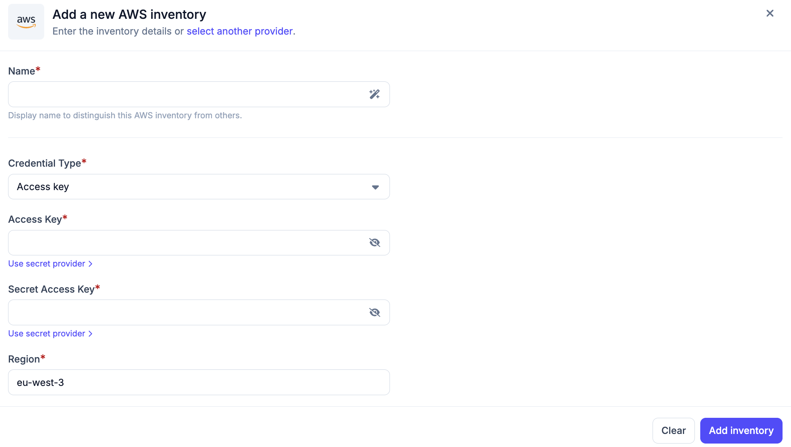
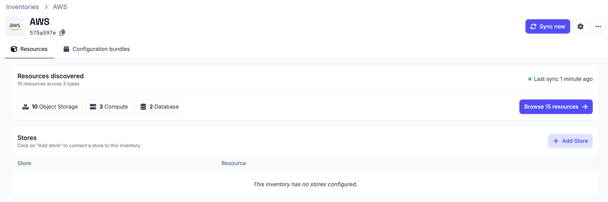
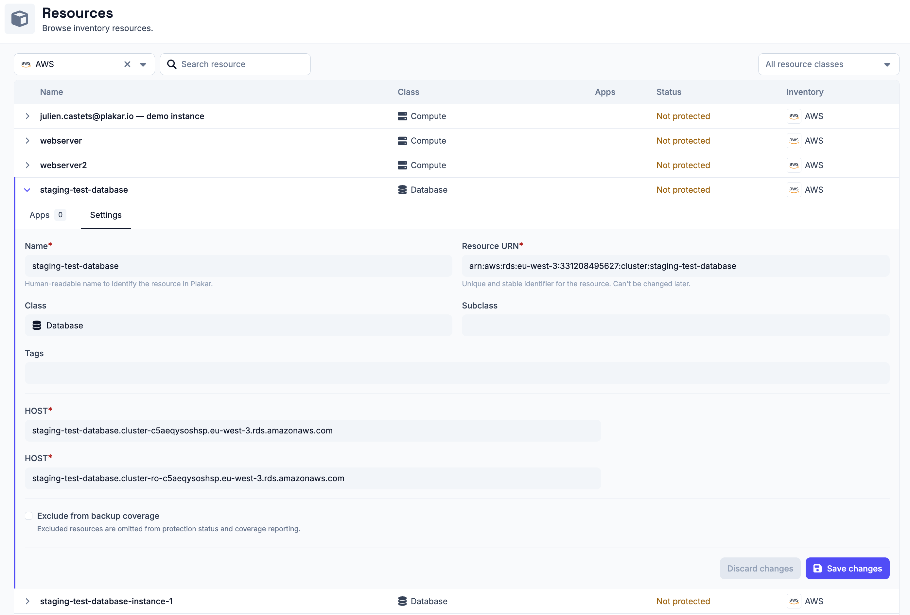

# AWS Inventory

The AWS inventory allows Plakar Control Plane to connect to your AWS account and
discover and classify your resources.

Once connected, Plakar Control Plane discovers all resources in your AWS account
and makes them available for management directly within Plakar Control Plane.

## Discovery flow

<!-- prettier-ignore-start -->

flowchart TD
  subgraph Plakar["Plakar Control Plane"]
    Inventory["AWS Inventory<br/>Discover & Classify"]
  end

  subgraph Creds["Authentication"]
    direction LR
    IAM["IAM Role<br/>(PCP deployed on AWS)"]
    Key["Access Key<br/>(PCP deployed outside AWS)"]
  end

  subgraph AWS["AWS Account"]
    Resources["Supported Resources"]
  end

  Inventory -->|"on AWS"| IAM
  Inventory -->|"outside AWS"| Key
  IAM & Key -->|"AWS APIs"| Resources
  Resources -->|"sync to inventory"| Inventory

<!-- prettier-ignore-end -->

## Supported Resources

| Resource        | Source | Store | Destination |
| --------------- | ------ | ----- | ----------- |
| S3 Bucket       | Yes    | Yes   | Yes         |
| EC2 Instance    | Yes    | No    | Yes         |
| PostgreSQL(RDS) | Yes    | No    | Yes         |

## Authentication

There are two ways to authenticate your AWS account, depending on where Plakar
Control Plane is deployed:

- **On AWS infrastructure**: For Plakar Control Plane instances deployed on AWS
  using the AWS Marketplace AMI, use the **IAM** credential type. Plakar Control
  Plane will use the IAM role and permissions attached to the EC2 instance to
  discover and manage your resources.
- **Outside AWS infrastructure**: If Plakar Control Plane is deployed on another
  cloud provider (such as Scaleway or OVHcloud) or on-premises, use the **Access
  Key** credential type. You will need to provide an AWS access key and secret
  key with sufficient permissions.

When using the **IAM** credential type, an IAM role with the required
permissions must first be attached to the Plakar Control Plane EC2 instance.

Read the documentation on
[Managing IAM Roles, Users, and Access Keys on AWS](../../../guides/aws/iam-users-roles-and-access-keys)
for more information on how to set up IAM role with the necessary permissions
and attach it to the instance.

Once attached, selecting the **IAM** credential type during AWS inventory setup
will use the permissions from the IAM role attached to the instance.

## Obtaining Access Keys

To use the **Access Key** credential type, you must create an AWS IAM user with
the required permissions and generate an access key for that user.

Access keys consist of:

- Access key ID
- Secret access key

> [!WARNING]+ SECRET KEYS
>
> The secret access key is only displayed once by AWS. Make sure to store it
> securely or use a secret provider.

## Required Permissions

Plakar Control Plane requires AWS permissions to discover and classify supported
resources in your AWS account.

The same permissions are required for both:

- The **Access Key** credential type
- IAM roles attached to the EC2 instance when using the **IAM** credential type

Use the following IAM policy:

```json
{
  "Version": "2012-10-17",
  "Statement": [
    {
      "Effect": "Allow",
      "Action": [
        "ec2:DescribeInstances",
        "resource-explorer-2:Search",
        "resource-explorer-2:List*",
        "resource-explorer-2:Get*",
        "s3:ListAllMyBuckets",
        "rds:DescribeDBInstances",
        "rds:DescribeDBClusters"
      ],
      "Resource": "*"
    }
  ]
}
```

### Permission Details

| Permission                   | Description                                  |
| ---------------------------- | -------------------------------------------- |
| `ec2:DescribeInstances`      | Discovers EC2 instances and related metadata |
| `resource-explorer-2:Search` | Searches AWS resources across the account    |
| `resource-explorer-2:List*`  | Lists Resource Explorer resources and views  |
| `resource-explorer-2:Get*`   | Retrieves Resource Explorer metadata         |
| `s3:ListAllMyBuckets`        | Discovers S3 buckets in the account          |
| `rds:DescribeDBInstances`    | Discovers RDS database instances             |
| `rds:DescribeDBClusters`     | Discovers RDS database clusters              |

## Adding the AWS Inventory

When creating a new AWS inventory, you must provide the following:

- **Name** for the inventory
- **Credential Type**
  - **IAM** (use only when running on AWS)
  - **Access Key** (for all other deployments)
- **Access key and secret key** (for Access Key authentication). These can be
  provided directly or loaded via a secret provider (see
  [secret providers documentation](../secret-providers))
- **Region**



After creating the inventory, you must trigger a **synchronization** to discover
and load resources. You can run synchronization at any time to refresh the
inventory, for example after adding new resources to your AWS account.

All configuration details provided during inventory creation can be updated
later by clicking the settings icon in the top right of the inventory page,
which opens a settings popup.



## Managing Resources

Resources in an AWS inventory are automatically discovered and synchronized.
They are managed by the inventory and cannot be manually created or deleted.

You can expand a resource row to view its details. Each row expands to show
three tabs:

- **Apps** - lists latest 5 restore points available for this resource, apps
  associated with the resource and and option to assign a new app to the
  resource. See the [apps documentation](../../apps) on how to set them up on
  resources.
- **Settings** - configure the resource, including backup coverage

Backup coverage tracks how many of your resources are protected by backups. If a
resource does not need to be backed up (for example, a test database), you can
exclude it from coverage using the **Exclude from backup coverage** option in
the **Settings** tab. Excluded resources are omitted from protection status and
coverage reporting.



