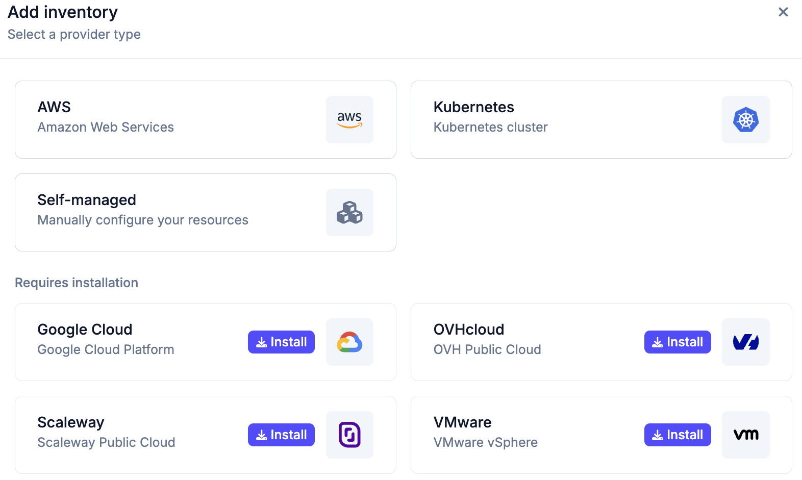

# Inventories

An inventory connects Plakar Control Plane to a provider and exposes a list of
resources available for management. Resources are the individual entities you
can back up, use as storage, or restore to, for example, EC2 instances, S3
buckets, and their equivalents across other supported cloud providers.

Inventory providers are delivered as integrations. Before creating an inventory,
install the required provider from the **Integrations** page or directly from
the **Add inventory** dialog. The dialog displays providers that are already
installed alongside providers that can be installed and used immediately.

Once an inventory is connected, you can attach apps to each resource. Plakar
Control Plane supports three app types:

- **Source**: the resource being backed up
- **Store**: where backups are stored
- **Destination**: where data is restored to

## Managed inventories

Managed inventories connect to a provider using credentials. Plakar Control
Plane then automatically discovers and classifies resources in your account.

Each managed inventory provider must be installed before it can be created.

For example, in an AWS inventory:

- EC2 instances are classified as compute resources
- S3 buckets are classified as storage resources

Managed inventories are supported for:

- AWS
- OVHcloud
- Scaleway
- Google Cloud
- VMware
- Kubernetes

## Self-managed inventories

Self-managed inventories allow you to add resources manually, either
individually or in bulk. This approach is useful when:

- The infrastructure is not supported by managed inventories (e.g., a local
  MinIO instance)
- You require full control over how resources are defined and managed

## Configuration bundles

Configuration bundles let you define shared credentials and settings at the
inventory level and apply them automatically to matching resources. This avoids
having to configure the same credentials individually on each discovered
resource. See [configuration bundles](./configuration-bundles) for details.

## Provider-specific instructions

## [AWS](https://www.plakar.io/docs/control-plane/infrastructure/inventories/aws/index.md)

## [OVHcloud](https://www.plakar.io/docs/control-plane/infrastructure/inventories/ovhcloud/index.md)

## [Scaleway](https://www.plakar.io/docs/control-plane/infrastructure/inventories/scaleway/index.md)

## [Google Cloud](https://www.plakar.io/docs/control-plane/infrastructure/inventories/google-cloud/index.md)

## [Kubernetes](https://www.plakar.io/docs/control-plane/infrastructure/inventories/kubernetes/index.md)

## [VMware](https://www.plakar.io/docs/control-plane/infrastructure/inventories/vmware/index.md)

## [Self Managed](https://www.plakar.io/docs/control-plane/infrastructure/inventories/self-managed/index.md)

