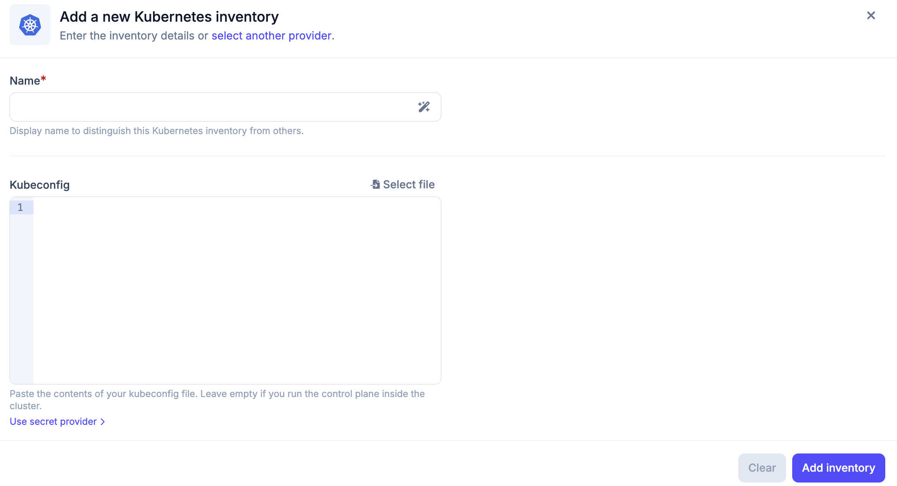
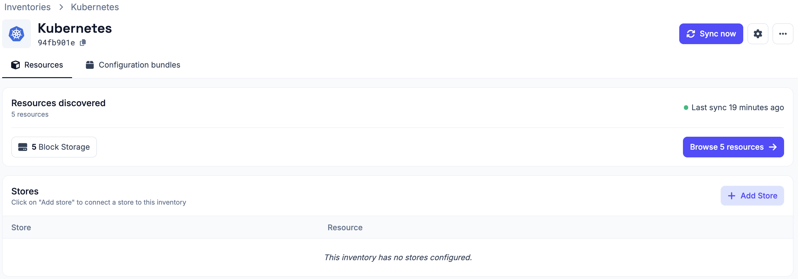
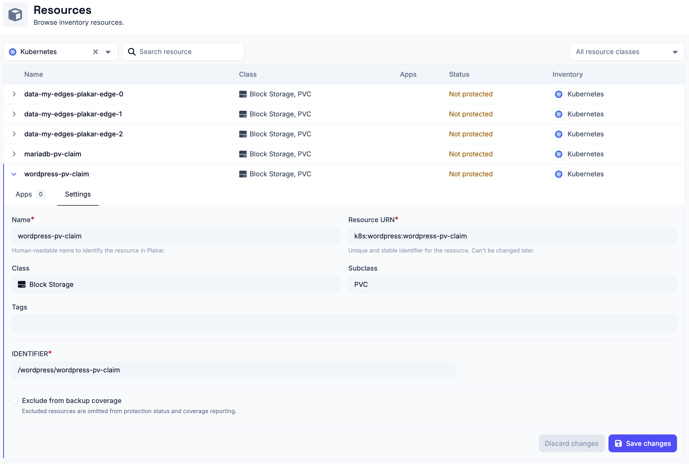

# Kubernetes Inventory

The Kubernetes inventory lets Plakar Control Plane connect to a Kubernetes
cluster and discover supported resources.

Once connected, the discovered resources become available for management
directly from Plakar Control Plane.

## Supported Resources

| Resource                     | Source | Store | Destination |
| ---------------------------- | ------ | ----- | ----------- |
| PersistentVolumeClaims (PVC) | Yes    | No    | No          |

## Authentication

Kubernetes inventories authenticate using a kubeconfig file. The kubeconfig
determines which cluster Plakar Control Plane connects to and which permissions
it has, so the associated user or service account must have read access to
`PersistentVolumeClaims` in the namespaces you want to discover.

When creating an Kubernetes inventory in Plakar Control Plane, you must provide:

- **Name**: a name for the inventory.
- **Kubeconfig**: paste the contents of your kubeconfig file directly, or select
  your kubeconfig file to use. You can leave this field empty if Plakar Control
  Plane runs inside the cluster, in which case it uses the in-cluster
  configuration instead. The kubeconfig can also be loaded from a
  [secret provider](../secret-providers).

## Adding the Kubernetes Inventory

When creating a new Kubernetes inventory, provide the inventory name and either
paste in a kubeconfig or select a kubeconfig file. If Plakar Control Plane runs
inside the cluster you want to inventory, you can leave the kubeconfig field
empty and it will use the in-cluster configuration.

After creating the inventory, trigger a synchronization to discover and load
PVCs from the configured cluster. You can run synchronization again at any time
to refresh the inventory, for example after creating new PVCs.

All configuration details provided during inventory creation can be updated
later by clicking the settings icon in the top right of the inventory page,
which opens a settings popup.

## Managing Resources

Resources in a Kubernetes inventory are automatically discovered and
synchronized. They are managed by the inventory and cannot be manually created
or deleted from Plakar Control Plane.

You can expand a resource row to view its details. Each row expands to show two
tabs:

- **Apps**: lists latest 5 restore points available for this resource, apps
  associated with the resource and an option to assign a new app to the
  resource. See the [apps documentation](../../apps) on how to set them up on
  resources.
- **Settings**: configure the resource, including backup coverage.

Backup coverage tracks how many of your resources are protected by backups. If a
resource does not need to be backed up, for example a test PVC, you can exclude
it from coverage using the **Exclude from backup coverage** option in the
**Settings** tab. Excluded resources are omitted from protection status and
coverage reporting.

