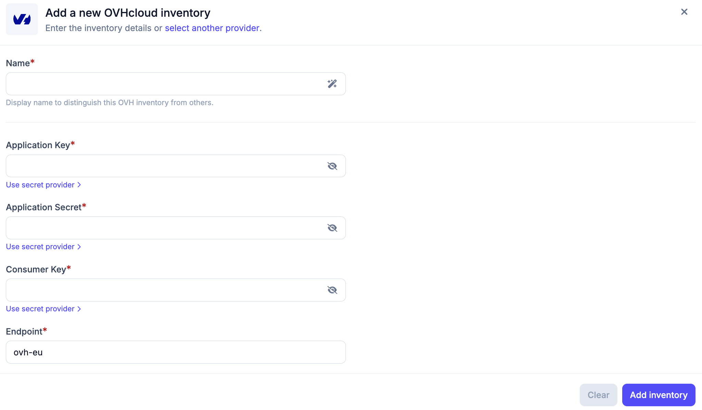
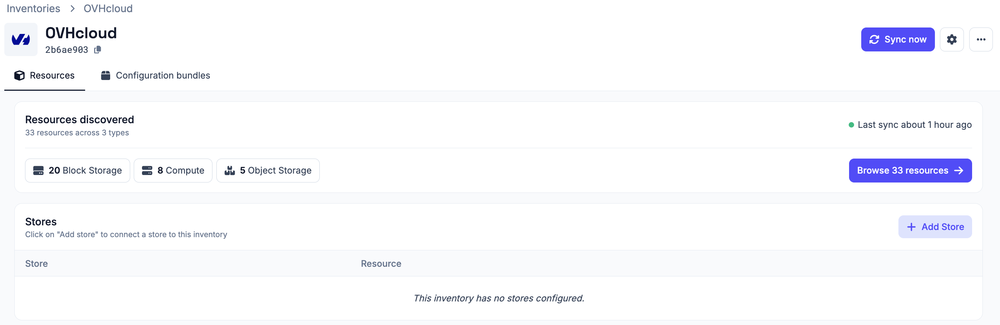
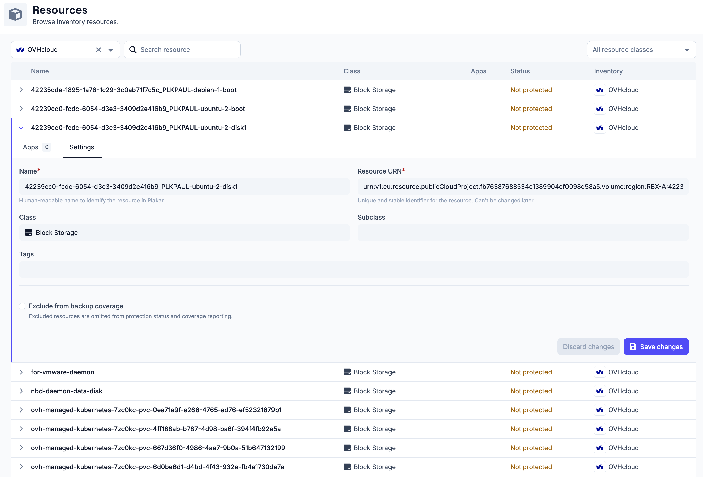

# OVHcloud Inventory

The OVHcloud inventory allows Plakar Control Plane to connect to your OVHcloud
account and discover resources across your projects.

Once connected, Plakar Control Plane discovers supported OVHcloud resources and
makes them available for management directly within Plakar Control Plane.

## Discovery flow

<!-- prettier-ignore-start -->

flowchart TD
  subgraph Plakar["Plakar Control Plane"]
    Inventory["OVHcloud Inventory Discover & classify"]
  end

  subgraph Creds["Authentication"]
    Keys["Application Key (AK) Application Secret (AS) Consumer Key (CK)"]
  end

  subgraph OVHcloud["OVHcloud Account"]
    Resources["Supported Resources"]
  end

  Inventory -->|"authenticate"| Keys
  Keys -->|"OVHcloud APIs"| Resources
  Resources -->|"sync to inventory"| Inventory

<!-- prettier-ignore-end -->

## Supported Resources

| Resource             | Source | Store | Destination |
| -------------------- | ------ | ----- | ----------- |
| Object Storage (S3)  | Yes    | Yes   | Yes         |
| Compute Instance     | Yes    | No    | Yes         |
| Block Storage Volume | Yes    | No    | Yes         |
| Managed Database     | Yes    | No    | Yes         |

## Authentication

OVHcloud inventories authenticate using an application key, application secret,
and consumer key. These credentials are generated through the OVHcloud token
creation portal and tied to a specific set of API permissions.

When creating an OVHcloud inventory in Plakar Control Plane, you must provide:

- **Name** for the inventory
- **Application key (AK)**
- **Application secret (AS)**
- **Consumer key (CK)**

For information on generating these credentials, see
[Managing API Applications and Credentials](../../../guides/ovhcloud/api-keys).

## Required Permissions

Plakar Control Plane requires read access to OVHcloud APIs so it can discover
and classify resources during inventory synchronization. All required rights use
the GET method only.

When generating credentials through the OVHcloud token creation portal, add the
following paths with the GET method:

| Path                            | Description                                         |
| ------------------------------- | --------------------------------------------------- |
| `/cloud/project`                | Lists all OVHcloud projects in the account          |
| `/cloud/project/*`              | Accesses a specific project and its metadata        |
| `/cloud/project/*/instance`     | Lists compute instances in a project                |
| `/cloud/project/*/instance/*`   | Retrieves details of a specific instance            |
| `/cloud/project/*/volume`       | Lists block storage volumes in a project            |
| `/cloud/project/*/volume/*`     | Retrieves details of a specific volume              |
| `/cloud/project/*/snapshot`     | Lists block storage snapshots in a project          |
| `/cloud/project/*/snapshot/*`   | Retrieves details of a specific snapshot            |
| `/cloud/project/*/storage/s3`   | Lists S3-compatible object storage buckets          |
| `/cloud/project/*/storage/s3/*` | Retrieves details of a specific S3 bucket           |
| `/cloud/project/*/storage`      | Lists Swift (legacy) object storage containers      |
| `/cloud/project/*/storage/*`    | Retrieves details of a specific Swift container     |
| `/cloud/project/*/database`     | Lists managed database services in a project        |
| `/cloud/project/*/database/*`   | Retrieves details of a specific database service    |
| `/cloud/project/*/database/*/*` | Retrieves database cluster details by engine and ID |

The `/cloud/project` and `/cloud/project/*` paths are always required, as Plakar
Control Plane uses them to enumerate which projects exist before querying
resources within them.

The three-level database path (`/cloud/project/*/database/*/*`) is required
because the OVHcloud database API nests the engine type and cluster ID together,
for example `/cloud/project/{id}/database/mysql/{clusterId}`.

If you only need to discover a subset of resource types, you can omit the paths
for resource types you do not use.

## Adding the OVHcloud Inventory

When creating a new OVHcloud inventory, provide the inventory name, application
key, application secret, and consumer key. Credentials can be entered directly
or loaded from a [secret provider](../secret-providers).

After creating the inventory, trigger a synchronization to discover and load
resources from your OVHcloud account. You can run synchronization again at any
time to refresh the inventory, for example after creating new instances or
object storage buckets in OVHcloud.

All configuration details provided during inventory creation can be updated
later by clicking the settings icon in the top right of the inventory page,
which opens a settings popup.

## Managing Resources

Resources in an OVHcloud inventory are automatically discovered and
synchronized. They are managed by the inventory and cannot be manually created
or deleted from Plakar Control Plane.

You can expand a resource row to view its details. Each row expands to show two
tabs:

- **Apps** - lists the latest 5 restore points available for this resource, apps
  associated with the resource, and an option to assign a new app. See the
  [apps documentation](../../apps) on how to set them up on resources.
- **Settings** - configure the resource, including backup coverage

Backup coverage tracks how many of your resources are protected by backups. If a
resource does not need to be backed up, for example a test instance or a
temporary bucket, you can exclude it from coverage using the **Exclude from
backup coverage** option in the **Settings** tab. Excluded resources are omitted
from protection status and coverage reporting.

