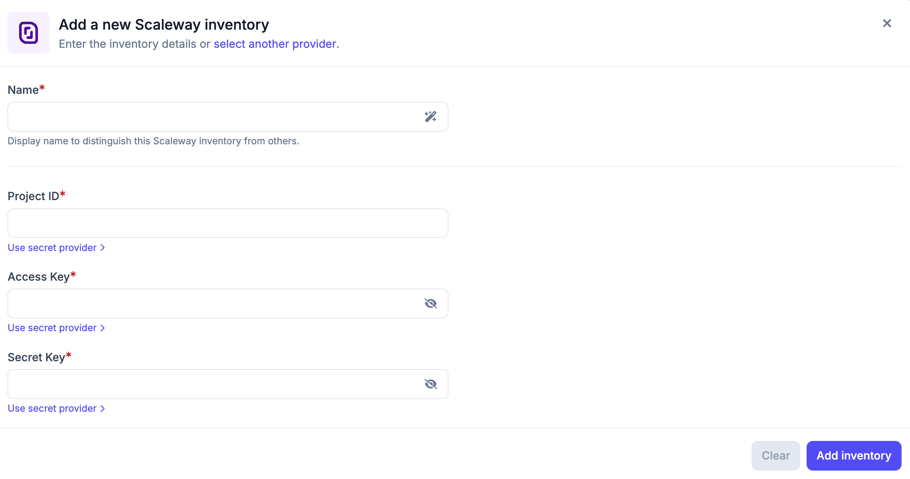
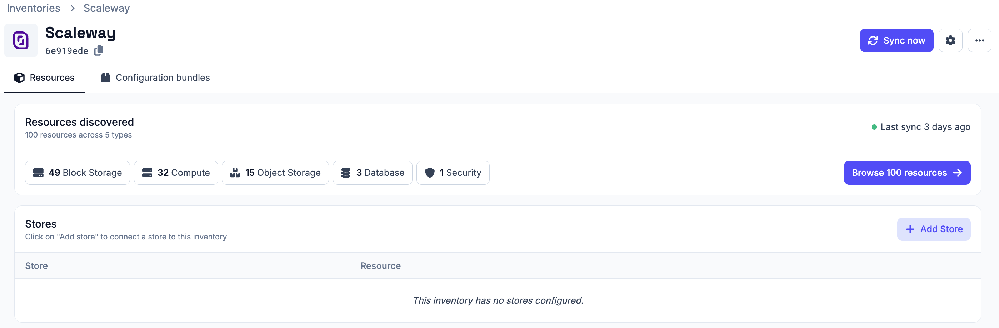
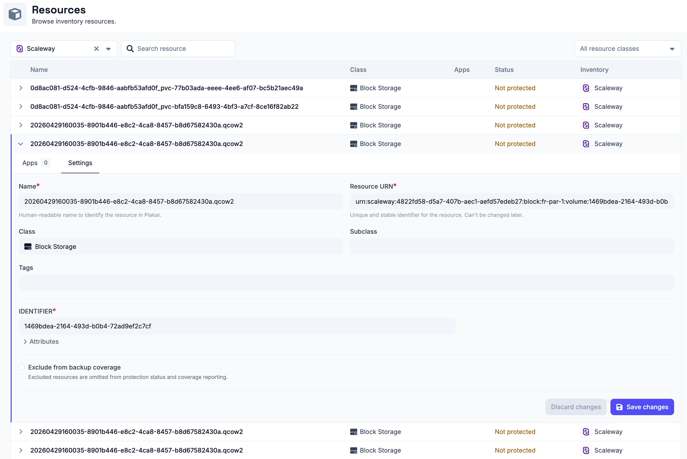

# Scaleway Inventory

The Scaleway inventory allows Plakar Control Plane to connect to your Scaleway
account and discover resources in a Scaleway project.

Once connected, Plakar Control Plane discovers supported Scaleway resources and
makes them available for management directly within Plakar Control Plane.

## Discovery flow

<!-- prettier-ignore-start -->

flowchart TD
  subgraph Plakar["Plakar Control Plane"]
    Inventory["Scaleway Inventory Discover & classify"]
  end

  IAMApp["IAM Application Access Key + Secret Key"]

  subgraph Scaleway["Scaleway Project"]
    Resources["Supported Resources"]
  end

  Inventory -->|"authenticate"| IAMApp
  IAMApp -->|"Scaleway APIs"| Resources
  Resources -->|"sync to inventory"| Inventory

<!-- prettier-ignore-end -->

## Supported Resources

| Resource                                 | Source | Store | Destination |
| ---------------------------------------- | ------ | ----- | ----------- |
| Object Storage                           | Yes    | Yes   | Yes         |
| Instances (with attached Block Storages) | Yes    | No    | Yes         |
| Block Storage Volume                     | Yes    | No    | Yes         |
| Secret Manager                           | Yes    | No    | Yes         |

## Authentication

Scaleway inventories authenticate using an access key and secret key generated
from a Scaleway IAM application.

When creating a Scaleway inventory in Plakar Control Plane, you must provide:

- **Name** for the inventory
- **Project ID**
- **Access key**
- **Secret key**

The access key and secret key should be generated from an IAM application with
the permissions required to read resources in the Scaleway project you want to
discover.

For more information on creating IAM applications, policies, and API keys, see
[Managing IAM Policies and API Keys on Scaleway](../../../guides/scaleway/scaleway-iam-api-keys).

## Required Permissions

Plakar Control Plane requires read access to Scaleway resources so it can
discover and classify them during inventory synchronization.

The IAM application used by the inventory must have a policy with a rule scoped
to **Access to resources**. The rule must include the project you want the
inventory to discover.

Use the following permission set under the `AllProducts` category:

| Permission Set        | Description                           |
| --------------------- | ------------------------------------- |
| `AllProductsReadOnly` | Read access to all resources/products |

Scaleway projects are used to isolate resources. A Scaleway inventory in Plakar
Control Plane is configured with a specific project ID, so it discovers
resources from that project.

When creating the policy rule, make sure the selected project matches the
project ID configured in the inventory. You can give the application access to
multiple projects or all current and future projects, but the inventory will
still use the project ID provided during setup.

For example, if you want separate inventories for production, staging, and
testing, create one inventory per project. Each inventory can use API keys from
an IAM application scoped only to the matching project.

## Adding the Scaleway Inventory

When creating a new Scaleway inventory, provide the inventory name, project ID,
access key, and secret key.

After creating the inventory, trigger a synchronization to discover and load
resources from the configured Scaleway project. You can run synchronization
again at any time to refresh the inventory, for example after creating new
Object Storage buckets, Instances, or Block Storage volumes in Scaleway.

All configuration details provided during inventory creation can be updated
later by clicking the settings icon in the top right of the inventory page,
which opens a settings popup.

## Managing Resources

Resources in a Scaleway inventory are automatically discovered and synchronized.
They are managed by the inventory and cannot be manually created or deleted from
Plakar Control Plane.

You can expand a resource row to view its details. Each row expands to show
three tabs:

- **Apps** - lists latest 5 restore points available for this resource, apps
  associated with the resource and and option to assign a new app to the
  resource. See the [apps documentation](../../apps) on how to set them up on
  resources.
- **Settings** - configure the resource, including backup coverage

Backup coverage tracks how many of your resources are protected by backups. If a
resource does not need to be backed up, for example a test Instance or temporary
bucket, you can exclude it from coverage using the **Exclude from backup
coverage** option in the **Settings** tab. Excluded resources are omitted from
protection status and coverage reporting.

