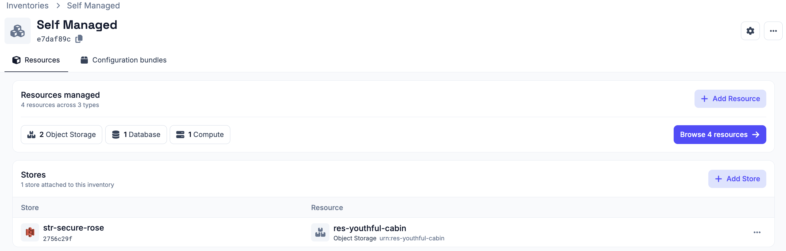
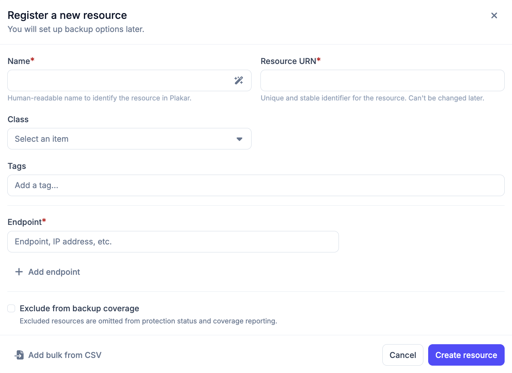
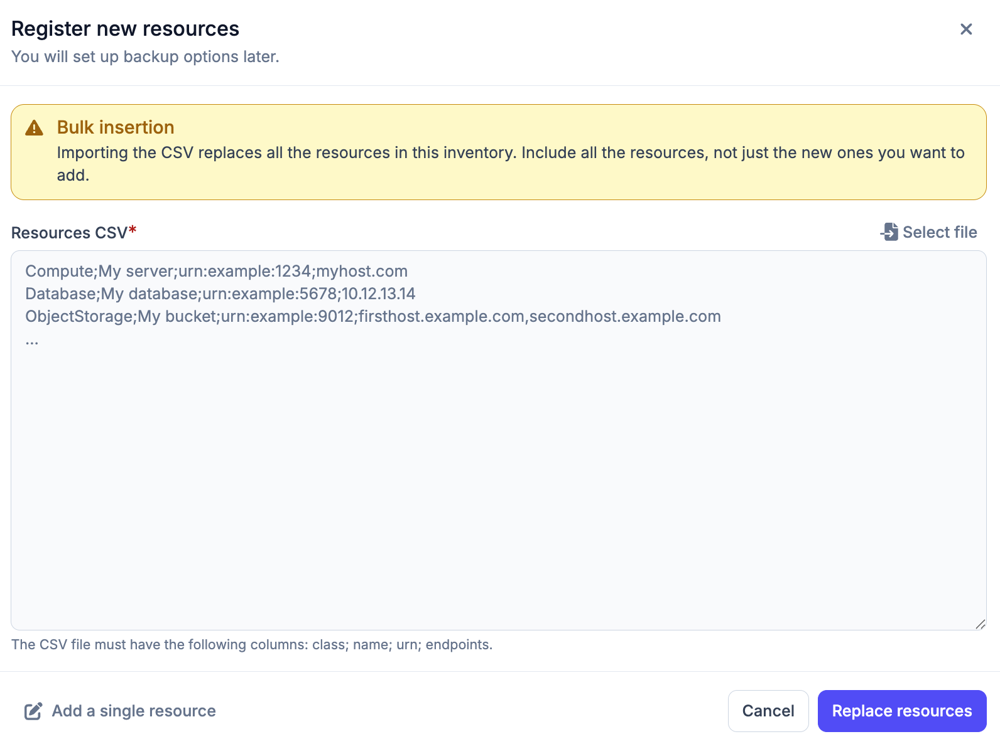
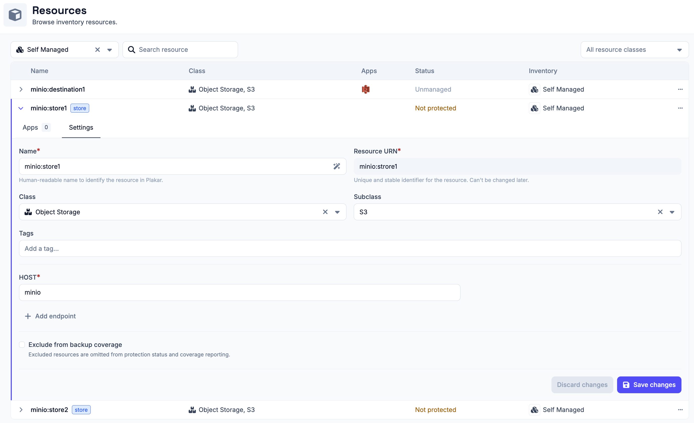

# Self-Managed Inventory

A self-managed inventory is a manually maintained inventory that acts as a
container for resources you define yourself. It is useful when your
infrastructure is not covered by a managed inventory, such as a local MinIO
instance, a self-hosted PostgreSQL database, or any other resource supported by
Plakar integrations.

## Creating a self-managed inventory

To create a self-managed inventory, you only need to provide a name. Once
created, you can start adding resources to it. The inventory name can be edited
later by clicking the settings icon in the top right of the inventory page,
which opens a settings popup.



## Adding resources

Resources can be added individually or imported in bulk using a CSV file.

### 1. Adding a resource manually

When adding a resource manually, you need to provide:

- **Name** - a display name for the resource
- **URN** - a unique identifier for the resource
- **Class** - the type of resource. See [Resource classes](#resource-classes)
  for the full list
- **Subclass** - a more specific type within the class. See
  [Resource classes](#resource-classes)
- **Tags** - provide several tags to the resource. Can be later used by
  [policies](../../operations/policies) or
  [configuration bundles](../../administration/configuration-bundles#scope) to
  filter resources
- **Hostname** - the address used to reach the resource (hostname or IP
  address). A resource can have multiple hostnames.
- **Exclude from backup coverage** - optionally exclude the resource from backup
  coverage reporting (see [Backup Coverage](#backup-coverage))



### 2. Importing resources via CSV

To add multiple resources at once, you can import a CSV file. Each row should
represent one resource in the following format. If a resource has multiple
hostnames, they can be specified by separating them with commas.

```txt
Class;Name;URN;Hostname
```

> [!WARNING]+
>
> Importing a CSV file replaces all existing resources in the inventory. Make
> sure to include both existing and new resources in the file.



## Managing resources

You can expand a resource row to view its details. Each row expands to show
three tabs:

- **Apps** - lists latest 5 restore points available for this resource, apps
  associated with the resource and and option to assign a new app to the
  resource. See the [apps documentation](../../apps) on how to set them up on
  resources.
- **Settings** - edit resource details and configure backup coverage

All fields can be modified in the **Settings** tab except the **URN**, which is
immutable.



## Resource class and sub-class

When adding a resource, you select a class and optionally a subclass to describe
the type of resource. The table below lists all supported classes and their
subclasses. All resources managed by Plakar Control Plane are documented in the
[resources documentation](../../resources)

## Backup Coverage

By default, all resources in a self-managed inventory and all classified
resources in a managed inventory are included in backup coverage reporting.

Backup coverage tracks how many of your resources are protected by backups. If a
resource does not need to be backed up (for example, a test database), you can
exclude it from coverage. Excluded resources are omitted from protection status
and coverage reporting. This option can be configured when creating or editing a
resource.

