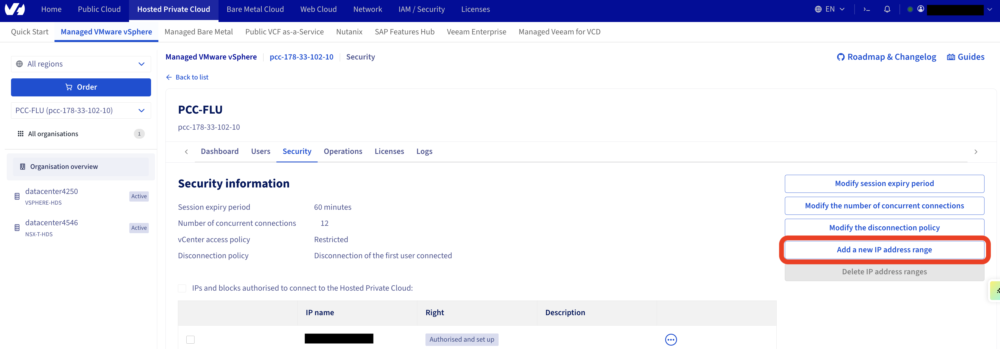
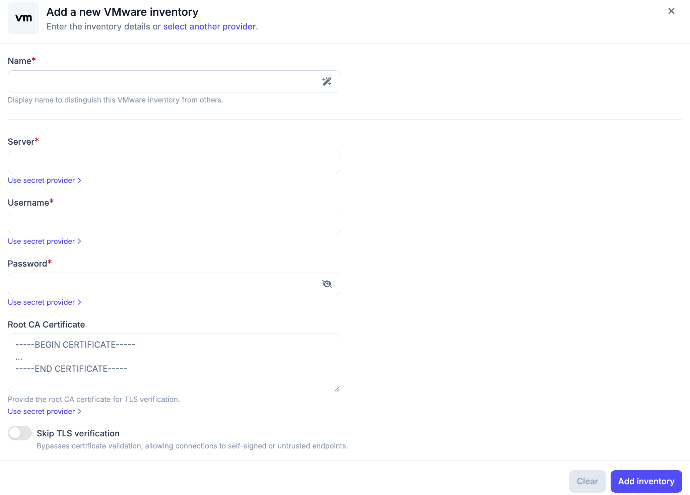
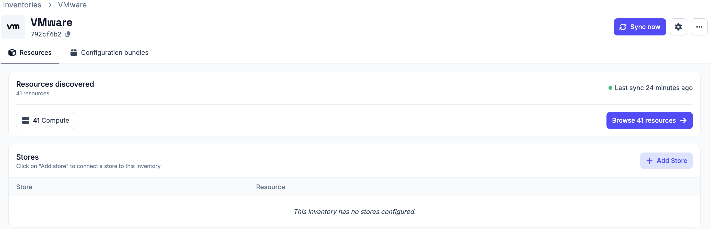
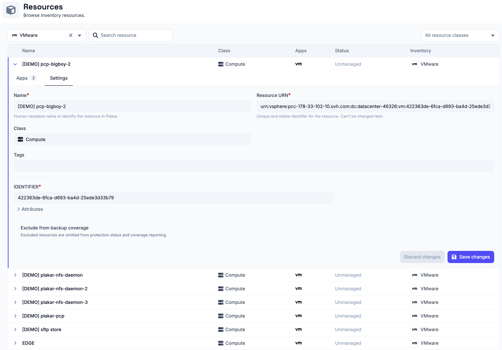

# VMware Inventory

The VMware inventory lets Plakar Control Plane connect to a VMware environment,
such as a vCenter Server or a vSphere-based cloud platform like OVHcloud, and
discover supported resources.

Once connected, the discovered resources become available for management
directly from Plakar Control Plane.

## Supported Resources

| Resource          | Source | Store | Destination |
| ----------------- | ------ | ----- | ----------- |
| Compute Instances | Yes    | No    | Yes         |

## Authentication

VMware inventories authenticate using a username and password for an account
that has access to the VMware environment.

When creating a VMware inventory, provide the following information:

- **Name**: a name for the inventory.
- **Server**: the VMware server address, for example `xxx.ovh.com` for OVHcloud
  Hosted Private Cloud environments.
- **Username**: a user account with permission to access the VMware server.
- **Password**
- **Root CA Certificate** (optional): the root CA certificate used to verify the
  server's TLS certificate.
- **Skip TLS verification** (optional): disables certificate validation,
  allowing connections to servers using self-signed or otherwise untrusted
  certificates.

The **Server**, **Username**, **Password**, and **Root CA Certificate** fields
can either be entered directly or retrieved from a configured secret provider by
clicking **Use secret provider**.

## Network Access

Before Plakar Control Plane can connect to a VMware environment, the public IP
address of the Plakar Control Plane instance must be allowed by the VMware
platform.

The exact procedure depends on your provider. For example, in an OVHcloud Hosted
Private Cloud environment, add the Plakar Control Plane IP address to the
vCenter allow list by navigating to:

> **Hosted Private Cloud** → **Managed VMware vSphere** → **Your vSphere
> Instance** → **Security**

If you're using another VMware provider or a self-managed vCenter deployment,
consult your platform's documentation for the equivalent allow-list or firewall
configuration.

Without allowing the Plakar Control Plane IP address, connection attempts to the
VMware server will fail even if the authentication credentials are correct.

## Adding the VMware Inventory

When creating a new VMware inventory, provide the inventory name, server,
username, password, and optionally a root CA certificate or enable **Skip TLS
verification**.

After creating the inventory, trigger a synchronization to discover and load
compute instances from the configured VMware environment. You can run
synchronization again at any time to refresh the inventory, for example after
creating new instances.

All configuration details provided during inventory creation can be updated
later by clicking the settings icon in the top right of the inventory page,
which opens a settings popup.

## Managing Resources

Resources in a VMware inventory are automatically discovered and synchronized.
They are managed by the inventory and cannot be manually created or deleted from
Plakar Control Plane.

You can expand a resource row to view its details. Each row expands to show
three tabs:

- **Apps**: lists latest 5 restore points available for this resource, apps
  associated with the resource and and option to assign a new app to the
  resource. See the [apps documentation](../../apps) on how to set them up on
  resources.
- **Settings**: configure the resource, including backup coverage

Backup coverage tracks how many of your resources are protected by backups. If a
resource does not need to be backed up, for example a test instance, you can
exclude it from coverage using the **Exclude from backup coverage** option in
the **Settings** tab. Excluded resources are omitted from protection status and
coverage reporting.

