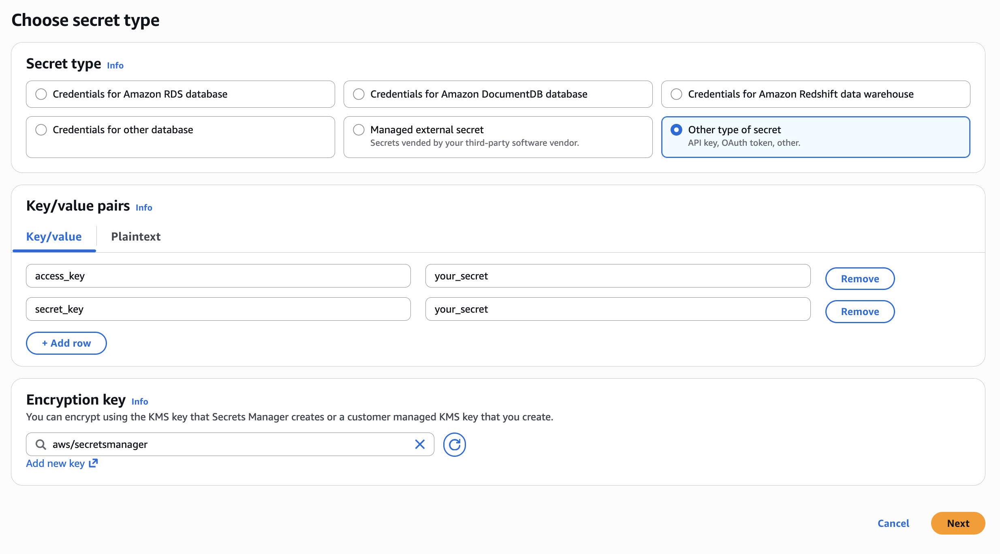
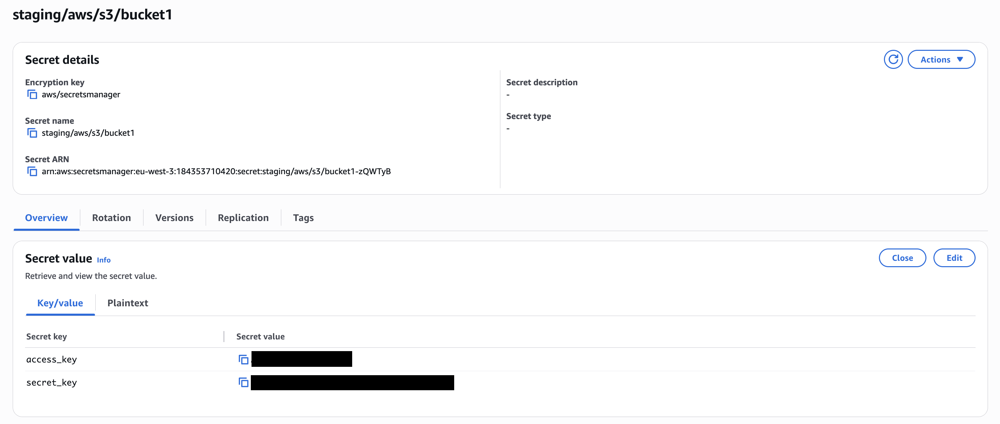
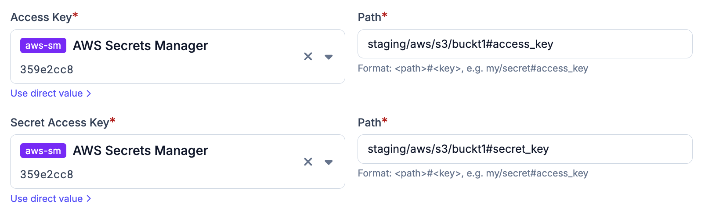

# AWS Secrets Manager

AWS Secrets Manager can be added as a secret provider in Plakar Control Plane by
selecting `aws` as the integration type when creating a new secret provider.

<!-- prettier-ignore-start -->

flowchart TB
  subgraph Plakar["Plakar Control Plane (on AWS)"]
    App["Any configuration field<br/>(passwords, keys, certs, ...)"]
  end

  IAM["IAM Role<br/>(attached to EC2 instance)"]
  SM["AWS Secrets Manager"]

  App -->|"authenticate via"| IAM
  IAM -->|"read secret"| SM
  SM -->|"secret value"| App

<!-- prettier-ignore-end -->

Currently, AWS Secrets Manager is only supported when Plakar Control Plane is
running on AWS and authenticated using an attached IAM role. Deployments hosted
outside AWS are not currently supported because access key authentication for
AWS Secrets Manager is not currently supported.

When adding the secret provider, you must provide:

- A name for the secret provider
- The AWS region where your secrets are stored

Plakar Control Plane uses the permissions granted to the IAM role attached to
the EC2 instance to authenticate and read secrets from AWS Secrets Manager. Read
the documentation on
[Managing IAM Roles, Users, and Access Keys on AWS](../../../guides/aws/iam-users-roles-and-access-keys)
for more information on how to set up IAM role with the necessary permissions.

## Required Permissions

To allow Plakar Control Plane to read secrets from AWS Secrets Manager, the IAM
role attached to the instance must include the following permissions as well.
This is added on top of the resource discovery permissions needed already and
mentioned in the [aws-inventory](../../inventories/aws/#required-permissions)
documentation:

```json
{
  "Version": "2012-10-17",
  "Statement": [
    {
      "Effect": "Allow",
      "Action": [
        "secretsmanager:GetSecretValue",
        "secretsmanager:DescribeSecret"
      ],
      "Resource": "*"
    }
  ]
}
```

## Creating Secrets

When creating a secret in AWS Secrets Manager you'll need to use the **Other
type of secret** and add your key/value pairs. You'll also need to select an
encryption key and provide a name for the secret before saving.

For encryption you can use either the default AWS managed key
(`aws/secretsmanager`) or any custom KMS key. As an example, a secret for an S3
bucket might be named `staging/aws/s3/bucket1` and contain keys like
`access_key` and `secret_key`.



## Secret Path Format

The path format used by Plakar Control Plane is:

```txt
{secret_name}#{field}
```

Using the example above:

```txt
staging/aws/s3/bucket1#access_key
```

This would retrieve the value stored under the `access_key` field inside the
`staging/aws/s3/bucket1` secret.



## Using Secrets in Plakar Control Plane

Once AWS Secrets Manager is configured as a secret provider, you can use it in
any form field that requires a credential. Switch the field from direct value to
secret provider, select your instance from the dropdown, and enter the path to
the secret you want to use.



