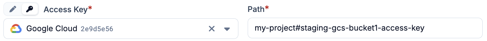

# GCP Secret Manager

Google Cloud Secret Manager can be added as a secret provider in Plakar Control
Plane by selecting `gcp` as the integration type when creating a new secret
provider.

<!-- prettier-ignore-start -->

flowchart TB
  subgraph Plakar["Plakar Control Plane"]
    App["Any configuration field<br/>(passwords, keys, certs, ...)"]
  end

  SA["Service account<br/>(attached to the instance or provided as a key)"]
  SM["GCP Secret Manager"]

  App -->|"authenticate via"| SA
  SA -->|"read secret"| SM
  SM -->|"secret value"| App

<!-- prettier-ignore-end -->

## Authentication

Plakar Control Plane authenticates to Secret Manager as a Google Cloud service
account. The service account can be provided in two ways:

- **Attached service account:** when Plakar Control Plane runs on a Compute
  Engine instance with a service account attached, no credentials need to be
  provided. The secret provider uses the instance's service account
  automatically. The instance must use the `cloud-platform` access scope, shown
  as **Allow full access to all Cloud APIs** in the Google Cloud Console, as
  described in the
  [Google Cloud installation](../../../intro/installation/google-cloud) guide.
- **Service account key:** when Plakar Control Plane runs outside Google Cloud,
  or when a different identity is needed, provide a service account key in the
  **Credentials Json** field.

For more information on creating service accounts, generating keys, and
attaching a service account to an instance, see
[Managing IAM Roles and Service Accounts](../../../guides/google-cloud/iam-roles-and-service-accounts).

## Configuration

When adding the secret provider, you must provide a name for the secret
provider. The remaining fields are optional and depend on how Plakar Control
Plane is deployed and where your secrets are stored.

- **Credentials Json:** The service account key, in JSON format. Leave empty to
  use the service account attached to the Plakar Control Plane instance.

- **GCP Location:** The location of regional secrets, for example
  `europe-west1`. Leave empty for global secrets. When set, the secret provider
  reads secrets from that location using the regional Secret Manager endpoint.

- **Endpoint:** A custom Secret Manager API endpoint, for example when access
  goes through Private Service Connect. Leave empty to use the default endpoint,
  or the regional endpoint when **Gcp Location** is set.

- **Use Rest Client:** Uses the Secret Manager REST API instead of gRPC. Enabled
  by default. Disable it only if your network or endpoint requires gRPC.

Google Cloud Secret Manager supports two kinds of secrets: global secrets, which
are replicated according to their replication policy, and regional secrets,
which are stored in a single location. A secret provider reads either global
secrets or the regional secrets of one location, depending on **Gcp Location**.

## Required Permissions

The service account used by the secret provider needs the
`secretmanager.versions.access` permission on the secrets it reads.

For more information on creating a custom role with this permission and
assigning it to a service account, see
[Managing IAM Roles and Service Accounts](../../../guides/google-cloud/iam-roles-and-service-accounts).

## Creating Secrets

In Secret Manager, a secret holds a single value. Each credential used by Plakar
Control Plane, such as a password or an access key, is therefore stored in its
own secret.

When creating the secret, choose between a global and a regional secret. A
regional secret requires the matching location to be set in **Gcp Location** on
the secret provider. As an example, the access key of a Cloud Storage bucket
might be stored in a secret named `staging-gcs-bucket1-access-key`.



## Secret Path Format

The path format used by Plakar Control Plane is:

```txt
{project_id}#{secret_name}
```

The path format is the same for global and regional secrets. Using the example
above, in a project named `my-project`:

```txt
my-project#staging-gcs-bucket1-access-key
```

## Using Secrets in Plakar Control Plane

Once GCP Secret Manager is configured as a secret provider, you can use it in
any form field that requires a credential. Switch the field from direct value to
secret provider, select your secret provider from the dropdown, and enter the
path to the secret you want to use.



