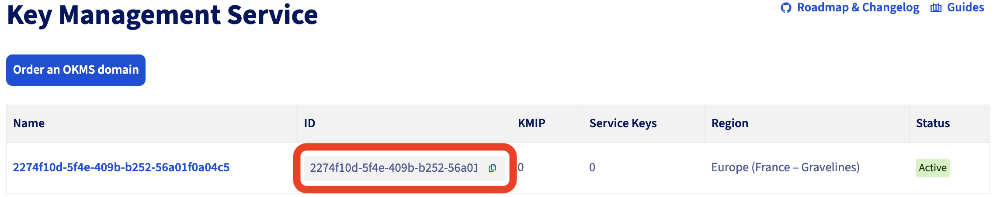
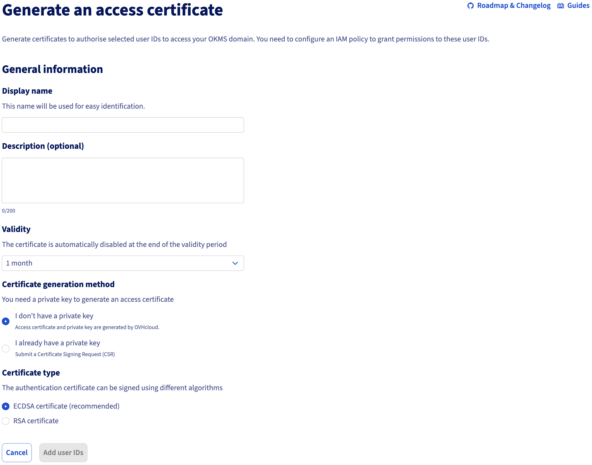
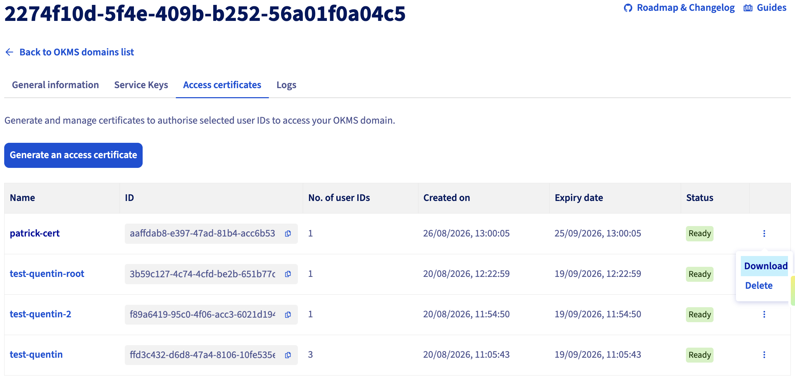
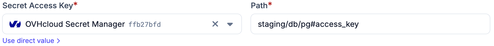

# OVHcloud Secret Manager

OVHcloud Secret Manager can be used as a secret provider in Plakar Control
Plane. Select `ovh` as the integration type when creating a new secret provider.

Plakar Control Plane connects to OVHcloud using an access certificate and its
matching private key. These credentials are created for an OKMS domain and used
for mutual TLS authentication.

<!-- prettier-ignore-start -->

flowchart TB
  subgraph Plakar["Plakar Control Plane"]
  App["Configuration field"]
end

Cert["Access Certificate<br/>+ Private Key"]
OKMS["OKMS Domain"]
Secret["OVHcloud Secret Manager"]

App -->|"requests secret"| Cert
Cert -->|"authenticate"| OKMS
OKMS --> Secret
Secret -->|"secret value"| App


<!-- prettier-ignore-end -->

When adding the secret provider, provide a name and the following values:

- **Access Certificate**: the OVHcloud access certificate in PEM format.
- **Access Certificate Key**: the private key matching the access certificate in
  PEM format.
- **OKMS ID**: the identifier of the OKMS domain, a UUID.
- **Region**: the region where the OKMS domain and secrets are hosted, for
  example `eu-west-gra`.

## How OKMS and Secret Manager Work Together

OVHcloud Key Management Service and Secret Manager are separate products.

**Key Management Service** is used to manage encryption keys. **Secret Manager**
is used to store secrets such as passwords, API keys, and other credentials.

Both products use the same underlying OKMS domain. The OKMS domain provides the
identity and access configuration used to access these services.

## Setting Up the OKMS Domain

In the OVHcloud Control Panel, open **Identity, Security & Operations >
Security > Key Management Service**. From there, you can use an existing OKMS
domain or create a new one.

The **OKMS ID** required by Plakar Control Plane is shown in the list of OKMS
domains.



### Generating an Access Certificate

Open the OKMS domain you want to use, then go to **Access Certificates** tab.
From there you can create a new access certificate and provide a **name** for
the certificate, **validity** and a **generation method**. You can let OVHcloud
generate the private key or provide your own private key when creating the
certificate.



Next, select the users, user groups, or service accounts that the certificate
should be associated with, then generate the certificate.

> [!WARNING]+ Private Key
>
> If OVHcloud generates the private key, it is displayed only once. Download and
> store it securely because it cannot be retrieved again later.

Once the certificate has been created, download its public certificate from the
options menu. The two files are used when configuring the secret provider in
Plakar Control Plane:

- the public certificate is the **Access Certificate**,
- the private key is the **Access Certificate Key**.



## Creating Secrets

Secrets are created and managed separately in **Identity, Security &
Operations > Security > Secret Manager**.

When creating a new secret, select the region where the secret will be stored.
This must match the **Region** configured for the secret provider in Plakar
Control Plane.

Next, choose a path for the secret. The path is used to organize secrets and can
follow any structure that fits your environment. For example:

```txt
staging/db/pg
```

Finally, add the key-value pairs you want to store in the secret. For example:

```txt
access_key: my-secret-value
```

Create the secret when you are finished.



## Secret Path Format

Plakar Control Plane uses the following format to reference a value stored in
OVHcloud Secret Manager:

```txt
{path}#{key}
```

For example, if a secret has the path `staging/db/pg` and contains a value
`access_key`. The reference used in Plakar Control Plane would be:

```txt
staging/db/pg#access_key
```

## Using Secrets in Plakar Control Plane

Once OVHcloud Secrets Manager is configured as a secret provider, you can use it
in any form field that requires a credential. Switch the field from direct value
to secret provider, select your instance from the dropdown, and enter the path
to the secret you want to use.



