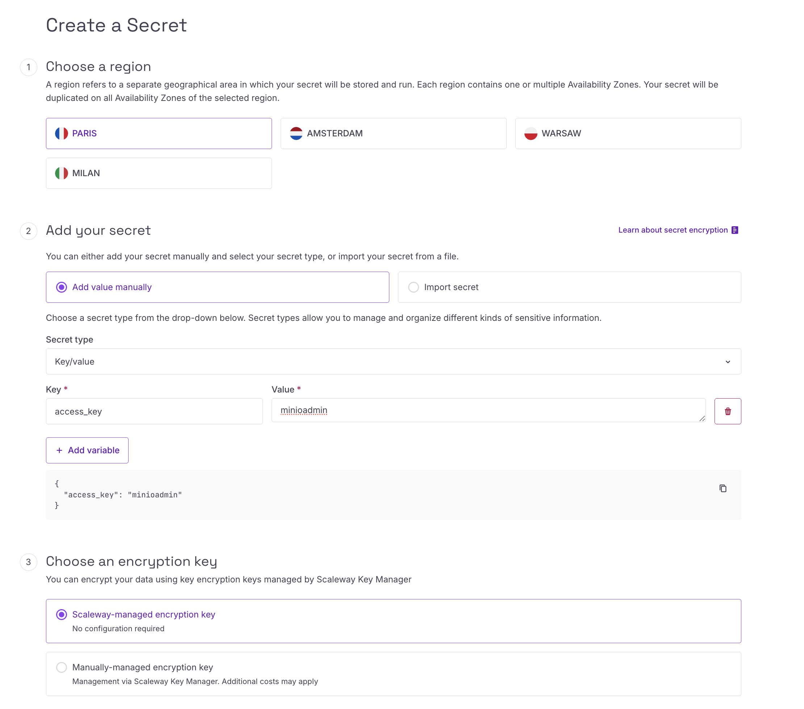
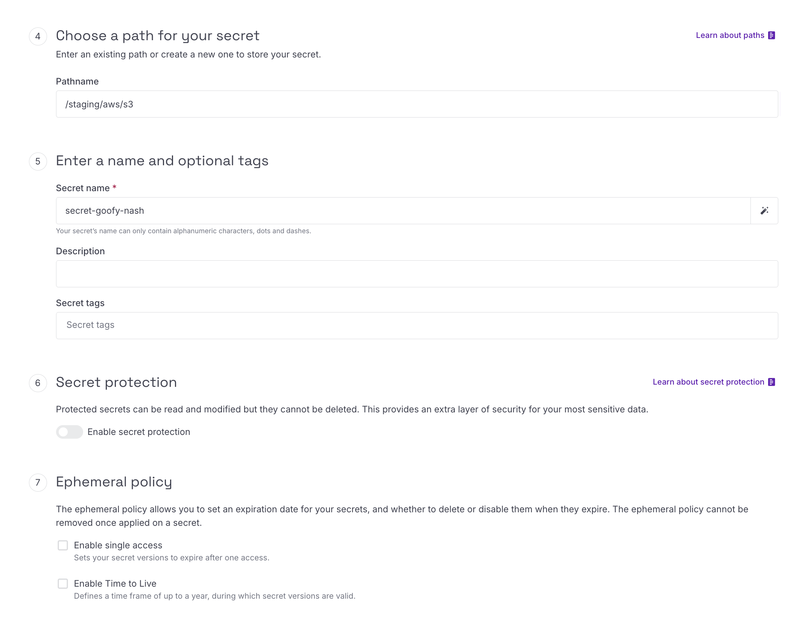
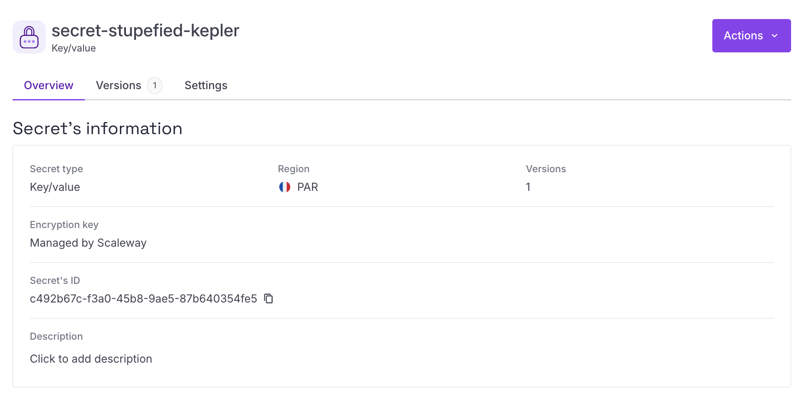
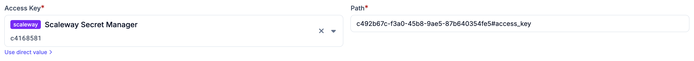

# Scaleway Secret Manager

Scaleway Secret Manager can be added as a secret provider in Plakar Control
Plane by selecting `scaleway` as the integration type when creating a new secret
provider.

<!-- prettier-ignore-start -->

flowchart TB
  subgraph Plakar["Plakar Control Plane"]
    App["Any configuration field<br/>(passwords, keys, certs, ...)"]
  end

  IAMApp["IAM Application<br/>Secret Key"]
  SM["Scaleway Secret Manager"]

  App -->|"authenticate via"| IAMApp
  IAMApp -->|"read secret"| SM
  SM -->|"secret value"| App

<!-- prettier-ignore-end -->

When adding the secret provider, you must provide a name for the secret
provider, the Scaleway region where your secret is stored, for example `fr-par`,
and a Scaleway secret key.

Scaleway access keys are generated as an access key and secret access key pair,
but only the secret key is required when configuring the secret provider in
Plakar Control Plane.

## Required Permissions

To allow Plakar Control Plane to read secrets from Scaleway Secret Manager, you
must create an IAM policy with permissions to read and access secrets.

As an example, you can create a policy named `scaleway-manage-secrets` and add a
rule with the following permission sets:

- `SecretManagerReadOnly`
- `SecretManagerSecretAccess`

Next, create an IAM application, for example `scaleway-secrets-manager`, attach
the policy to the application, then generate an API key for that application.
The generated secret key can then be used when configuring the secret provider
in Plakar Control Plane.

A more detailed guide on configuring Scaleway IAM permissions and generating API
keys is available in the
[Managing IAM Policies and API Keys on Scaleway](../../../guides/scaleway/iam-and-api-keys)
documentation.

## Creating Secrets

When creating a secret in Scaleway Secret Manager, you must first select the
**region** where the secret will be stored. The **region** selected here must
match the **region** configured in the secret provider inside Plakar Control
Plane.

For the secret type, select **Key-value**.

You'll also need to select an **encryption key**. You can either use the default
Scaleway managed encryption key or provide your own manually managed encryption
key.



Next, choose a **pathname** for the secret. The **pathname** is used only for
organizing secrets within Scaleway and can be anything that fits your
environment structure. For example:

```txt
/staging/aws/s3
```

Finally, provide a **name** for the secret and create the secret.



## Secret Path Format

The path format used by Plakar Control Plane for Scaleway Secret Manager is:

```txt
{secret_id}#{field}
```

Unlike AWS Secrets Manager and HashiCorp Vault which reference secrets using
secret paths, Scaleway Secret Manager uses the secret ID directly.

For example, if your secret was assigned the ID
`c492b67c-f3a0-45b8-9ae5-87b640354fe5` and the secret contains a field named
`access_key`, the reference used in Plakar Control Plane would be:

```txt
c492b67c-f3a0-45b8-9ae5-87b640354fe5#access_key
```



## Using Secrets in Plakar Control Plane

Once Scaleway Secrets Manager is configured as a secret provider, you can use it
in any form field that requires a credential. Switch the field from direct value
to secret provider, select your instance from the dropdown, and enter the path
to the secret you want to use.



