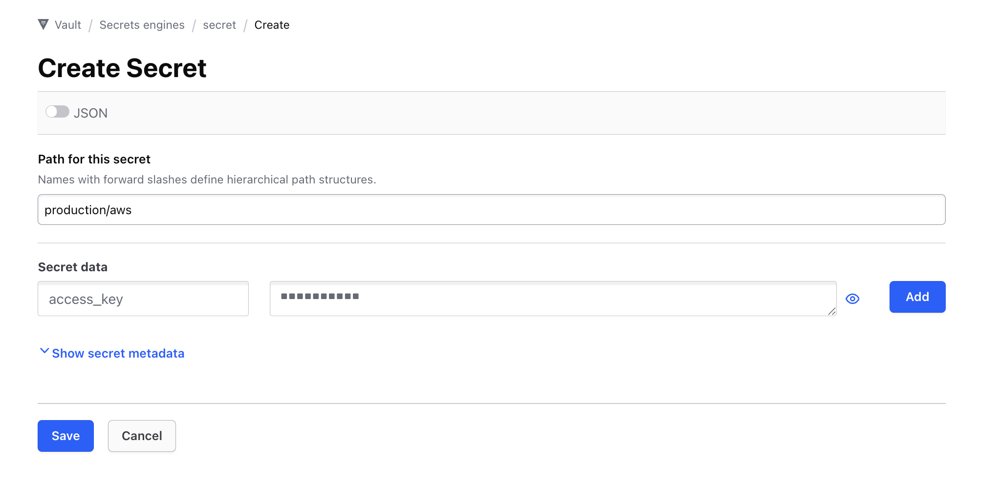
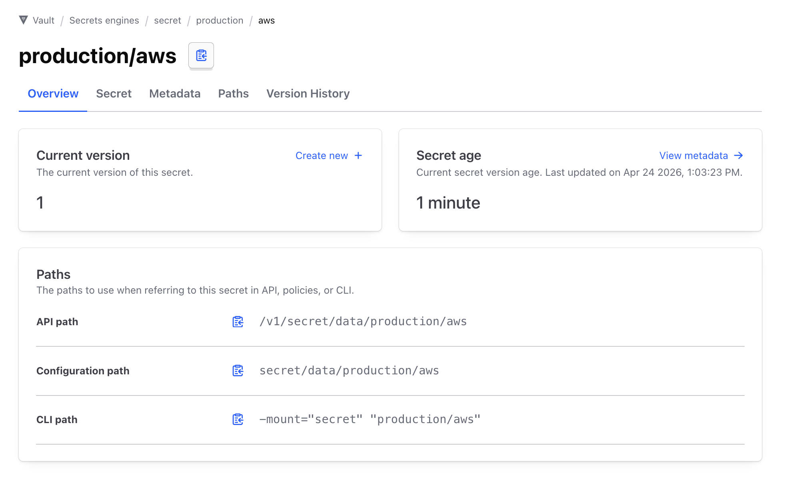
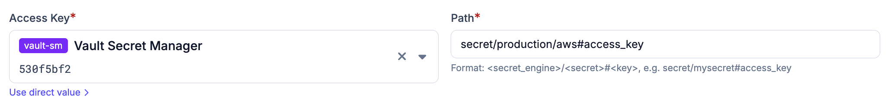

# HashiCorp Vault

HashiCorp Vault can be added as a secret provider to Plakar Control Plane by
selecting `vault` as integration type when adding a new secret provider. You'll
then need to provide your vault access token, the vaults server url and any
suitable name for it.

<!-- prettier-ignore-start -->

flowchart TB
  subgraph Plakar["Plakar Control Plane"]
    App["Any configuration field<br/>(passwords, keys, certs, ...)"]
  end

  Token["Vault Access Token"]
  Vault["HashiCorp Vault"]

  App -->|"authenticate via"| Token
  Token -->|"read secret"| Vault
  Vault -->|"secret value"| App

<!-- prettier-ignore-end -->

## Vault's path format

Vault organizes secrets under secret engines. Think of a secret engine as a
namespace which sits at the top of every path and tells Vault which backend to
look in. When you reference a secret in Plakar Control Plane, you must include
the secret engine name in the path.

The path format used by Plakar Control Plane is:

```txt
{secret_engine}/{path}#{field}
```



For example, if you have a secret at path `production/aws` inside the default
`secret` engine, and you want the field `access_key`, you would enter:

```txt
secret/production/aws#access_key
```



In our example above, we can remove the `data` section in the configuration path
then append our field in the end, in our case that's `#access_key`

## Using Vault secrets in Plakar Control Plane

Once Vault is configured as a secret provider, you can use it in any form field
that requires a credential. Switch the field from direct value to secret
provider, select your instance from the dropdown, and enter the path to the
secret you want to use.



