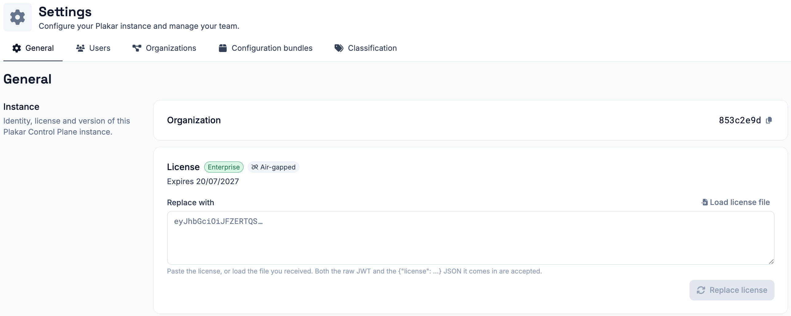

# Air-gapped enrollment

[Standard enrollment](./enrollment) registers your instance with `plakar.io` to
verify the owner email and retrieve your license. If your instance runs in an
air-gapped or PCI-DSS environment where outbound connections are not permitted,
use air-gapped enrollment instead. It enrolls the instance entirely from a
license issued by Plakar in advance, without the instance ever reaching out to
`plakar.io`.

From the sign-in step of the enrollment process, select **Enroll with an offline
license bundle** to switch to air-gapped enrollment.





## Getting a license

[Contact us](/contact) to request an offline license for your instance. Once you
have it, paste it into the enrollment page, or load it directly from the license
file. The instance validates the license locally, then uses it to create the
organization and admin account described below.





## Organization and admin account

Air-gapped enrollment creates the organization and the admin account in a single
step, rather than as separate steps like in
[standard enrollment](../enrollment). Provide the required information then
enroll the instance.



Because there is no owner email verification step in air-gapped mode, the admin
account created here also acts as the instance owner.





## License renewal

Offline licenses includes an expiry date. You can view the current license,
plan, and expiry date under **Settings > General**.

Unlike online instances, air-gapped instances do not renew their license
automatically. To renew an offline license, [contact us](/contact) to obtain a
new license for your instance. Then, on the **General** settings page, paste the
new license into the **Replace with** field or load it from a license file, and
select **Replace license**.

Replacing the license does not require re-enrollment and does not affect your
existing configuration or backups.

