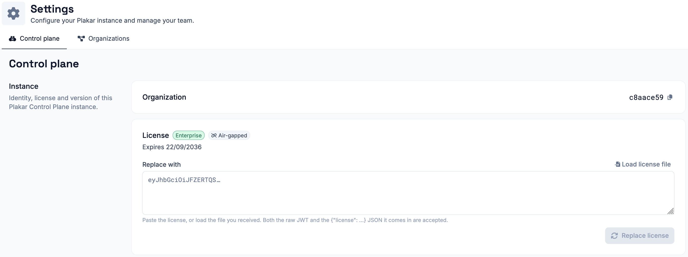

# Enrollment

When you first access your Plakar Control Plane instance, you are taken through
a one-time enrollment process. Enrollment registers the instance with Plakar,
creates its root organization, and creates the first admin account. No backup
data is ever transferred, only the consumption metrics needed for billing.

An instance is registered either with an email or with a license. Licenses come
in two types, online and air-gapped, which gives three ways to enroll:

| Method             | Reaches `plakar.io` | Use it when                                                   |
| ------------------ | ------------------- | ------------------------------------------------------------- |
| Email              | Yes                 | You are setting up a single instance by hand.                 |
| Online license     | Yes                 | You are enrolling several instances or automating enrollment. |
| Air-gapped license | No                  | The instance cannot make outbound connections.                |

**Email** enrollment verifies an owner email with `plakar.io`, then asks you to
create the organization. It needs no license, but the verification has to be
repeated for every instance.

**License** enrollment uses a license that Plakar issues for your organization.
The same license can enroll many instances without any email verification.
[Contact us](/contact) to get one. Both license types are entered the same way,
and the instance detects which type it has been given:

- An **online license** still requires the instance to reach `plakar.io`.
- An **air-gapped license** is validated locally, so the instance never contacts
  `plakar.io`. It suits air-gapped or PCI-DSS environments, needs a
  [self-hosted package repository](../../guides/self-hosted-package-repository),
  and is renewed by hand. See [air-gapped instances](#air-gapped-instances).



## Registering the instance









### Owner email

Enter an owner email address. This is the email `plakar.io` uses for billing,
license reporting, and any account-level communication. Ownership can be
transferred later if needed.





### Confirmation code

A verification link is sent to the owner email. Opening it shows a confirmation
code on the sign-in page. Enter that code on the setup page to confirm the
email.







### Organization

Create the root organization of the instance. This is the account that groups
your backups, team members, and billing together. Use your company name or team
name.









Paste the license into the setup page or load it from the license file. The
instance detects whether it is an online or air-gapped license, then shows its
organization, plan, mode, and expiry date. For an air-gapped license, read
[air-gapped instances](#air-gapped-instances) before enrolling.



The license names your organization, so there is no separate organization step.
If the license does not name an organization, you will be asked to enter one
before continuing.





## Admin account

The last step creates an admin account for this specific instance. This is a
local account on the appliance, separate from the owner email. You can use the
same email address or a different one.



This account holds the **Superuser** role, which grants access to
[Control Plane settings](../../administration/settings/control-plane) and the
license. The [Platform Admin](../../administration/permissions/platform-admin)
role grants the same access and can be assigned later.

## Air-gapped instances

An air-gapped instance never reaches `plakar.io`. It enrolls entirely from its
license, which is validated locally. Since there is no owner email in this mode,
the admin account also acts as the instance owner.

The instance also cannot reach `plakar.io` to fetch integrations and appliance
components. Before enrolling, set up a
[self-hosted package repository](../../guides/self-hosted-package-repository) so
the instance can retrieve these files from your own network instead.

### License renewal

Air-gapped licenses include an expiry date. You can view the current license,
plan, and expiry date in the
[Control Plane settings](../../administration/settings/control-plane#instance).

Unlike online instances, air-gapped instances do not renew their license
automatically. To renew, [contact us](/contact) to obtain a new license. Then,
in the **Control Plane settings**, paste the new license into the **Replace
with** field or load it from a license file, and select **Replace license**. A
[Platform Admin](../../administration/permissions/platform-admin) can do this as
well as the **Superuser**, since both hold the license permission.

Replacing the license does not require re-enrollment and does not affect your
existing configuration or backups.

