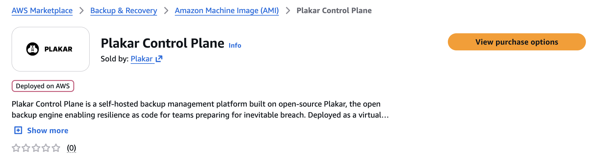
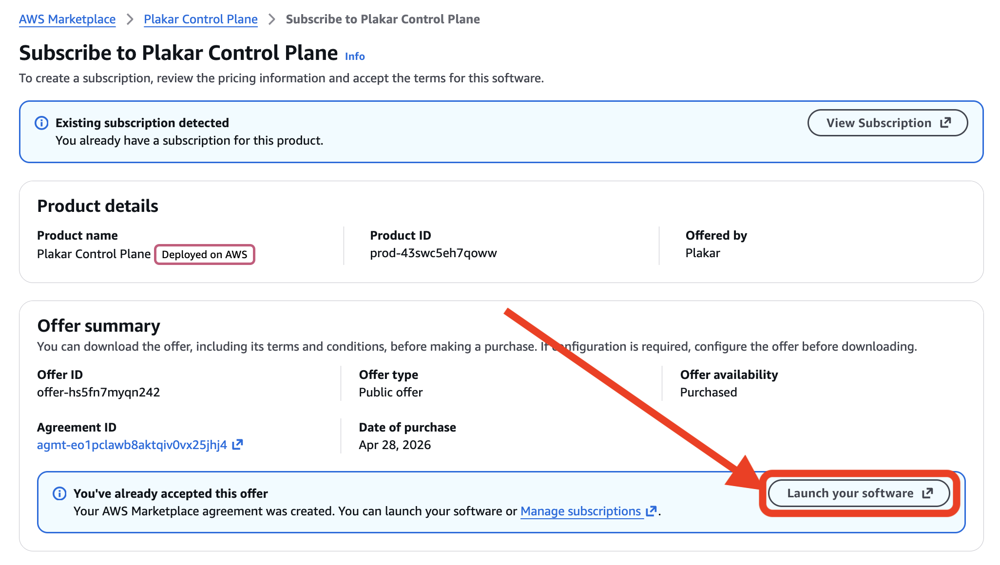
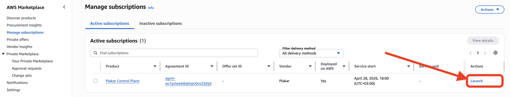
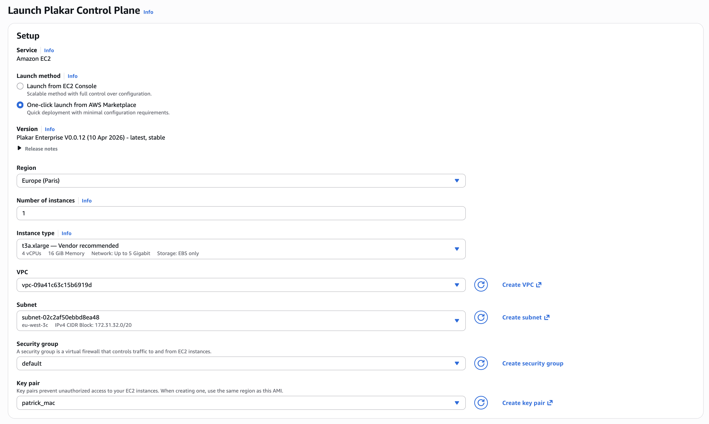
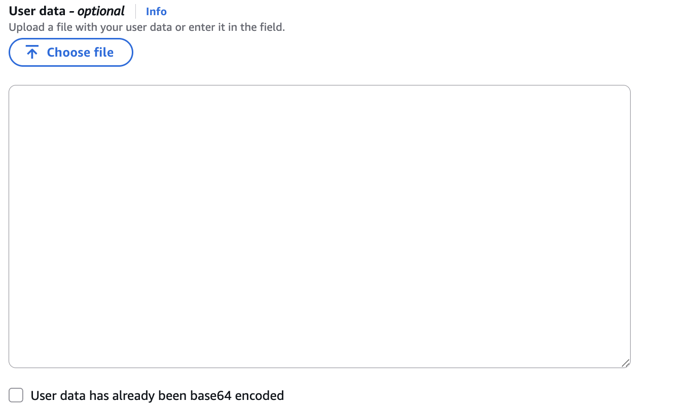
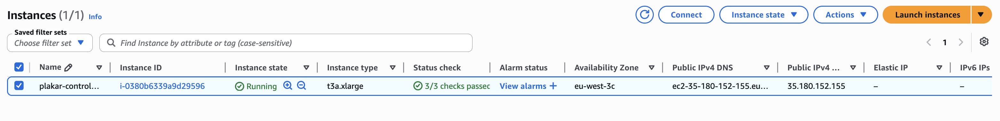

# AWS Installation

Plakar Control Plane is distributed as an Amazon Machine Image (AMI) through the
AWS Marketplace. You can access the marketplace listing here:
[Plakar Control Plane](https://aws.amazon.com/marketplace/pp/prodview-n3wsyckyby6vq)



You can subscribe to the AMI by clicking **View purchase options** and
completing the subscription process on the next page. After subscribing, click
**Launch your software** to open the EC2 launch configuration page.



You can also launch the AMI later from the AWS Marketplace subscriptions
management page in the AWS Console.



## Launching the instance

From the launch page, under **Launch method**, select **One-click launch from
AWS Marketplace**, then choose the AWS region for your deployment.

Plakar Control Plane requires the following recommended setup:

- A minimum of **4 vCPUs**
- At least **16 GiB RAM**
- At least **1 TB of EBS storage**

These are recommendations for a production deployment. For evaluation or
testing, you can reduce CPU, RAM, and storage. The data volume stores the
database, logs, and all Plakar state. Backups themselves are stored wherever you
configure using apps.

The default marketplace configuration already selects a compatible instance type
and storage configuration.

You will also need to configure:

- **VPC**
- **Subnet**
- **Security Group**
- **SSH Key Pair**

You can read more about security groups in the
[Security Groups](#security-groups) section.

Once configured, click **Launch** to create the EC2 instance. After the instance
has been launched successfully, you can view and manage it from the **EC2
Instances** page in the AWS Console.



## Proxy and Harbor Configuration

If the instance doesn't have direct internet access, configure an HTTP proxy, a
local Harbor registry mirror, or both through the EC2 **User data** field before
launching the instance.

To provide User data, choose **Launch from EC2 Console** instead of **One-click
launch from AWS Marketplace**. This exposes the **Advanced details** section,
where you can paste or upload a yaml file of the cloud-init configuration.



### What needs to be reachable

Plakar Control Plane requires HTTPS access to `api.plakar.io` for runtime
configuration, license validation, and plugin downloads. If your proxy uses a
whitelist instead of allowing all outbound traffic, you need to add
`*.plakar.io`

The appliance also needs to pull container images from `docker.io` and
`ghcr.io`. There are two supported approaches:

1. **Route image pulls through the HTTP proxy.** If you choose this option, the
   proxy should allow access to:
   - `*.docker.io`
   - `*.docker.com`
   - `*.ghcr.io`
   - `*.githubusercontent.com`

2. **Use a Harbor registry mirror.** This is the recommended approach for
   production deployments because images are pulled from a local registry cache
   instead of the public internet. When using Harbor, you don't need to
   whitelist the Docker and GitHub domains above on your proxy.

### User data configuration

The User data is a standard cloud-init YAML document containing `proxy:` and/or
`registry:` sections, depending on your environment.

```yaml
#cloud-config
proxy:
  http: http://<proxy-ip>:<proxy-port>
  https: http://<proxy-ip>:<proxy-port>
  no_proxy: .corp.example,10.0.0.0/8 # optional

registry:
  mirrors:
    docker.io: <harbor-host>/dockerhub-proxy
    ghcr.io: <harbor-host>/ghcr-proxy
  insecure: false # true: skip TLS verification for the mirror hosts
```

## Security Groups

The networking configuration shown below is intended for a basic deployment
setup.

In production environments, networking and access control should be adapted to
match your infrastructure and security requirements. For example:

- Exposing Plakar Control Plane through a load balancer with HTTPS/TLS
  certificates
- Restricting access through a VPN or private network
- Limiting inbound traffic to trusted IP ranges
- Using internal-only networking

By default, the instance will not be accessible from a web browser because the
default security group does not allow inbound HTTP traffic. To allow access to
the Plakar Control Plane web interface:



1. Select the Plakar Control Plane instance
2. Open `Actions -> Security -> Change security groups`
3. Attach a security group that allows inbound TCP traffic on port `80`

The source can be:

- Your public IP address
- Your organization gateway or VPN address

For testing purposes, you can temporarily use `0.0.0.0/0`

> [!WARNING]+
>
> Using `0.0.0.0/0` allows access from any IP address and should only be used
> for testing or temporary deployments.

## Assigning an IAM Role

Plakar Control Plane requires AWS permissions to discover and classify resources
in your AWS account so they can be used in backup workflows.

This is covered in detail in the
[AWS Inventory](../../../infrastructure/inventories/aws#required-permissions)
documentation.

## Accessing Plakar Control Plane

After configuring the security group, Plakar Control Plane can be accessed from
your browser using:

```txt
http://<public-ipv4-address>
```

Where `<public-ipv4-address>` is the public IPv4 address assigned to the EC2
instance.

For new installations, you will be guided through the enrollment process to:

- Register the instance with Plakar services for licensing and billing
- Create the initial administrator account

See the [enrollment](../../enrollment) documentation for more details.

