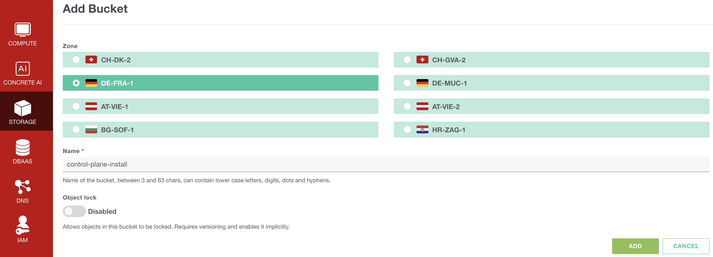
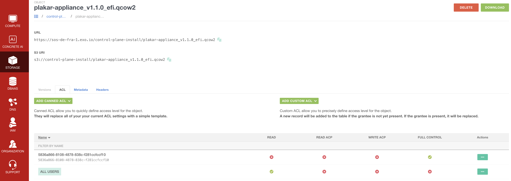
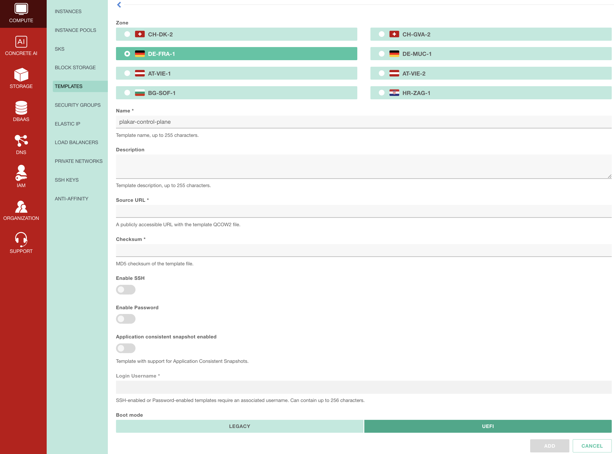
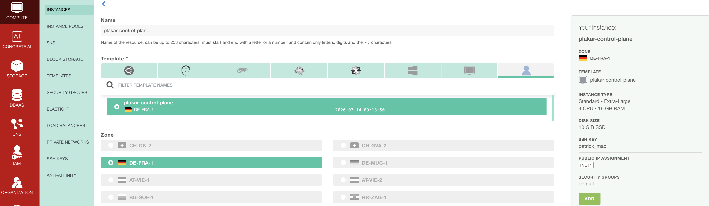
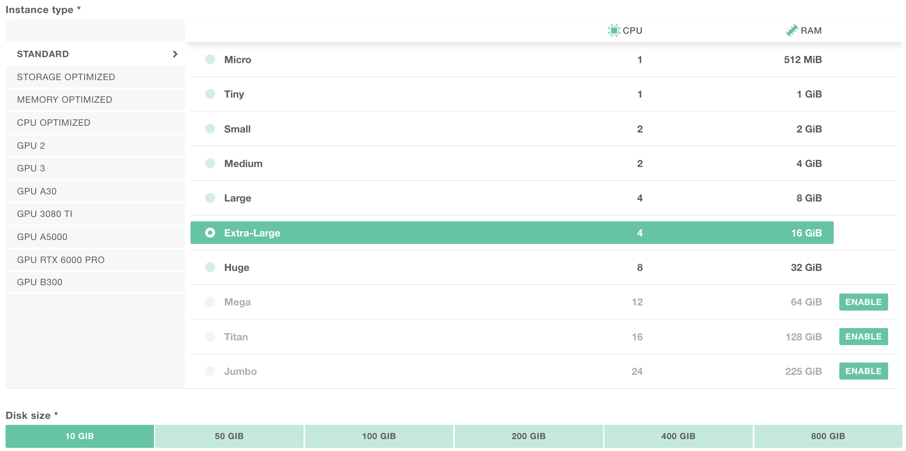
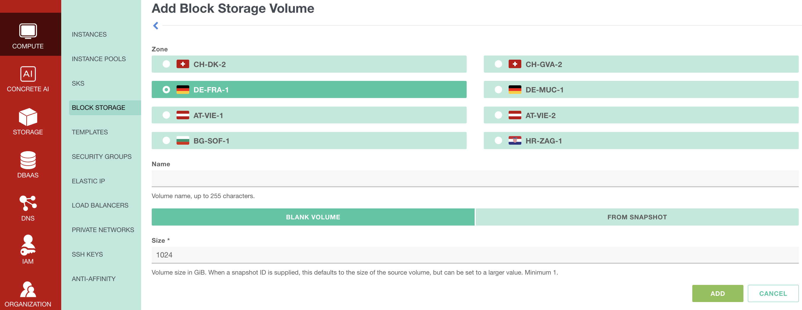
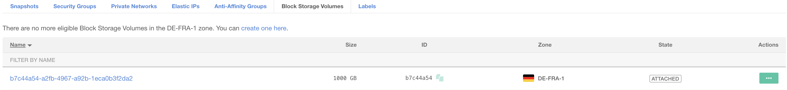
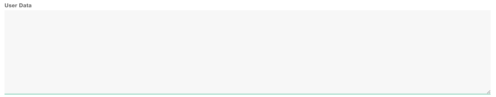

# Exoscale Installation

Plakar Control Plane is distributed for Exoscale as a QCOW2 virtual machine
image. The official QCOW2 image can be downloaded from:

- [Plakar Control Plane Downloads Page](https://www.plakar.io/download)

Unlike marketplace-based deployments such as AWS AMIs, Exoscale instances cannot
boot directly from a QCOW2 image. Instead, the image must first be registered as
a **Compute custom template**, which can then be used to create instances.

## Preparing the QCOW2 image

Exoscale needs a publicly accessible URL to download the QCOW2 image from when
creating the custom template, along with its MD5 checksum to verify the image
during import. There are two ways to provide this:

- **Direct download (recommended)**: use the download link from the
  [downloads page](https://www.plakar.io/download) directly as the image source,
  together with the MD5 checksum published alongside it. No local download or
  re-hosting is required.
- **Self-hosted**: download the QCOW2 image locally, then re-upload it to your
  own publicly accessible storage, such as Exoscale's Simple Object Storage
  (SOS). Use this if you want to keep your own copy of the image, or if your
  environment can't reach `plakar.io` directly when creating the template.

If you choose the self-hosted option, download the image from the downloads
page, then confirm it downloaded correctly by comparing its checksum against the
one published on the downloads page:

```bash
md5sum plakar-control-plane.qcow2
```

> [!NOTE]+ QCOW2 Image URL
>
> Whichever option you choose, the image URL must be publicly accessible.
> Exoscale downloads the image directly when creating the custom template, so
> the URL cannot require authentication.

## Hosting the QCOW2 image with Exoscale Simple Object Storage

This step is only needed if you're following the self-hosted option above. If
you're linking directly to the downloads page, skip ahead to
[Creating the custom template](#creating-the-custom-template).

Open the **Storage** section in the Exoscale console and create a new **Simple
Object Storage (SOS)** bucket. Choose a zone for the bucket and provide a name.
The region does not matter for this purpose.



Once the bucket has been created, open it and click **Upload object**. Upload
the QCOW2 image that you downloaded earlier.

After the upload completes, open the uploaded object and navigate to the **ACL**
tab. Click **ADD CANNED ACL**, then select **PUBLIC-READ**. This makes the
object publicly accessible so Exoscale can download it when creating the custom
template.



You can then copy the object's URL and use it when registering the custom
template in Exoscale.

## Creating the custom template

Open **Compute → Templates** in the Exoscale console, then click **Add custom
template**.

Provide a name for the template and select the zone where it will be created.
The template can only be used to create instances in the same zone, so choose
the zone where you intend to deploy Plakar Control Plane.



For the image source, provide the public URL of the QCOW2 image, either the
direct download link from the downloads page or your SOS object URL then enter
the corresponding MD5 checksum. Set the boot mode to **UEFI**.

If you intend to use Exoscale's Application Consistent Snapshots, enable
**Application consistent snapshot** when creating the custom template. This
option cannot be enabled later unless it is supported by the template.

If you want SSH access to the instance, enable **SSH access** and set the
**Login username** to `plakar`. SSH access is optional and is not required for a
standard installation. Plakar Control Plane is designed to be managed through
the web interface.

Once the template has been configured, click **Add** to create the template.

> [!NOTE]+ SSH Access
>
> SSH-enabled templates require a public SSH key. If SSH access is enabled,
> you'll be able to connect to the instance after deployment using:
>
> ```bash
> ssh plakar@<instance-ip-address>
> ```
>
> Replace `<instance-ip-address>` with the public IP address assigned to the
> instance.

## Creating the instance

Open **Compute → Instances** in the Exoscale console, then click **Add
instance**.

Provide a name for the instance. Under **Templates**, select **Custom
template**, then choose the template created in the previous step.

Once a custom template has been selected, the instance is automatically created
in the same zone as the template. The zone cannot be changed, so ensure the
template was created in the zone where you intend to deploy Plakar Control
Plane.



For a production deployment, Plakar Control Plane is recommended to run with:

- **4 vCPUs**
- **16 GB RAM**
- **1 TB of Block Storage**

An **Extra Large** instance from the **Standard** instance type family is
suitable for most deployments. The template only requires a small boot disk, so
a 10 GB system disk is sufficient. Plakar Control Plane stores its database,
logs, and application state on a separate Block Storage volume, which will be
attached later.

For evaluation or testing, you can reduce the CPU, memory, and storage
allocation.



Configure the remaining instance options as needed for your environment.

If your environment requires outbound traffic to pass through a proxy, configure
it as described in the [Proxy Configuration](#proxy-configuration) section.

If SSH access was enabled when creating the custom template, select the SSH key
pair to authorize for the instance.

Leave **Public IP Assignment** enabled so the instance receives a public IPv4
address that can be used to access Plakar Control Plane after deployment. If
you're deploying Plakar Control Plane behind a private network, you can disable
public IP assignment instead.

You can also assign one or more **Security Groups** to the instance. This can be
configured now or after the instance has been created. The recommended security
group configuration is covered in the [Security Groups](#security-groups)
section.

If the custom template was created with **Application consistent snapshot**
support enabled, you can also enable it for the instance. This is optional and
only required if you intend to use Exoscale's application-consistent snapshot
feature.

Before creating the instance, disable **Auto start**. This allows you to attach
the additional Block Storage volume before Plakar Control Plane boots for the
first time.

Once configured, click **Create instance**.

## Creating the Block Storage volume

Open **Compute → Block Storage** in the Exoscale console, then click **Create
Block Storage**.

Provide a name for the volume, select the same zone as the instance, and create
it as a **Blank volume**. A recommended size of **1024 GB** is suitable for most
deployments.

Block Storage volumes can only be attached to instances in the same zone. This
volume stores the Plakar Control Plane database, logs, and all application
state. Backups themselves are stored wherever you configure using
[apps](../../apps).



Once the volume has been created, open **Compute → Instances** and select the
Plakar Control Plane instance. Under **Block Storage Volumes**, click **Attach
volume**, then select the Block Storage volume that you created.



## Proxy and Harbor Configuration

If the instance doesn't have direct internet access, configure an HTTP proxy, a
local Harbor registry mirror, or both through the instance's **User data**
before creating the instance.



### What needs to be reachable

Plakar Control Plane requires HTTPS access to `api.plakar.io` for runtime
configuration, license validation, and plugin downloads. If your proxy uses a
whitelist instead of allowing all outbound traffic, you need to add
`*.plakar.io`

The appliance also needs to pull container images from `docker.io` and
`ghcr.io`. There are two supported approaches:

1. **Route image pulls through the HTTP proxy.** If you choose this option, the
   proxy should allow access to:
   - `*.docker.io`
   - `*.docker.com`
   - `*.ghcr.io`
   - `*.githubusercontent.com`

2. **Use a Harbor registry mirror.** This is the recommended approach for
   production deployments because images are pulled from a local registry cache
   instead of the public internet. When using Harbor, you don't need to
   whitelist the Docker and GitHub domains above on your proxy.

### User data configuration

The User data is a standard cloud-init YAML document containing `proxy:` and/or
`registry:` sections, depending on your environment.

```yaml
#cloud-config
proxy:
  http: http://<proxy-ip>:<proxy-port>
  https: http://<proxy-ip>:<proxy-port>
  no_proxy: .corp.example,10.0.0.0/8 # optional

registry:
  mirrors:
    docker.io: <harbor-host>/dockerhub-proxy
    ghcr.io: <harbor-host>/ghcr-proxy
  insecure: false # true: skip TLS verification for the mirror hosts
```

## Security Groups

The networking configuration below is intended for a basic deployment setup.

In production environments, networking and access control should be adapted to
match your infrastructure and security requirements. For example:

- Exposing Plakar Control Plane through a load balancer with HTTPS/TLS
  certificates
- Restricting access through a VPN or private network
- Limiting inbound traffic to trusted IP ranges
- Using internal-only networking

Create a security group that allows inbound TCP traffic on port `80` to access
the Plakar Control Plane web interface. If SSH access was enabled when creating
the custom template, also allow inbound TCP traffic on port `22`.

The allowed source can be:

- Your public IP address
- Your organization gateway or VPN address
- `0.0.0.0/0` for temporary testing access

By default, Exoscale allows all outbound traffic, so no additional egress rules
are required.

Once the security group has been created, open the Plakar Control Plane instance
and navigate to the **Security Groups** tab. Attach the security group to the
instance.

> [!WARNING]+
>
> Using `0.0.0.0/0` allows access from any IP address and should only be used
> for testing or temporary deployments.

## Starting the instance

After the Block Storage volume has been attached, start the instance from the
Exoscale console.

Plakar Control Plane will detect and initialize the attached Block Storage
volume during its first boot.

## Accessing Plakar Control Plane

After the instance has started, the Block Storage volume has been attached, and
the security group has been configured, Plakar Control Plane can be accessed
from your browser using:

```txt
http://<public-ipv4-address>
```

Where `<public-ipv4-address>` is the public IPv4 address assigned to the
instance. For first-time installations, you will be guided through the
enrollment process to:

- Register the instance with Plakar services for licensing and billing
- Create the initial administrator account

See the [enrollment](../../enrollment) documentation for more details.

