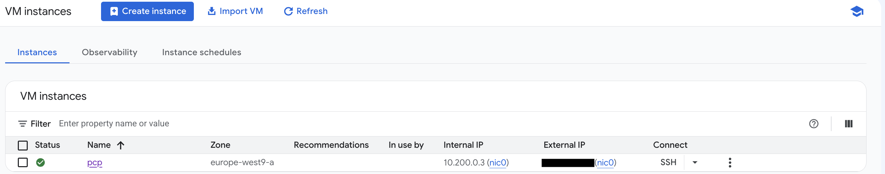

# Google Cloud Platform Installation

Plakar Control Plane is distributed on Google Cloud Platform as a custom image
hosted under the (`plakar-images`) project. Because the image lives outside your
own project, GCP requires explicit authorization before it can be used, and this
authorization works differently depending on whether you deploy through the
Console or the `gcloud` CLI.

## Getting access to the image

GCP images can only be shared with projects, domains, or individual accounts
that the image owner has explicitly authorized. The Console's instance-creation
flow relies on this authorization to browse and select an image, so it only
works for accounts Plakar has whitelisted, either by domain or by an email
address.

- **`gcloud` CLI:** works without any whitelisting, because referencing an image
  by name and project doesn't require the browsing permissions the Console UI
  needs. This is the recommended path for most users, since it doesn't depend on
  Plakar granting access first.
- **Console (UI):** [contact us](/contact) to have your Google account or
  Workspace domain added to the `plakar-images` project's IAM policy. Once
  whitelisted, the project appears when browsing custom images, and the rest of
  the deployment can be done by clicking through the Console.





The `gcloud` CLI can reference the `plakar-images` project directly, without
requiring the domain-whitelisting the Console needs:

```bash
gcloud compute instances create <INSTANCE_NAME> \
  --project=<YOUR_PROJECT> \
  --zone=<ZONE> \
  --machine-type=n2-standard-4 \
  --image=control-plane-v-0-0-3 \
  --image-project=plakar-images \
  --boot-disk-size=10GB \
  --boot-disk-type=pd-balanced \
  --create-disk=name=<INSTANCE_NAME>-data,size=1024GB,type=pd-balanced \
  --tags=http-server
```

- `--machine-type=n2-standard-4` provides the recommended 4 vCPUs and 16 GiB
  RAM. For evaluation or testing, a smaller machine type is fine.
- `--image` and `--image-project` reference the Plakar Control Plane image by
  name, which works regardless of whitelisting.
- `--create-disk` provisions the 1 TB data disk that holds the database, logs,
  and all Plakar state, separate from wherever you configure backups themselves
  to be stored. For evaluation or testing, a smaller size is fine.
- `--tags=http-server` applies the tag GCP's default network firewall rule uses
  to allow inbound HTTP traffic. If your project doesn't have that default rule,
  create one explicitly:

  ```bash
  gcloud compute firewall-rules create allow-http \
    --network=<NETWORK> \
    --allow=tcp:80 \
    --target-tags=http-server \
    --source-ranges=0.0.0.0/0
  ```

  > [!WARNING]+
  >
  > Restrict `--source-ranges` to trusted IP ranges, your organization's
  > gateway, or a VPN in production. `0.0.0.0/0` allows access from any address
  > and should only be used for testing or temporary deployments.

- To use Spot provisioning instead of Standard, add `--provisioning-model=SPOT`.
  Spot instances run until preempted by GCP, which makes them a fit for
  fault-tolerant workloads but not for a Control Plane instance, which needs to
  run continuously.

Once the instance is created, it can be viewed and managed from **Compute Engine
→ VM instances** in the Console like any other instance.





> [!NOTE]+
>
> This path requires your Google account or domain to already be whitelisted on
> the `plakar-images` project. If it isn't, use the CLI tab instead, or
> [contact us](/contact) to request access.

Compute instances can be created from **Compute Engine → VM instances** then
click on **Create Instance** to create a new instance.

### Machine configuration

Provide the instance a name, and choose the region and zone where it should run.
You then need to select an instance type for running control plane on.



Plakar Control Plane requires the following recommended setup:

- **4 vCPUs**
- **16 GiB RAM**
- **1 TB of additional storage**, on top of the boot disk

These are recommendations for a production deployment. For evaluation or
testing, a smaller machine type is fine. A preset such as `n2-standard-4`
satisfies the CPU and RAM requirement.

Under **Provisioning model**, choose **Standard** for a persistent deployment.
**Spot VMs** run until preempted by GCP, which makes them a fit for
fault-tolerant workloads but not for a Control Plane instance, which needs to
run continuously.



### OS and storage

By default, GCP proposes a generic Debian image. This needs to be replaced with
the Plakar Control Plane image:



1. Under **Boot disk**, click **Change**.
2. Select the **Custom images** tab.
3. Under **Source project for image**, click **Change**, and select
   `plakar-images` from the list of projects your account has been granted
   access to. If the project doesn't appear here, your account hasn't been
   whitelisted yet. See
   [getting access to the image](#getting-access-to-the-image) above.
4. Select the latest available image (currently `control-plane-v-0-0-3`).

For the boot disk itself, any of the available persistent disk types (Balanced,
SSD, Extreme, or Standard) will work; a size of **10 GB** is enough, since the
appliance's actual state is stored on a separate data disk.



### Additional disk

The database, logs, and all Plakar state are stored on a dedicated data disk,
separate from wherever you configure backups to be stored:

1. Under **Additional disks**, click **Add new disk**.
2. Leave the disk source blank so GCP creates a new, empty disk.
3. Set the size to **1024 GB**.
4. Choose a disk type. Balanced, SSD, Extreme, Standard, and Hyperdisk are all
   supported; pick whichever matches your performance and cost requirements.

The remaining disk settings (snapshot schedule and deletion behavior) can be
left at their defaults.



### Data protection

Choose the snapshot or backup schedule that matches your organization's data
protection requirements for this instance.

### Networking

Plakar Control Plane is served through a web UI over HTTP. For HTTPS, place a
load balancer in front of the instance to handle TLS termination. Configure
firewall rules, network tags, and IP settings according to your organization's
network policy. At minimum, **Allow HTTP traffic** needs to be enabled for the
web UI to be reachable once the instance is running.

The **Observability**, **Security**, and **Advanced** tabs can be configured
according to your organization's standards as none of them are required for a
working deployment.

Click **Create** once the configuration is complete.





## Accessing Plakar Control Plane

Once the instance is running and reachable, open it from a browser using its
assigned external IP address:

```txt
http://<EXTERNAL-IP>
```



For new installations, you will be guided through the enrollment process to:

- Register the instance with Plakar services for licensing and billing
- Create the initial administrator account

See the [enrollment](../../enrollment) documentation for more details.

## Limitations

The Google Cloud image does not yet support two capabilities available on the
other platforms.

- **SSH access:** The instance cannot be reached over SSH. It is administered
  entirely through the web interface, so plan for the appliance to be managed
  that way.

- **Proxy and registry mirror configuration:** Other platforms accept an HTTP
  proxy and a Harbor registry mirror through cloud-init user data. The Google
  Cloud image does not read that configuration, so the instance needs direct
  outbound access to:

  - `*.plakar.io`, for runtime configuration, license validation, and plugin
    downloads.
  - `*.docker.io`, `*.docker.com`, `*.ghcr.io`, and `*.githubusercontent.com`,
    for the container images the appliance runs.

  Without that access, the instance cannot validate its license or pull the
  images it needs to start.

