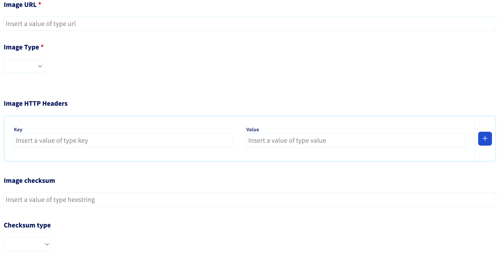
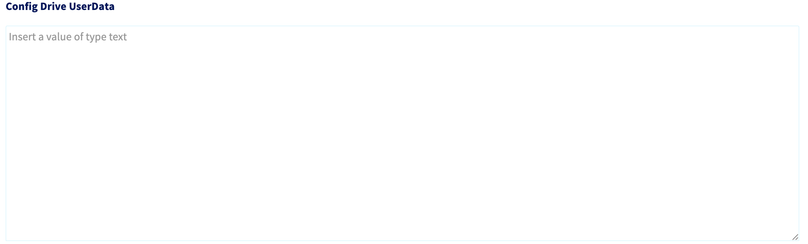

# OVHcloud Bare Metal Installation

Plakar Control Plane can be deployed on an OVHcloud dedicated server using the
official `QCOW2` image. The image can be downloaded from the
[Downloads Page](/download).

Dedicated servers are available in the OVHcloud Control Panel under **Bare Metal
Cloud -> Dedicated Servers**.

## Ordering a Dedicated Server

Plakar Control Plane requires the following recommended setup:

- A minimum of **4 vCPUs**
- At least **16 GB RAM**
- A first disk of around **10 GB** for the OS
- A second disk of at least **1 TB** for Control Plane data

These are recommendations for a production deployment. For evaluation or
testing, you can reduce CPU, RAM, and storage. The data volume stores the
database, logs, and all Plakar state. Backups themselves are stored wherever you
configure using apps.

> [!NOTE]+
>
> Dedicated servers on OVHcloud are preconfigured hardware offers, so you cannot
> always select an exact combination of CPU, RAM, and disk sizes. Choose the
> closest available offer to the recommended specifications above.

## Installing the Appliance

The Plakar Control Plane appliance is distributed as a `QCOW2` image. OVHcloud
allows custom images to be installed through its custom OS flow. After ordering
a dedicated server, the following setup is required.

### OS Setup

Set **Type of OS** to **Custom**, then select **Bring your own image**.



### Appliance Image

Provide a publicly accessible URL for the Plakar Control Plane `QCOW2` image in
**Image URL**. You can use the download link from the
[Downloads Page](/downloads), or host the image yourself on publicly accessible
storage such as an S3 bucket. and set the **Image Type** to **qcow2**.

You can optionally provide a checksum to verify the image during installation.
We publish both `SHA-256` and `MD5` checksums on the Downloads Page. If you
provide a checksum, enter it in **Image checksum** and select the corresponding
**checksum type**.



### SSH Public Key

Leave **SSH Public Key** blank. OVHcloud's SSH key configuration is not read by
the appliance.

If you need SSH access, provide your public key through **Config Drive
UserData**. The appliance uses the `plakar` user for SSH access.

### Config Drive UserData

Config Drive UserData contains the cloud-init configuration used by the
appliance. It can be used to configure SSH access, an HTTP proxy, or a Harbor
registry mirror.

See [Configuring the Appliance](#configuring-the-appliance) for more
information.



### EFI Bootloader

The appliance boots through `UEFI`. Set **Path of the EFI bootloader from the OS
installed on the server** to:

```text
\EFI\BOOT\BOOTX64.EFI
```


## Configuring the Appliance

Config Drive UserData is the cloud-init configuration passed to the appliance
during installation. At minimum, it can contain an SSH public key. Proxy and
registry mirror settings can be added when required by your environment.

### What needs to be reachable

Plakar Control Plane requires HTTPS access to `api.plakar.io` for runtime
configuration, license validation, and plugin downloads. If your proxy uses a
whitelist instead of allowing all outbound traffic, add `*.plakar.io` to it.

The appliance also needs to pull container images from `docker.io` and
`ghcr.io`. There are two supported approaches:

1. **Route image pulls through the HTTP proxy.** If you choose this option, the
   proxy should allow access to:

   - `*.docker.io`
   - `*.docker.com`
   - `*.ghcr.io`
   - `*.githubusercontent.com`

2. **Use a Harbor registry mirror.** This is the recommended approach for
   production deployments because images are pulled from a local registry cache
   instead of the public internet. When using Harbor, you don't need to
   whitelist the Docker and GitHub domains above on your proxy.

### UserData Example

The following example configures an SSH key, an HTTP proxy, and Harbor registry
mirrors:

```yaml
#cloud-config
ssh_authorized_keys:
  - ssh-ed25519 AAAA...

proxy:
  http: http://<proxy-ip>:<proxy-port>
  https: http://<proxy-ip>:<proxy-port>
  no_proxy: .corp.example,10.0.0.0/8 # optional

registry:
  mirrors:
    docker.io: <harbor-host>/dockerhub-proxy
    ghcr.io: <harbor-host>/ghcr-proxy
  insecure: false # true: skip TLS verification for the mirror hosts
```

Every top-level key above is optional. Include only the configuration required
by your environment.

### Network Configuration

By default, the appliance uses DHCP to obtain its network configuration. If the
OVHcloud server requires a static IP address, multiple network interfaces, or
custom routes, you can configure them using the `network` key in UserData.

For example:

```yaml
#cloud-config
network:
  ethernets:
    eth0:
      addresses: [10.0.1.5/24]
      gateway4: 10.0.1.1
      nameservers:
        addresses: [10.0.1.53, 10.0.1.54]
```

### Connect over SSH

If you configured an SSH public key, connect to the appliance using the `plakar`
user:

```sh
ssh plakar@<server-ip-address>
```

Replace `<server-ip-address>` with the public IP address assigned to the
dedicated server.

## Start the Appliance and Complete Enrollment

Once the installation settings are configured, confirm the order to start the
installation.

> [!NOTE]+
>
> The first boot may take some time while the appliance completes its initial
> setup.

Once the appliance has booted and the initial setup is complete, open Plakar
Control Plane from a browser using the server's public IP address:

```text
http://<server-ip-address>
```

For a new installation, you will be guided through the enrollment process to:

- Register the instance with Plakar services for licensing and billing
- Create the initial administrator account

See the [enrollment](../../enrollment) documentation for more information.

